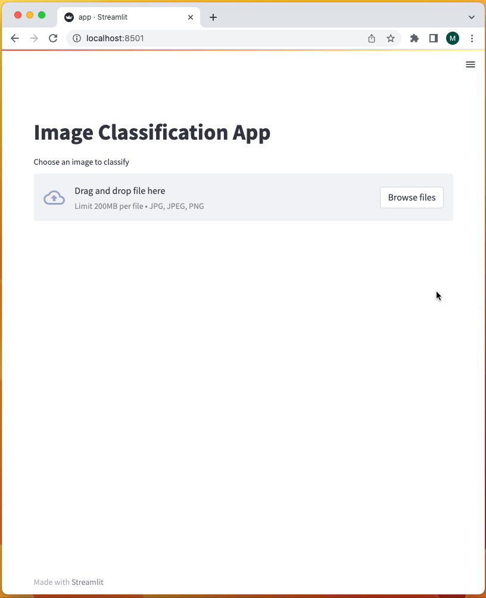

# Image classification

The following projects use deep learning to classify images and Streamlit to build an app with the trained model.

## Installation

```bash
pip install -r requirements.txt
```

## Projects

- [Ants vs Bees](ants-bees/image-classification.ipynb): an app that classifies ants and bees images, with RegNet--a ConvNet--using transfer learning

<p align="center"></p>
