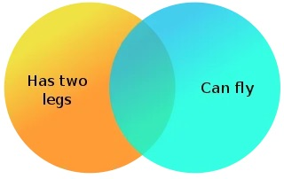
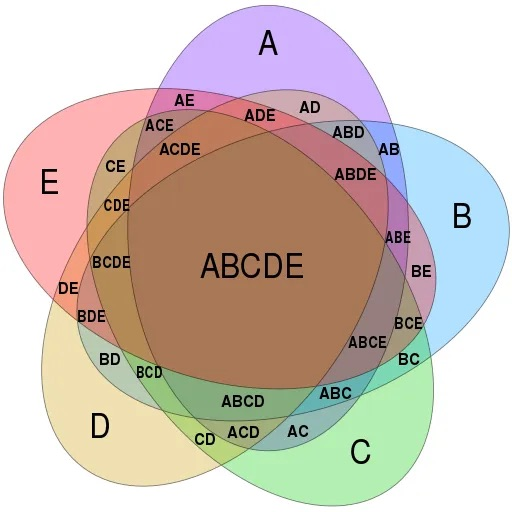
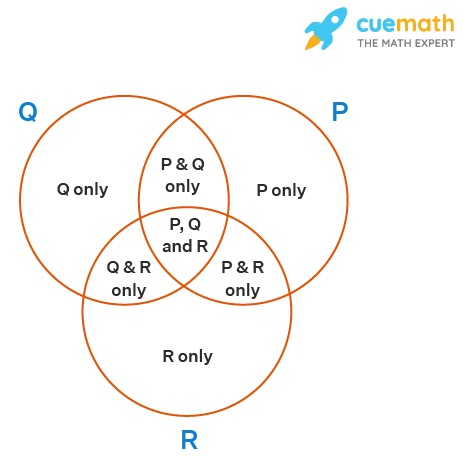
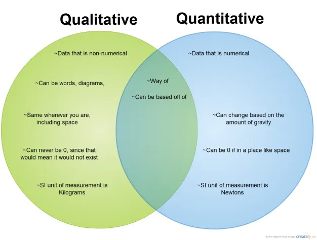

In the world of data visualization, few tools have gained as much recognition as Venn diagrams. These overlapping circles have become synonymous with illustrating set relationships, making complex data more accessible at a glance. Yet, while Venn diagrams are undeniably valuable, they also have a propensity to mislead. As a data scientist, I’ve encountered their allure and their limitations. In this article, we’ll delve into why Venn diagrams, despite their apparent simplicity, can be misleading if not used with caution. We’ll explore the intricacies that lie beneath those overlapping circles, shedding light on when and how to employ them effectively, and when to turn to alternative visualization methods for a more accurate representation of data.

<!--truncate-->

The followings are some reasons why Venn diagrams can sometimes be considered misleading.

## Misrepresentation of Set Sizes

Venn diagrams, often characterized by their overlapping circles, can inadvertently create a false impression of the sizes of the sets they represent. The issue arises from the inherent limitations of Venn diagrams, where the circles’ sizes are typically not proportional to the actual cardinalities of the sets. This can lead to a misperception of the data, as viewers may wrongly assume that each set is of equal size or that the proportions between sets differ from reality. Such misrepresentations can have far-reaching consequences, impacting decision-making processes and resource allocation strategies. It underscores the importance of using Venn diagrams judiciously and considering alternative visualization methods when precision in conveying set sizes is paramount in data analysis.

## Limited to Two or Three Sets

One of the inherent constraints of Venn diagrams is their limited applicability to visualizing relationships between only two or three sets effectively. While these diagrams excel at illustrating the intersections and overlaps between a small number of sets, they become less practical when dealing with more complex data scenarios involving multiple overlapping sets. Attempting to represent numerous sets with overlapping circles in a Venn diagram can result in a convoluted and challenging-to-interpret visualization. This limitation highlights the need for data analysts and scientists to consider alternative visualization techniques, such as Euler diagrams, when dealing with larger and more intricate datasets with numerous intersecting subsets.

## Overlapping Interpretation

The interpretation of overlapping regions in Venn diagrams can often be a source of confusion and misinterpretation. While these overlapping areas are intended to represent the elements shared between sets, the extent and significance of this overlap may not be immediately clear. Viewers might struggle to discern the precise number of elements in these intersections, making it challenging to draw accurate conclusions. Additionally, it may not always be apparent which sets contribute more or less to the overlap, leaving room for ambiguity in understanding the relationships between sets. This ambiguity can be particularly problematic in complex data scenarios with multiple sets, where the nuances of overlapping interpretations become even more pronounced. To address this challenge, it’s essential to provide clear labels, context, and supplementary information when using Venn diagrams to ensure that viewers can accurately decipher the overlapping regions and their implications within the data.

## Non-binary Data

Venn diagrams are most effective when dealing with binary data, where elements either belong to a set or do not. However, they can become less suitable when confronted with non-binary data, which encompasses more nuanced membership or gradations of inclusion. In situations where elements can belong to multiple sets simultaneously or have varying degrees of membership, Venn diagrams may oversimplify the complexity of these relationships. Attempting to represent such data in a binary, all-or-nothing fashion within the confines of overlapping circles can lead to a loss of valuable information and potentially mislead viewers. For these scenarios, alternative visualization methods like heatmaps or network graphs may offer a more accurate depiction of the intricate interconnections and degrees of membership present in the dataset.

## Contextual Misuse

Contextual misuse of Venn diagrams can occur when these visual tools are applied in inappropriate situations or for purposes they were not designed for. While Venn diagrams excel at representing set relationships, they may fall short when used to convey other types of data, such as numerical values or probabilistic information. Employing Venn diagrams in the wrong context can lead to misinterpretations, confusion, or a lack of clarity in conveying the intended message. It’s crucial for data scientists and analysts to exercise discretion and choose the most suitable visualization method based on the nature of the data they are dealing with. By recognizing the limitations of Venn diagrams and reserving them for scenarios where they can provide meaningful insights into set relationships, we can avoid the pitfalls of contextual misuse and ensure that data visualizations effectively communicate the desired information.

## Lack of Quantitative Information

A notable limitation of Venn diagrams is their inherent lack of quantitative information. These diagrams are primarily designed to show the relationships and intersections between sets visually, but they do not provide numerical or quantitative data. Consequently, when relying solely on Venn diagrams, it can be challenging to ascertain the exact size of sets, compare set sizes accurately, or determine the precise proportions of elements within overlapping regions. This absence of quantitative information can limit the depth of analysis and decision-making based on Venn diagrams alone. To address this limitation, it is advisable to complement Venn diagrams with numerical data or use other types of visualizations, such as bar charts or histograms, to provide viewers with a more comprehensive and precise understanding of the dataset.

