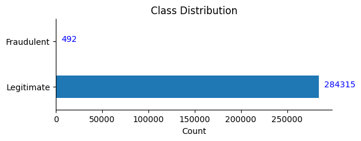
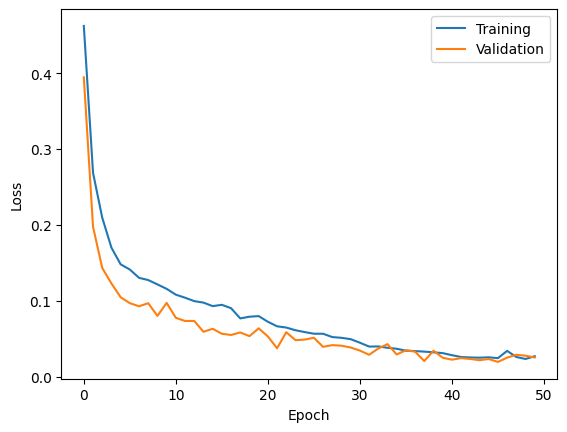
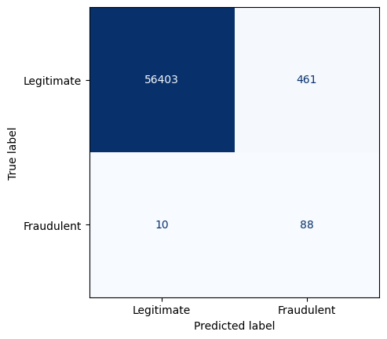

# Credit card fraud detection

Welcome to this exciting journey into the world of credit card fraud detection using the power of machine learning and Python! In this article, I’m going to walk you through the entire process of building a robust fraud detection model using the [Keras](https://keras.io/) library. Strap in as we explore each step, from data preprocessing to model evaluation, all while sprinkling in handy code examples and tips to make your learning experience smooth and enjoyable.

## Dataset Exploration and Understanding

Before we jump into the code, let’s take a moment to understand the dataset we’ll be working with. Our dataset contains credit card transaction data, a mixture of legitimate and fraudulent transactions. This dataset is an example of an imbalanced dataset, where legitimate transactions (the majority class) far outnumber fraudulent ones (the minority class).

Now, let’s dive into exploring structure and characteristics of the dataset.

```bash title="Shell"
pip install -q scipy pandas scikit-learn tensorflow keras
```

```python title="Python" showLineNumbers
import urllib.request
from scipy.io import arff
import pandas as pd

# Download the dataset to the current directory (149 MB)
# Source: https://www.openml.org/search?type=data&id=43627
url = "https://www.openml.org/data/download/22102452"
file_name = "credit_card.arff"
urllib.request.urlretrieve(url, file_name)

# Convert the dataset in arff format into a pandas dataframe
data_arff = arff.loadarff("credit_card.arff")
data = pd.DataFrame(data_arff[0])

data.head(3)
```

<div>
  <table border="1">
    <thead>
      <tr>
        <th></th>
        <th>Time</th>
        <th>V1</th>
        <th>V2</th>
        <th>V3</th>
        <th>V4</th>
        <th>V5</th>
        <th>V6</th>
        <th>V7</th>
        <th>V8</th>
        <th>V9</th>
        <th>...</th>
        <th>V21</th>
        <th>V22</th>
        <th>V23</th>
        <th>V24</th>
        <th>V25</th>
        <th>V26</th>
        <th>V27</th>
        <th>V28</th>
        <th>Amount</th>
        <th>Class</th>
      </tr>
    </thead>
    <tbody style={{ textAlign: "right" }}>
      <tr>
        <th>0</th>
        <td>0.0</td>
        <td>-1.359807</td>
        <td>-0.072781</td>
        <td>2.536347</td>
        <td>1.378155</td>
        <td>-0.338321</td>
        <td>0.462388</td>
        <td>0.239599</td>
        <td>0.098698</td>
        <td>0.363787</td>
        <td>...</td>
        <td>-0.018307</td>
        <td>0.277838</td>
        <td>-0.110474</td>
        <td>0.066928</td>
        <td>0.128539</td>
        <td>-0.189115</td>
        <td>0.133558</td>
        <td>-0.021053</td>
        <td>149.62</td>
        <td>0.0</td>
      </tr>
      <tr>
        <th>1</th>
        <td>0.0</td>
        <td>1.191857</td>
        <td>0.266151</td>
        <td>0.166480</td>
        <td>0.448154</td>
        <td>0.060018</td>
        <td>-0.082361</td>
        <td>-0.078803</td>
        <td>0.085102</td>
        <td>-0.255425</td>
        <td>...</td>
        <td>-0.225775</td>
        <td>-0.638672</td>
        <td>0.101288</td>
        <td>-0.339846</td>
        <td>0.167170</td>
        <td>0.125895</td>
        <td>-0.008983</td>
        <td>0.014724</td>
        <td>2.69</td>
        <td>0.0</td>
      </tr>
      <tr>
        <th>2</th>
        <td>1.0</td>
        <td>-1.358354</td>
        <td>-1.340163</td>
        <td>1.773209</td>
        <td>0.379780</td>
        <td>-0.503198</td>
        <td>1.800499</td>
        <td>0.791461</td>
        <td>0.247676</td>
        <td>-1.514654</td>
        <td>...</td>
        <td>0.247998</td>
        <td>0.771679</td>
        <td>0.909412</td>
        <td>-0.689281</td>
        <td>-0.327642</td>
        <td>-0.139097</td>
        <td>-0.055353</td>
        <td>-0.059752</td>
        <td>378.66</td>
        <td>0.0</td>
      </tr>
    </tbody>
  </table>
  <p>3 rows × 31 columns</p>
</div>

```python title="Python" showLineNumbers
from pprint import pprint

# Display basic information about the dataset
print("Number of rows:", data.shape[0])
print("Number of columns:", data.shape[1])

print("\nColumn names:")
pprint(data.columns.values.tolist(), compact=True, width=60)

print("\nTarget distribution:")
print(data['Class'].value_counts())

print("\nSummary statistics:")
print(data.describe().applymap(lambda x: f"{x: 0.2f}"))
```

```
Number of rows: 284807
Number of columns: 31

Column names:
['Time', 'V1', 'V2', 'V3', 'V4', 'V5', 'V6', 'V7', 'V8',
 'V9', 'V10', 'V11', 'V12', 'V13', 'V14', 'V15', 'V16',
 'V17', 'V18', 'V19', 'V20', 'V21', 'V22', 'V23', 'V24',
 'V25', 'V26', 'V27', 'V28', 'Amount', 'Class']

Target distribution:
Class
0.0    284315
1.0       492
Name: count, dtype: int64

Summary statistics:
            Time         V1         V2         V3         V4         V5  \
count  284807.00  284807.00  284807.00  284807.00  284807.00  284807.00
mean    94813.86       0.00       0.00      -0.00       0.00       0.00
std     47488.15       1.96       1.65       1.52       1.42       1.38
min         0.00     -56.41     -72.72     -48.33      -5.68    -113.74
25%     54201.50      -0.92      -0.60      -0.89      -0.85      -0.69
50%     84692.00       0.02       0.07       0.18      -0.02      -0.05
75%    139320.50       1.32       0.80       1.03       0.74       0.61
max    172792.00       2.45      22.06       9.38      16.88      34.80
...
          Amount      Class
count  284807.00  284807.00
mean       88.35       0.00
std       250.12       0.04
min         0.00       0.00
25%         5.60       0.00
50%        22.00       0.00
75%        77.16       0.00
max     25691.16       1.00
```

Running the above code will load the dataset and provide you with some initial insights. You’ll see e.g., the distribution of classes (fraudulent vs. legitimate transactions).
Additionally, it’s a good idea to visualize the class distribution to get a better sense of the data imbalance. You can create a bar plot to illustrate this:

```python title="Python" showLineNumbers
import matplotlib.pyplot as plt

# Plot the distribution of the target variable
class_counts = data["Class"].value_counts()

ax = class_counts.plot(
    kind="barh",
    figsize=(6, 2),
    title="Class Distribution",
    xlabel="Count",
    ylabel="",
)
ax.set_yticklabels(["Legitimate", "Fraudulent"])
ax.spines[["right", "top"]].set_visible(False)

# Print the count of each class
for index, value in enumerate(class_counts):
    plt.text(
        value + int(class_counts[0] / 50),
        index,
        str(value),
        color="blue",
    )
```



Remember, the goal of this step is to establish a solid foundation for the rest of your credit card fraud detection project. With this understanding in place, you’re ready to move on to preprocessing the data and preparing it for model training.

## Preprocessing: Cleaning and Preparing the Data

Data preprocessing is a critical step in any machine learning project. It involves transforming raw data into a format that is suitable for training a model. In this section, we’ll walk through the various preprocessing steps required to prepare our dataset for training a fraud detection model.

### Handling Missing Values

Dealing with missing values is crucial to ensure the quality of our dataset. Missing values can disrupt model training and lead to inaccurate predictions. Let’s take a look at how we can handle missing values:

```python title="Python" showLineNumbers
# Check for missing values in the dataset
missing_values = data.isnull().sum()

# Display columns with missing values
print("Columns with missing values:")
print(f"{missing_values[missing_values > 0]}")
```

```
Columns with missing values:
Series([], dtype: int64)
```

As can be seen, there is no missing value in our dataset. However, if you find any columns with missing values, you have a few options: you can impute missing values using techniques like mean, median, or predictive modeling, or you can remove rows or columns with a significant number of missing values. Choose the approach that best suits your dataset and the specific column.

### Train-Test Splitting

To evaluate the performance of our model accurately, and also some preprocessing steps shown bellow, we need to split our dataset into training and testing sets. In the evaluation part, the training set is used to train the model, while the testing set is used to evaluate its performance on unseen data:

```python title="Python" showLineNumbers
from sklearn.model_selection import train_test_split

# Separate features and target variable
X = data.drop("Class", axis=1)
y = data["Class"]

# Split the data into training and testing sets
X_train, X_test, y_train, y_test = train_test_split(
    X, y, test_size=0.2, random_state=42
)
```

In the code above, we’ve split the data into an 80–20 ratio, meaning 80% of the data will be used for training and 20% for testing. The `random_state` parameter ensures reproducibility.

### Finding Class Weights

As mentioned earlier, our dataset is imbalanced, with fraudulent transactions being the minority class. To handle this, we’ll calculate class weights and pass them to our model during training. This way, the model will pay _more attention to the minority_ class:

```python title="Python" showLineNumbers
from sklearn.utils.class_weight import compute_class_weight
import numpy as np

# Get the unique classes
unique_classes = np.unique(y_train)

# Calculate class weights
class_weights_array = compute_class_weight(
    class_weight="balanced", classes=unique_classes, y=y_train
)

# Convert class weights to a dictionary for model training
class_weights = dict(zip(unique_classes, class_weights_array))
print(f"Class weights: {class_weights}")
```

```
Class weights: {0.0: 0.5008661206149896, 1.0: 289.14340101522845}
```

### Standard Scaling

Standard scaling ensures that all features are on the same scale, which is essential for many machine learning algorithms. It prevents features with larger values from dominating the training process:

```python title="Python" showLineNumbers
from sklearn.preprocessing import StandardScaler

# Initialize the scaler
scaler = StandardScaler()

# Fit and transform the scaler on training data
X_train_scaled = scaler.fit_transform(X_train)

# Transform the test data using the same scaler
X_test_scaled = scaler.transform(X_test)
```

With these preprocessing steps completed, our data is now cleaned, split, and ready for model training. In the next section, we’ll dive into building our binary classification model using the powerful Keras library.

## Building a Binary Classification Model

Now that our data is preprocessed and ready, it’s time to roll up our sleeves and construct a binary classification model using the Keras library. Keras provides a user-friendly interface to build and train neural networks, making it a great choice for this task.

```python title="Python" showLineNumbers
from tensorflow.keras import Sequential, layers, activations, initializers

dropout_rate = 0.3

# Define the model
model = Sequential(
    [
        layers.Dense(
            256,
            activation=activations.relu,
            input_shape=(X_train_scaled.shape[-1],),
        ),
        layers.Dense(256, activation=activations.relu),
        layers.Dropout(dropout_rate),
        layers.Dense(256, activation=activations.relu),
        layers.Dropout(dropout_rate),
        layers.Dense(1, activation=activations.sigmoid),
    ]
)

# Summarize the model
model.summary()
```

```
Model: "sequential"
_________________________________________________________________
 Layer (type)                Output Shape              Param #
=================================================================
 dense (Dense)               (None, 256)               7936

 dense_1 (Dense)             (None, 256)               65792

 dropout (Dropout)           (None, 256)               0

 dense_2 (Dense)             (None, 256)               65792

 dropout_1 (Dropout)         (None, 256)               0

 dense_3 (Dense)             (None, 1)                 257

=================================================================
Total params: 139777 (546.00 KB)
Trainable params: 139777 (546.00 KB)
Non-trainable params: 0 (0.00 Byte)
```

In the above code, we designed an effective feedforward neural network architecture for our fraud detection task. We defined a sequential model that includes three hidden layers with [ReLU](https://keras.io/api/layers/activation_layers/relu/) activation functions, which help the model learn complex patterns in the data. We’ve also incorporated [dropout](https://keras.io/api/layers/regularization_layers/dropout/) layers to introduce regularization, which serves to counteract overfitting. The output layer uses a [sigmoid](https://keras.io/api/layers/activations/#sigmoid-function) activation function for binary classification. Eventually, we take a look at the summary of our model to understand its architecture and the number of parameters.

## Training the Model

Training the model involves providing it with our preprocessed data and letting it learn the patterns from the training set:

```python title="Python" showLineNumbers
from tensorflow.keras import metrics, optimizers, losses, callbacks

# Define the metrics to be used for model evaluation
metrics_ = [
    metrics.FalseNegatives(name="fn"),
    metrics.FalsePositives(name="fp"),
    metrics.TrueNegatives(name="tn"),
    metrics.TruePositives(name="tp"),
]

# Compile the model
model.compile(
    optimizer=optimizers.Adam(1e-4),
    loss=losses.binary_crossentropy,
    metrics=metrics_,
)

# Define callbacks
callbacks_ = [
    callbacks.ModelCheckpoint(
        filepath="fraud_model.h5",
        save_best_only=True,
        save_weights_only=True,
    )
]

# Train the model
history = model.fit(
    x=X_train_scaled,
    y=y_train,
    validation_data=(X_val_scaled, y_val),
    batch_size=2048,
    epochs=50,
    callbacks=callbacks_,
    class_weight=class_weights,
)
```

```
Epoch 1/50
90/90 [==============================] - 1s 12ms/step - loss: 0.4623 - fn: 30.0000 - fp: 80148.0000 - tn: 101798.0000 - tp: 300.0000 - val_loss: 0.3945 - val_fn: 10.0000 - val_fp: 265.0000 - val_tn: 45240.0000 - val_tp: 54.0000
Epoch 2/50
90/90 [==============================] - 1s 10ms/step - loss: 0.2687 - fn: 44.0000 - fp: 1939.0000 - tn: 180007.0000 - tp: 286.0000 - val_loss: 0.1977 - val_fn: 9.0000 - val_fp: 363.0000 - val_tn: 45142.0000 - val_tp: 55.0000
Epoch 3/50
90/90 [==============================] - 1s 10ms/step - loss: 0.2096 - fn: 39.0000 - fp: 2854.0000 - tn: 179092.0000 - tp: 291.0000 - val_loss: 0.1433 - val_fn: 7.0000 - val_fp: 631.0000 - val_tn: 44874.0000 - val_tp: 57.0000
...
Epoch 48/50
90/90 [==============================] - 1s 10ms/step - loss: 0.0259 - fn: 1.0000 - fp: 1718.0000 - tn: 180228.0000 - tp: 329.0000 - val_loss: 0.0288 - val_fn: 7.0000 - val_fp: 405.0000 - val_tn: 45100.0000 - val_tp: 57.0000
Epoch 49/50
90/90 [==============================] - 1s 11ms/step - loss: 0.0233 - fn: 1.0000 - fp: 1560.0000 - tn: 180386.0000 - tp: 329.0000 - val_loss: 0.0276 - val_fn: 7.0000 - val_fp: 396.0000 - val_tn: 45109.0000 - val_tp: 57.0000
Epoch 50/50
90/90 [==============================] - 1s 10ms/step - loss: 0.0269 - fn: 2.0000 - fp: 1954.0000 - tn: 179992.0000 - tp: 328.0000 - val_loss: 0.0253 - val_fn: 7.0000 - val_fp: 350.0000 - val_tn: 45155.0000 - val_tp: 57.0000
```

Here, we’re using the `fit` method to train the model. We specify the training data (`X_train_scaled` and `y_train`), the number of training epochs, the batch size for gradient updates, and the validation data for monitoring the model’s performance during training. The `class_weight` argument helps our model pay more attention to the _minority_ class.

### Visualizing Training Progress

It’s helpful to visualize the training progress using plots. This allows us to observe how the model’s performance changes over epochs:

```python title="Python" showLineNumbers
import matplotlib.pyplot as plt

plt.plot(history.history["loss"], label="Training")
plt.plot(history.history["val_loss"], label="Validation")
plt.ylabel("Loss")
plt.xlabel("Epoch")
plt.legend();
```



As can be seen, the model is performing well not only on the training data but also on new, unseen validation data.

## Evaluation: Measuring Model Performance

In this section, we’ll dive into evaluating the performance of our credit card fraud detection model. By using various metrics, we can gain insights into how well the model is identifying fraudulent transactions and where it might need improvement.

To evaluate a binary classification model like ours, we’ll use several key metrics that provide a comprehensive view of its performance:

- **True positives:** The model predicts fraud and the event is actually fraud.
- **False positives:** The model predicts fraud but the event is actually legitimate.
- **True negatives:** The model predicts legitimate and the event is actually legitimate.
- **False negatives:** The model predicts legitimate but the event is actually fraud.
- **Confusion Matrix:** A table that summarizes the model’s predictions and actual classes. It shows true positive, true negative, false positive, and false negative counts.
- **Recall:** Also known as _sensitivity_ or _True Positive Rate_, is percentage of total fraud the model detects. Also known as capture rate.
- **Precision:** Percentage of fraud events correctly predicted as fraudulent as compared to all events predicted as fraudulent.

Once the model is trained, we can use it to make predictions on the test data:

```python title="Python" showLineNumbers
# Predict on the test data
y_pred = model.predict(X_test_scaled)

# Convert predictions to binary values
y_pred = np.where(y_pred >= 0.5, 1, 0)
```

```
1781/1781 [==============================] - 1s 411us/step
```

```python title="Python" showLineNumbers
from sklearn.metrics import recall_score, precision_score, confusion_matrix

# Recall score
recall = recall_score(y_test, y_pred)
print(f"Recall score: {recall:.2f}")

# Precision score
precision = precision_score(y_test, y_pred)
print(f"Precision score: {precision:.2f}")

# Confusion matrix
conf_matrix = confusion_matrix(y_test, y_pred)

# True negatives, false positives, false negatives, true positives
tn, fp, fn, tp = conf_matrix.ravel()
print(f"\nTrue negatives: {tn}")
print(f"False positives: {fp}")
print(f"False negatives: {fn}")
print(f"True positives: {tp}")

# Plot the confusion matrix
disp = ConfusionMatrixDisplay(
    confusion_matrix=conf_matrix,
    display_labels=["Legitimate", "Fraudulent"]
)
print("\nConfusion matrix:")
disp.plot(cmap="Blues", values_format="d", ax=None, colorbar=False);
```

```
Recall score: 0.90
Precision score: 0.16

True negatives: 56403
False positives: 461
False negatives: 10
True positives: 88

Confusion matrix:
```



This heatmap provides a clearer view of how well the model is classifying instances.

Out of 56,962 testing transactions, we are:

- Correctly identifying 88 of them as fraudulent (True Positives)
- Missing 10 fraudulent transactions (False Negatives)
- At the cost of incorrectly flagging 461 legitimate transactions (False Positives)

## Conclusion

Congratulations! You’ve successfully embarked on a journey through the creation of a credit card fraud detection model using Keras and Python. From data preprocessing to model training and evaluation, you’ve gained a comprehensive understanding of the entire process. Remember, the world of fraud detection is ever-evolving, so feel free to experiment with different architectures, hyperparameters, and techniques to further enhance your model’s performance.

Happy coding and stay vigilant against fraud!
