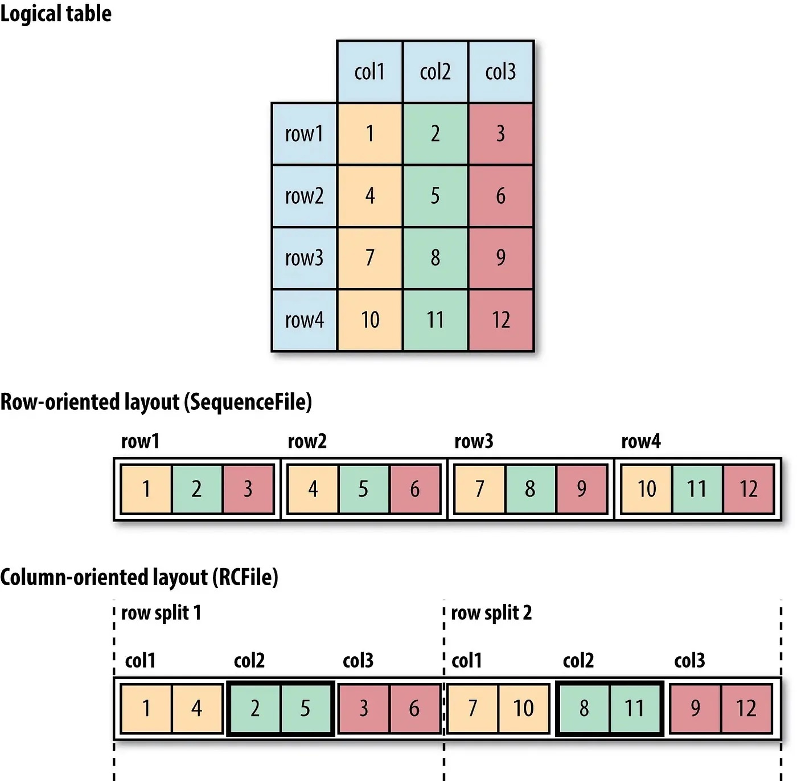

# Why is Parquet format so popular?

## Introduction

[Parquet](https://parquet.apache.org/) is a popular columnar storage format for big data processing. It’s widely used in the Hadoop ecosystem and provides several benefits over traditional row-based storage formats like CSV and JSON. In this article, we’ll take a closer look at why Parquet is so popular and how it can help improve the performance and efficiency of big data processing tasks. Also, we’ll compare it to the popular pandas DataFrame.

## History

The Parquet format was created in 2013 by the Apache Software Foundation’s Parquet project, a collaboration between Twitter, Cloudera, and other organizations. The goal of the project was to create a columnar storage format that was optimized for big data processing and could be used with a variety of data processing frameworks such as Hadoop, Impala, and Hive. The project was a response to the growing need for a more efficient way of storing and processing large datasets as data collection and storage was rapidly increasing. Since its release, the Parquet format has become one of the most popular storage formats for big data, widely used in the industry and adopted by many companies.

## Why so popular?

The first reason why Parquet is so popular is its high compression and encoding capabilities. Parquet uses a technique called columnar storage, which organizes data in a way that allows for more efficient compression and encoding. This means that data stored in Parquet format takes up less space on disk and can be read and processed more quickly.

Another benefit of Parquet is its support for advanced data types and encoding schemes. Parquet supports a wide range of data types, including integers, floating-point numbers, strings, and timestamps. It also supports advanced encoding schemes like dictionary encoding, which can further reduce the size of the data on disk.

Parquet also supports advanced data querying capabilities. It provides a feature called predicate pushdown, which allows query engines to filter data on disk before reading it into memory. This reduces the amount of data that needs to be read and processed, and can greatly improve query performance.

In addition to its high compression and encoding capabilities, Parquet is also highly interoperable. It’s supported by a wide range of big data processing tools and platforms, including Hadoop, Spark, Hive, and Pig. This means that data stored in Parquet format can be easily read and processed by a wide range of tools and platforms, making it a versatile format for big data processing tasks.

Finally, Parquet is an open-source format, which means that it can be freely used and modified by anyone. This has led to a large and active community of developers working on the format, which has helped to improve its performance and capabilities over time.

## Parquet vs pandas DataFrame

| Feature             | Parquet                                | pandas DataFrames                       |
| ------------------- | -------------------------------------- | --------------------------------------- |
| Storage format      | Columnar                               | Row-based                               |
| Compression         | High                                   | Low                                     |
| Encoding            | Advanced (dictionary, RLE, etc.)       | Basic                                   |
| Data querying       | Advanced (predicate pushdown)          | Basic                                   |
| Handling large data | Efficiently handle large data          | Not optimized for large data processing |
| Execution           | Can be executed in distributed systems | Executed on single machine              |
| Open-source         | Yes                                    | Yes                                     |

As you can see, Parquet and [pandas](https://pandas.pydata.org/) DataFrames have some similarities, but they also have some important differences. Parquet is a columnar storage format that is optimized for big data processing and provides advanced compression and encoding capabilities. On the other hand, pandas DataFrames are row-based and are more commonly used for data analysis and manipulation.

One of the main benefits of using Parquet is that it can greatly improve the performance and efficiency of big data processing tasks by reducing the amount of data that needs to be read and processed. pandas DataFrames, on the other hand, are not as optimized for big data processing and may not be as efficient when working with large datasets.

https://timepasstechies.com/row-oriented-column-oriented-file-formats-hadoop/

Another benefit of Parquet is that it supports a wide range of data types and encoding schemes, which can further reduce the size of the data on disk. pandas DataFrames, on the other hand, have a limited set of data types and do not support advanced encoding schemes.

## Conclusion

Parquet is a popular columnar storage format for big data processing due to its high compression and encoding capabilities, support for advanced data types and encoding schemes, advanced data querying capabilities, high interoperability, and the fact that it is open-source. These benefits make it a powerful and versatile format for big data processing tasks, and it’s likely to continue to be widely used in the future.
