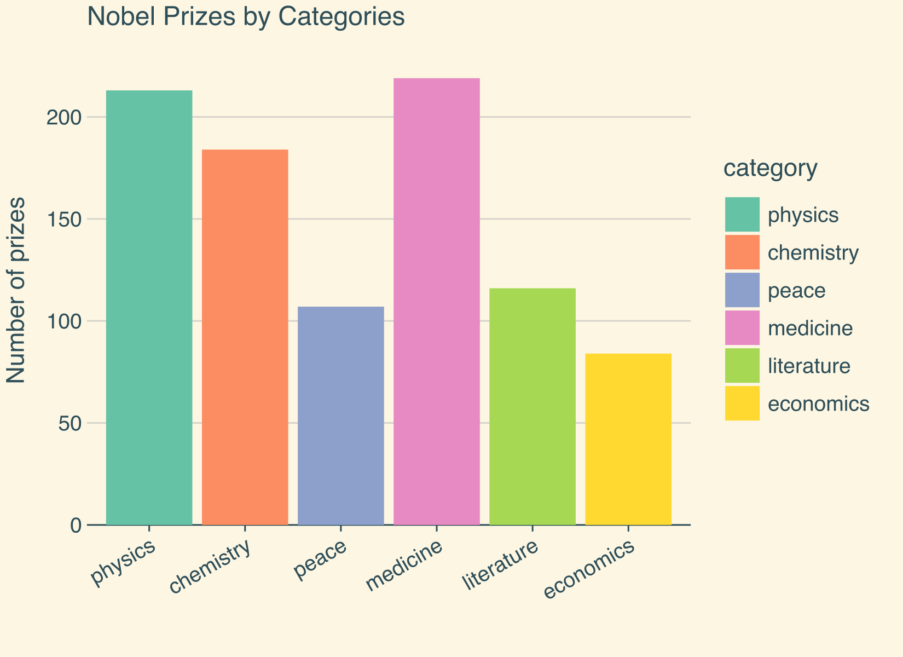

# Captivating Visualization Power of lets-plot

Hi, fellow data enthusiasts! Today, we’re setting sail on a delightful journey to explore the world of data visualization with [lets-plot](https://lets-plot.org/index.html) Python package, a captivating gem, by [JetBrains](https://www.jetbrains.com/), inspired by the legendary [ggplot2](https://ggplot2.tidyverse.org/) from the R universe. If you’re tired of bland and dull plots that make you yawn louder than a bear in hibernation, fear not! lets-plot is here to save the day with its elegance, versatility, and charm. So, hoist your Python flags high and let’s embark on this hands-on adventure!

## tl;dr

Check out the [Bonus](#bonus) section!

## Setting Sail with lets-plot

The beauty of lets-plot lies in its simplicity. To get started, ensure you have lets-plot and `pandas` installed:

```bash title="Shell"
pip install lets-plot pandas
```

Then, import them:

```python title="Python" showLineNumbers
import pandas as pd

from lets_plot import *

LetsPlot.setup_html()
```

With lets-plot and pandas on board, we’re ready to work our magic on visualizations!

## Data Preparation

Before we dazzle our eyes with mesmerizing plots, we need some data to play with. In the first part of this tutorial, we’ll use a swashbuckling dataset of pirates and their treasure loots (available [here](https://github.com/smortezah/Portfolio/blob/main/data-visualization/lets-plot/data/pirate.csv)). To import the data, we’ll rely on the trusty pandas library:

```python title="Python" showLineNumbers
# Load the dataset
df = pd.read_csv("data/pirate.csv")

df
```

<div>
<table border="1">
  <thead>
    <tr>
      <th></th>
      <th>ship_name</th>
      <th>ship_type</th>
      <th>age</th>
      <th>plunder</th>
    </tr>
  </thead>
  <tbody>
    <tr>
      <th>0</th>
      <td>Blackbeard's Revenge</td>
      <td>Galleon</td>
      <td>32</td>
      <td>50000</td>
    </tr>
    <tr>
      <th>1</th>
      <td>The Salty Sea Serpent</td>
      <td>Frigate</td>
      <td>28</td>
      <td>42000</td>
    </tr>
    <tr>
      <th>2</th>
      <td>The Crimson Corsair</td>
      <td>Sloop</td>
      <td>24</td>
      <td>30000</td>
    </tr>
    <tr>
      <th>3</th>
      <td>Calico Jack's Jewel</td>
      <td>Galleon</td>
      <td>36</td>
      <td>65000</td>
    </tr>
    <tr>
      <th>4</th>
      <td>The Jolly Roger</td>
      <td>Frigate</td>
      <td>22</td>
      <td>38000</td>
    </tr>
    <tr>
      <th>5</th>
      <td>The Sea Serpent</td>
      <td>Sloop</td>
      <td>27</td>
      <td>32000</td>
    </tr>
    <tr>
      <th>6</th>
      <td>Captain Hook's Revenge</td>
      <td>Galleon</td>
      <td>40</td>
      <td>70000</td>
    </tr>
    <tr>
      <th>7</th>
      <td>The Flying Dutchman</td>
      <td>Frigate</td>
      <td>35</td>
      <td>48000</td>
    </tr>
    <tr>
      <th>8</th>
      <td>The Shadow Shark</td>
      <td>Sloop</td>
      <td>30</td>
      <td>35000</td>
    </tr>
  </tbody>
</table>
</div>

## Basic Plotting

Behold the simplicity of lets-plot! Creating stunning plots is a piece of cake. Let’s start with a scatter plot to visualize the relationship between the pirates’ plunder and their age:

```python title="Python" showLineNumbers
# A basic scatter plot
p = ggplot(df) + geom_point(aes(x="age", y="plunder"))

# Show the plot
p.show()
```


## Customizing the Plot

Our plot might be functional, but it needs some flair, a touch of customization to make it truly memorable. Let’s spice things up with a pirate-worthy title, axes labels, and some eye-catching aesthetics:

```python title="Python" showLineNumbers
# Customizing the plot with labels and colors
p = (
    ggplot(df)
    + geom_point(aes(x="age", y="plunder", color="ship_name"), size=5)
    + labs(
        title="Pirate Plunder vs. Age",
        x="Age of Pirate",
        y="Plunder Amount",
        color="Ship Name",
    )
    + theme_bw()
    + theme(text=element_text(family="Helvetica"))
)

# Show the upgraded plot
p.show()
```


## Faceting

Want to create a series of plots for different ship types? _Faceting_ is the answer! Check out this neat trick:

```python title="Python" showLineNumbers
# Faceting the plot by ship type
p = (
    ggplot(df)
    + geom_point(aes(x="age", y="plunder", color="ship_name"), size=5)
    + labs(
        title="Pirate Plunder vs. Age",
        x="Age of Pirate",
        y="Plunder Amount",
        color="Ship Name",
    )
    + facet_wrap("ship_type", ncol=3)
    + theme_bw()
    + theme(text=element_text(family="Helvetica"))
)

# Show the faceted plot
p.show()
```


## A Dash of Bar Charts

Now, it’s time to delve into bar charts. Let’s visualize the average plunder by each ship type:

```python title="Python" showLineNumbers
# Data
df_bar = df[["ship_type", "plunder"]].groupby("ship_type").mean().reset_index()

# Creating a bar chart for average plunder by ship type
p = (
    ggplot(df_bar)
    + geom_bar(
        aes(x="ship_type", y="plunder", fill="ship_type"), stat="identity"
    )
    + coord_flip()
    + labs(
        title="Average Plunder by Ship Type",
        x="Ship Type",
        y="Average Plunder",
    )
    + theme_classic()
    + theme(text=element_text(family="Helvetica"), legend_position="none")
    + ggsize(500, 300)
)

# Show the bar chart
p.show()
```


## Bonus

Now, check out some complicated plots!

:::note
The datasets are available [here](https://github.com/smortezah/Portfolio/tree/main/data-visualization/lets-plot/data).
:::

```python title="Python" showLineNumbers
# Data
df = pd.read_csv("data/nobel_final.csv")

# Plot
p = (
    ggplot(df)
    + geom_boxplot(aes(x="category", y="age_get_prize", fill="category"))
    + facet_grid(x="gender")
    + ggtitle("Aggregated Information About Age by Category and Gender")
    + labs(x="", y="Age when getting the prize")
    + theme_bw()
    + theme(text=element_text(family="Helvetica"))
)

p.show()
```


```python title="Python" showLineNumbers
# Data
df = pd.read_csv("data/nobel_final.csv")

# Plot
p = (
    ggplot(df, aes(x="age", y="age_get_prize"))
    + geom_bin2d(binwidth=[5, 5])
    + scale_fill_gradient(low="#ace3c2", high="#013b18")
    + facet_grid(x="gender")
    + ggtitle("Common Distribution of Death Age and Getting the Prize Age")
    + labs(x="Death age", y="Age when getting the prize")
    + theme_bw()
    + theme(text=element_text(family="Helvetica"))
    # + ggsize(500, 300)
)

p.show()
```


```python title="Python" showLineNumbers
# Data
df = pd.read_csv("data/nobel_final.csv")

# Plot
p = (
    ggplot(df)
    + geom_bar(aes(x="category", fill="category"))
    + ggtitle("Nobel Prizes by Categories")
    + labs(x="", y="Number of prizes")
    + theme(
        text=element_text(family="Helvetica"),
        panel_grid_major_x=element_blank(),
    )
    + flavor_solarized_light()
    + ggsize(550, 400)
)

p.show()
```



```python title="Python" showLineNumbers
from lets_plot.bistro.corr import corr_plot

# Data
df = pd.read_csv("data/mpg.csv")

# Plot
corr = corr_plot(df)
nice_font = theme(text=element_text(family="Helvetica"))

p1 = (
    corr.tiles().palette_RdYlGn().build()
    + ggtitle("Tiles")
    + nice_font
    + flavor_solarized_dark()
)

p2 = corr.points().palette_RdBu().build() + ggtitle("Points") + nice_font

p3 = (
    corr.tiles()
    .labels()
    .palette_gradient(low="#417555", mid="lightgray", high="#963CA7")
    .build()
    + ggtitle("Tiles and labels")
    + nice_font
)

p4 = (
    corr.points().labels().tiles().build()
    + ggtitle("Tiles, points and labels")
    + nice_font
    + flavor_solarized_light()
)

p = gggrid([p1, p2, p3, p4], ncol=2) + ggsize(600, 550)

p.show()
```


---

First, install “geopandas”, then run the Python code.

```bash title="Shell"
pip install geopandas
```

```python title="Python" showLineNumbers
# Data
import geopandas as gpd

world = gpd.read_file("data/world.gpkg")
world_limits = coord_map(ylim=[-70, 85])

# Create a choropleth by mapping the continent variable to the fill aes.
p = (
    ggplot()
    + geom_map(aes(fill="continent"), data=world, color="white")
    + world_limits
    + labs(x="Longitude", y="Latitude")
    + theme(
        text=element_text(family="Helvetica"),
        axis_line_y=element_line(),
    )
    + ggsize(900, 500)
)

p.show()
```


## Conclusion

With lets-plot in your Python arsenal, data visualization becomes a thrilling voyage rather than a tedious journey. Inspired by R’s ggplot2, this delightful package brings charm, ease, and beauty to your plotting adventures. So, hoist your Python flags high, unleash your creativity, and chart a course to mesmerizing visualizations. May your plots be as captivating as the tales of legendary pirates!

Happy plotting, and may the seas of data always be in your favor! 🌟✨
