# Dodging the Common Pitfalls in Data Visualization

Hello data enthusiasts!

Today, we’ll be addressing a crucial topic that’s often overlooked in the exciting world of data science and machine learning: Bad and Good Data Visualisation. We know how critical it is to not just crunch those numbers and build models, but present our findings in the most effective way possible.

You know, they say a picture is worth a thousand words. This couldn’t be truer in our field! The right plot or graphs can be the difference between giving others a clear insight into the data or leaving them utterly confused. So, let’s dive into the common pitfalls we find in data visualisations and how to correct them.

## Setup

For our illustrations, we’ll use the matplotlib library and [ggplot_classic](https://github.com/smortezah/mplstyle) plotting style. Ready to go on this journey? Let’s roll!

Make sure to install the required libraries:

```bash title="Shell"
pip install numpy pandas matplotlib
```

And let’s import all the necessary libraries and set things up.

```python title="Python" showLineNumbers
import string

import numpy as np
import pandas as pd

import matplotlib.pyplot as plt

# Plot style
plt.style.use("ggplot_classic.mplstyle")

# Seed for reproducibility
SEED = 7
```

## Pitfall 1: Inappropriate Use of Pie charts

:::caution Pitfall

A common error that many make is to use pie charts when there are too many categories. Pie charts work best when there’s only a few categories to compare. Otherwise, the chart looks cluttered and doesn’t vindicate the cause of visualisation.

:::

:::tip Fix

For better readability and efficient information delivery, we can use a bar chart.

:::

```python title="Python" showLineNumbers
# Data
np.random.seed(SEED)  # set random seed for reproducibility
n_cat = 11  # number of categories

df = pd.DataFrame(
    {
        "Category": list(string.ascii_uppercase[:n_cat]),
        "Value": np.random.randint(5, 20, n_cat),
    }
)

# Plot
fig, ax = plt.subplots(nrows=1, ncols=2, figsize=(10, 4))

# Bad Example
df.plot.pie(
    y="Value",
    labels=df["Category"],
    autopct="%.0f",
    colors=plt.cm.Set3.colors,
    title="Bad Use of Pie Chart",
    ylabel="",
    legend=False,
    ax=ax[0],
)

# Good Example
df.plot.barh(
    x="Category",
    y="Value",
    width=0.8,
    color=plt.cm.Set3.colors,
    title="Better Use of Bar Chart",
    xlabel="Value",
    legend=False,
    ax=ax[1],
)

plt.show()
```

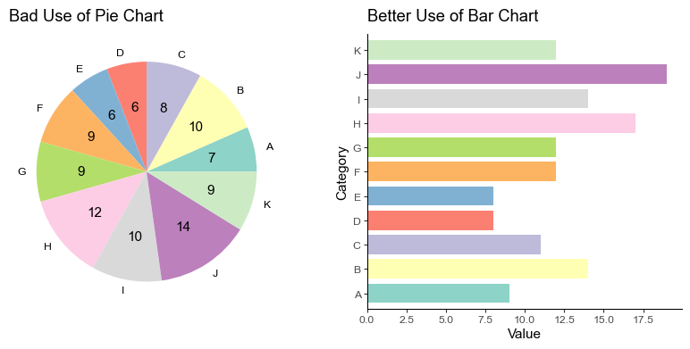

There you have it! The right plot ensures there’s no straining of eyes or brows. Each category and its value is readily on display.

## Pitfall 2: Misleading Y-axis

:::caution Pitfall

Manipulating the y-axis to emphasize a minor change is a common issue. This can mislead the viewer into assuming a greater difference than there actually is.

:::

:::tip Fix

Ensure y-axis scaling accurately represents the data, avoiding exaggeration or understatement. Start from zero, if possible, for clarity.

:::

```python title="Python" showLineNumbers
# Data
df = pd.DataFrame(
    {
        "Year": ["2020", "2021", "2022", "2023"],
        "Revenue": [3.4, 3.5, 3.6, 3.7],
    }
)

# Plot
fig, ax = plt.subplots(nrows=1, ncols=2, figsize=(10, 4))

# Bad Example
df.plot(
    x="Year",
    y="Revenue",
    color="blue",
    ylim=(3.3, 3.8),
    title="Misleading Y-axis",
    ylabel="Revenue",
    legend=False,
    ax=ax[0],
)

# Good Example
df.plot(
    x="Year",
    y="Revenue",
    color="blue",
    ylim=(0, 5),
    title="Appropriate Y-axis",
    ylabel="Revenue",
    legend=False,
    ax=ax[1],
)

plt.show()
```

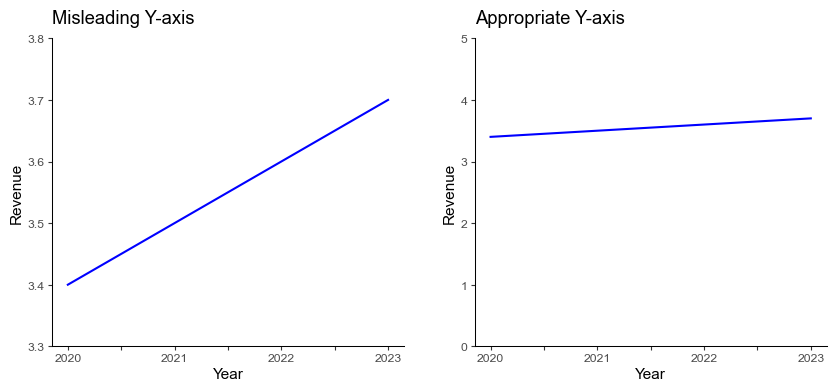

In the left plot above, the increase in revenue might seem significant due to the narrow range of the y-axis. The correct graphic, on the right side, gives us a much more honest perspective of the revenue change.

## Pitfall 3: Overcomplication of Plot Designs

:::caution Pitfall

Sometimes, we try to create aesthetically striking visualizations and end up overcomplicating the design. This can result in the dampening of the information we were trying to convey.

:::

:::tip Fix

Instead, we could settle for straightforward designs that are easy-to-follow, using neat colors.

:::

```python title="Python" showLineNumbers
# Data
np.random.seed(SEED)
n_columns = 3

df = pd.DataFrame(
    np.random.rand(4, n_columns),
    columns=list(string.ascii_uppercase[:n_columns]),
    index=["Spring", "Summer", "Autumn", "Winter"],
)

# Plot
fig, axs = plt.subplots(nrows=1, ncols=2, figsize=(10, 4))

# Bad Example
df.plot.bar(
    stacked=True,
    rot=0,
    color=plt.cm.Set2_r.colors,
    title="Overcomplicated Design",
    ylabel="Value",
    ax=axs[0],
)

# Good Example
df.plot.bar(
    width=0.7,
    rot=0,
    color=plt.cm.Set2_r.colors,
    title="Simplified Design",
    ylabel="Value",
    ax=axs[1],
).legend(loc="upper right", ncol=3)

plt.show()
```

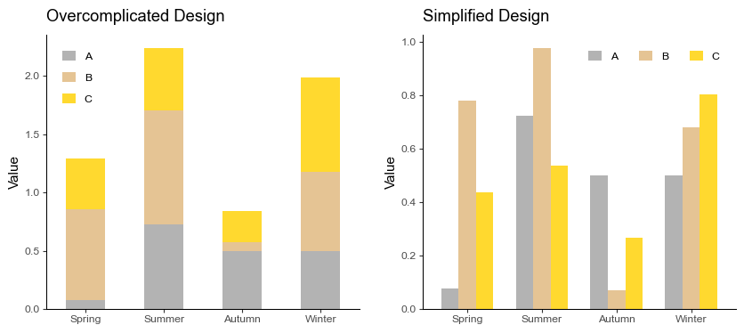

## Pitfall 4: Ignoring Scale Differences

:::caution Pitfall

We often overlook the scale of different variables while plotting them in the same graph, which can lead to the misrepresentation of data.

:::

:::tip Fix

We might want to plot separate graphs or use secondary y-axis for variables with different scales.

:::

```python title="Python" showLineNumbers
# Data
np.random.seed(SEED)
n_points = 10

df = pd.DataFrame(
    {
        "Celsius": np.random.randint(25, 31, n_points),
        "Fahrenheit": np.random.randint(75, 85, n_points)
    },
    index=pd.date_range(start="2023-08-20", periods=n_points, freq="D"),
)

# Plot
fig, ax = plt.subplots(nrows=1, ncols=3, figsize=(15, 4))

# Bad Example
df.plot(title="Ignoring Scale Difference", color=["red", "blue"], ax=ax[0])

# Good Example
df["Celsius"].plot(
    title="Addressed Scale Difference",
    color="red",
    ax=ax[1],
).legend(loc="lower left")

df["Fahrenheit"].plot(
    title="Addressed Scale Difference",
    color="blue",
    ax=ax[2],
).legend(loc="lower left")

plt.show()
```

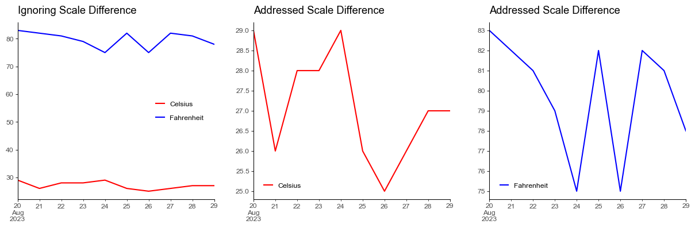

## Pitfall 5: Unconsidered use of 3D Plots

:::caution Pitfall

While 3D plots might seem like a good idea to represent a third variable, it often leads to misinterpretation and confusion. This is exacerbated if the view angle hides important details.

:::

:::tip Fix

Instead, 2D scatter plots with color encoding for the 3rd dimension often work better.

:::

```python title="Python" showLineNumbers
# Data
np.random.seed(SEED)

df = pd.DataFrame(np.random.rand(70, 3) * 100, columns=["X", "Y", "Z"])

# Plot
fig = plt.figure(figsize=(10, 4))
ax0 = fig.add_subplot(121, projection="3d")
ax1 = fig.add_subplot(122)

# Bad Example
ax0.scatter(df["X"], df["Y"], df["Z"])
ax0.view_init(elev=20, azim=110, roll=0)
ax0.set(
    title="Overcomplicated 3D Scatter",
    xlabel="X",
    ylabel="Y",
    zlabel="Z",
)

# Good Example
scatter = ax1.scatter(df["X"], df["Y"], c=df["Z"])
ax1.set(title="2D Scatter with Color Encoding", xlabel="X", ylabel="Y")
fig.colorbar(scatter, shrink=0.75, label="Z").set_label("Z", rotation=0)

plt.show()
```

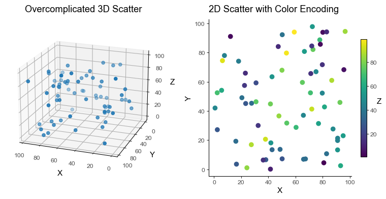

## Pitfall 6: Overplotting

:::caution Pitfall

While trying to visualize a large amount of data, we sometimes end with overplotting. This happens when data points overlap each other and obscure the view.

:::

:::tip Fix

We can use techniques like transparency, jitter, or even better, a 2D density plot.

:::

```python title="Python" showLineNumbers
# Data
np.random.seed(SEED)

df = pd.DataFrame(np.random.rand(1000, 2), columns=["X", "Y"])

# Plot
fig, ax = plt.subplots(nrows=1, ncols=2, figsize=(10, 4))

# Bad Example
df.plot.scatter(x="X", y="Y", title="Overcomplicated Scatter", ax=ax[0])

# Good Example
num_hexagons = 15  # no. hexagons in x-axis. The more, the finer the grid.

df.plot.hexbin(
    x="X",
    y="Y",
    gridsize=num_hexagons,
    cmap="Purples",
    title="2D Density Plot",
    ax=ax[1],
)

plt.show()
```

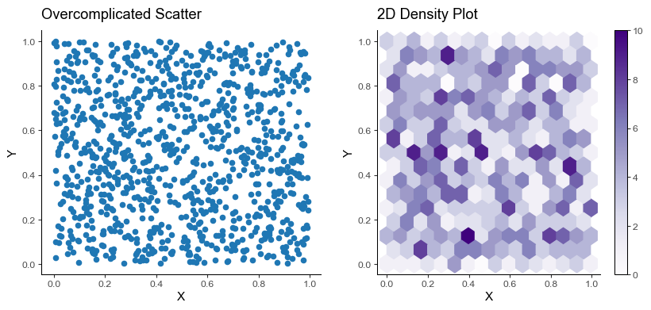

## Pitfall 7: Not Emphasizing on What’s Important

:::caution Pitfall

A pitfall comes when visualizing everything but not emphasizing what is important. We always want to highlight the most important aspects of our visualizations.

:::

:::tip Fix

The remedy here is to highlight what’s important.

:::

```python title="Python" showLineNumbers
# Data
np.random.seed(SEED)

df = pd.DataFrame(np.random.rand(10, 1), columns=["Value"])

# Plot
fig, ax = plt.subplots(nrows=1, ncols=2, figsize=(10, 4))

# Bad Example
df.plot(
    title="Can't Emphasize on What's Important",
    ylabel="Value",
    marker="o",
    color="deepskyblue",
    legend=False,
    ax=ax[0],
)

# Good Example
df.plot(
    title="Emphasize on What's Important",
    ylabel="Value",
    marker="o",
    color="deepskyblue",
    legend=False,
    ax=ax[1],
)

important_idx = np.argmax(df["Value"])  # index of the important point
ax[1].plot(important_idx, df.iloc[important_idx], color="red", marker="o")

plt.show()
```

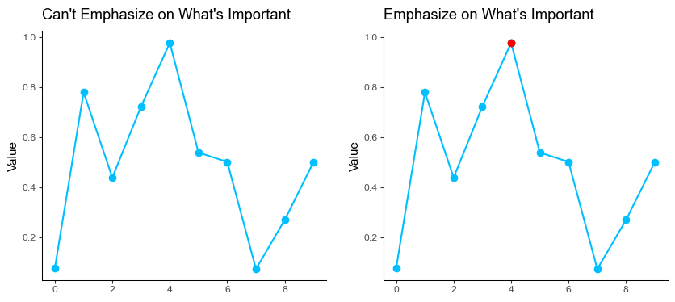

## Pitfall 8: Improper use of Line charts for Discrete Data

:::caution Pitfall

The line chart connects data points with a line implying a smooth continuity in the data which is often incorrect for _discrete_ categories.

:::

:::tip Fix

We replace line charts with bar charts which are efficient for comparative analysis as well as presenting discrete data. It’s important to select the right chart type when visualizing data in order to accurately represent the data’s story.

:::

```python title="Python" showLineNumbers
# Data
df = pd.DataFrame(
    {
        "student": ["John", "Mary", "Peter", "Bill", "Lisa"],
        "grade": [80, 60, 60, 40, 40],
    }
)

# Plot
fig, ax = plt.subplots(nrows=1, ncols=2, figsize=(10, 4))

# Bad Example
df.plot(
    x="student",
    y="grade",
    ylim=(0, 100),
    marker="o",
    title="Bad Use: Line Chart",
    xlabel="Student",
    ylabel="Grade",
    color="green",
    legend=False,
    ax=ax[0],
)

# Good Example
df.plot.bar(
    x="student",
    y="grade",
    ylim=(0, 100),
    width=0.6,
    title="Good Use: Bar Chart",
    xlabel="Student",
    ylabel="Grade",
    color="deepskyblue",
    rot=0,
    legend=False,
    ax=ax[1],
)

plt.show()
```

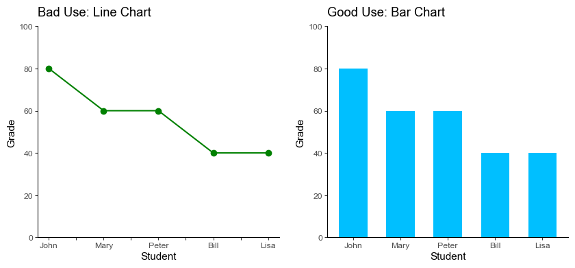

## Pitfall 9: Not Using Faceting for multidimensional data

:::caution Pitfall

Faceting is the act of breaking data variables up across multiple subplots, and combining those subplots into a single figure. Plotting multiple dimensions in a single graph can overwhelm viewers and obscure patterns.

:::

:::tip Fix

Instead of plotting a line graph with six superposed lines, we can create six subplots with one subplot for each dimension.

:::

```python title="Python" showLineNumbers
# Data
np.random.seed(SEED)

df = pd.DataFrame(
    {
        "Region": np.random.choice(["North", "South"], size=100),
        "Category": np.random.choice(["A", "B", "C"], size=100),
        "Sales": np.random.randint(low=100, high=1000, size=100),
    }
)

# Pivot data
df_wide = df.pivot(
    columns=["Region", "Category"],
    values="Sales",
).sort_index(axis=1)

# Bad Example
df_wide.plot.kde(
    title="Bad: Single Plot for Multidimensional Data", figsize=(7, 4)
).legend(
    ncols=2,
    title="Region, Category",
    bbox_to_anchor=(1.0, 1.05),
)

# Good Example
facet = df_wide.plot.kde(
    title="Good: Multiple Plots for Multidimensional Data",
    subplots=True,
    layout=(2, 3),
    figsize=(7, 4),
    legend=False,
    sharex=False,
    sharey=True,
)

for ax in facet.ravel():
    ax.legend(loc="lower center")

plt.show()
```

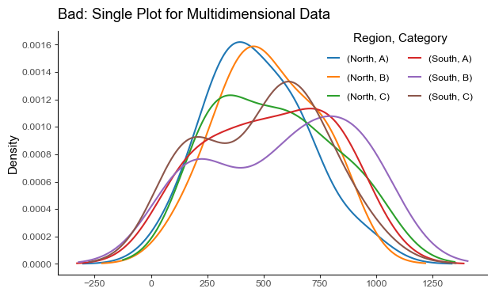

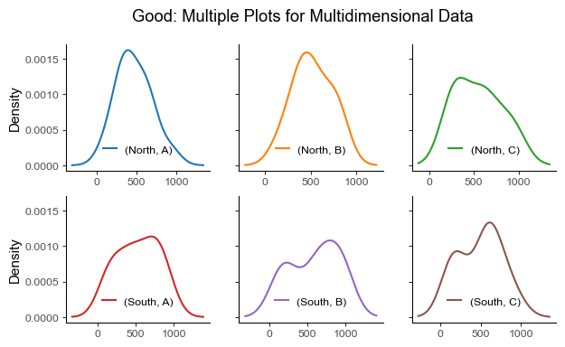

## Pitfall 10: Not Smoothing Noisy Data

:::caution Pitfall

Data often comes with noise. Yet bypassing the important step of smoothing noisy data before visualizing it can lead to an unclear and misleading interpretation.

:::

:::tip Fix

Instead, smoothing the data can help to reveal important trends and remove random variation.

:::

```python title="Python" showLineNumbers
# Data
np.random.seed(SEED)
x = np.linspace(0, 10, 100)
y = np.sin(x) + np.random.normal(0, 0.35, 100)

df = pd.DataFrame({"x": x, "y": y})

# Plot
fig, ax = plt.subplots(nrows=1, ncols=2, figsize=(10, 4))

# Bad Example
df.plot(
    x="x",
    y="y",
    title="Bad: Raw Noisy Data",
    xlabel="X",
    ylabel="Y",
    legend=False,
    color="green",
    ax=ax[0],
)

# Moving average smoothing
window_size = 10
smoothed_y = np.convolve(
    df["y"],
    np.ones(window_size) / window_size,
    mode="same",
)
df["smoothed_y"] = smoothed_y

# Good Example
df.plot(
    x="x",
    y="smoothed_y",
    title="Good: Smoothed Data",
    xlabel="X",
    ylabel="Y",
    legend=False,
    color="darkgreen",
    ax=ax[1],
)

plt.show()
```

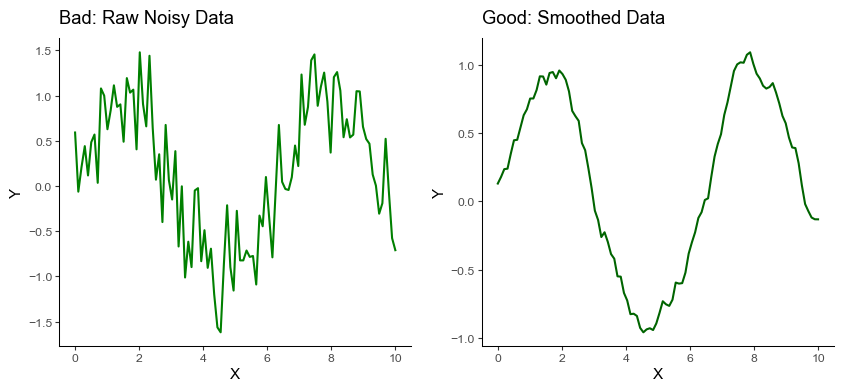

In the example above, the smoothed data reveals the underlying sinusoidal pattern, which would be rather difficult to observe in the raw, noisy data.

Employing effective data visualization techniques is crucial in unlocking the potential of (big) data and enhancing informed decision-making in the business realm.
