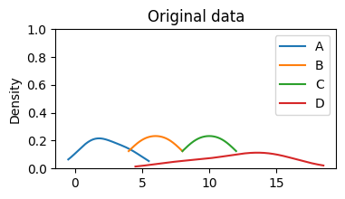
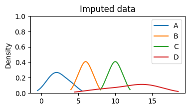

# Dealing with Missing Data Like a Pro

Welcome, fellow data enthusiasts and Python aficionados! Today, we embark on a thrilling journey to tackle one of the most common challenges in data science &mdash; missing data! Ah, those pesky gaps in our datasets that can ruin our models and give us headaches. But fear not! With Python as our trusty companion, we shall equip ourselves with the skills to handle missing data. So, fasten your seatbelts and let’s dive in!

## Understanding the Missing Data Landscape

Before we don our data superhero capes, let’s take a moment to understand the types of missing data we might encounter in our datasets:

- **Missing Completely at Random (MCAR):** Imagine a mischievous data gremlin randomly removing entries from our dataset while we’re not looking. Sneaky, right? Well, these missing values are said to be MCAR, where their absence is unrelated to any variables in our dataset. No patterns, no worries!
- **Missing at Random (MAR):** This type of missing data shows a bit of cunning. Here, the probability of data being missing depends on other observed variables. As if it’s saying, “Hey, if you already know X and Y, I’ll decide whether to hide.”
- **Missing Not at Random (MNAR):** These missing values are neither random nor related to the observed variables. They might hide for specific reasons unknown to us, and they’re quite adept at keeping secrets.

## Detecting Missing Data

Now that we’re familiar with the missing data breeds, it’s time to put on our detective hats and find those gaps in our dataset. Our Python magnifying glass and trusty pandas library will come to the rescue:

```python title="Python" showLineNumbers
import pandas as pd

# Load your dataset
data = pd.DataFrame(
    {
        "A": [1, 2, None, 4],
        "B": [5, None, 7, None],
        "C": [None, 9, None, 11],
        "D": [12, 8, 14, 15],
    }
)

# Print the dataset
print("Original dataset:")
print(data)
```

```
Original dataset:
     A    B     C   D
0  1.0  5.0   NaN  12
1  2.0  NaN   9.0   8
2  NaN  7.0   NaN  14
3  4.0  NaN  11.0  15
```

```python title="Python" showLineNumbers
# Check for missing values in the entire dataset
print("\nMissing values in the entire dataset:")
print(data.isnull().sum())

# Identify columns with missing values
print("\nColumns with missing values:")
print(data.columns[data.isnull().any()].tolist())
```

```
Missing values in the entire dataset:
A    1
B    2
C    2
D    0
dtype: int64

Columns with missing values:
['A', 'B', 'C']
```

The `isnull().sum()` command gives us the number of missing values in each column, while `data.columns[data.isnull().any()]` reveals the columns with missing data. Now we know where our data gremlins have been up to their mischief!

## Strategies for Handling Missing Data

### Imputation Techniques

Missing data can leave unsightly holes in our analysis, but fear not, for we shall artfully fill in these gaps with imputation techniques. One popular method is mean imputation:

```python title="Python" showLineNumbers
# Print the original column A
print("\nOriginal column A:")
print(data["A"])

# Impute missing values with the column A's mean
data_imputed = data["A"].fillna(data["A"].mean())

# Print the imputed column A
print("\nImputed column A:")
print(data_imputed)
```

```
Original column A:
0    1.0
1    2.0
2    NaN
3    4.0
Name: A, dtype: float64

Imputed column A:
0    1.000000
1    2.000000
2    2.333333
3    4.000000
Name: A, dtype: float64
```

### Forward and Backward Fill

For sequential data, such as time-series, we can employ forward-fill or backward-fill techniques to propagate the last observed value:

```python title="Python" showLineNumbers
# Print the original column B
print("\nOriginal column B:")
print(data["B"])

# Forward-fill missing values in column B
data_imputed = data["B"].fillna(method="ffill")

# Print the forward-filled column B
print("\nForward-filled column B:")
print(data_imputed)

# Backward-fill missing values
data_imputed = data["B"].fillna(method="bfill")

# Print the backward-filled column B
print("\nBackward-filled column B:")
print(data_imputed)
```

```
Original column B:
0    5.0
1    NaN
2    7.0
3    NaN
Name: B, dtype: float64

Forward-filled column B:
0    5.0
1    5.0
2    7.0
3    7.0
Name: B, dtype: float64

Backward-filled column B:
0    5.0
1    7.0
2    7.0
3    NaN
Name: B, dtype: float64
```

### Predictive Imputation

For a touch of magic, we can use machine learning models to predict missing values based on other features:

```python title="Python" showLineNumbers
from sklearn.ensemble import RandomForestRegressor


def impute_with_random_forest(df, target_column):
    # Split data into two sets: with and without missing values in the
    # target column
    known = df[df[target_column].notnull()]
    unknown = df[df[target_column].isnull()]

    # Create the Random Forest model
    model = RandomForestRegressor()

    # Train the model on known data to predict missing values
    X = known.drop(columns=[target_column])
    y = known[target_column]
    model.fit(X, y)

    # Predict missing values
    predicted_values = model.predict(unknown.drop(columns=[target_column]))

    # Assign predicted values to missing entries
    df.loc[df[target_column].isnull(), target_column] = predicted_values


# Impute missing values of all columns except C
data_imputed = data.copy()
data_imputed[["A", "B"]] = data_imputed[["A", "B"]].fillna(
    data_imputed[["A", "B"]].mean()
)

# Print the dataset before imputing column C
print("Before imputing column C:")
print(data_imputed)

# Impute the column C
impute_with_random_forest(data_imputed, "C")

# Print the dataset after imputing column C
print("\nAfter imputing column C:")
print(data_imputed)
```

```
Before imputing column C:
          A    B     C   D
0  1.000000  5.0   NaN  12
1  2.000000  6.0   9.0   8
2  2.333333  7.0   NaN  14
3  4.000000  6.0  11.0  15

After imputing column C:
          A    B      C   D
0  1.000000  5.0   9.92  12
1  2.000000  6.0   9.00   8
2  2.333333  7.0   9.92  14
3  4.000000  6.0  11.00  15
```

### K-Nearest Neighbors (KNN)

Let’s embrace the spirit of camaraderie and let our friendly neighbors help us fill in the missing values:

```python title="Python" showLineNumbers
from sklearn.impute import KNNImputer

# Create KNN imputer
knn_imputer = KNNImputer(n_neighbors=2)

# Perform imputation on all columns with missing values
array_imputed = knn_imputer.fit_transform(data)
data_imputed = pd.DataFrame(array_imputed, columns=data.columns)

# Print the original dataset
print("Before imputation:")
print(data)

# Print the imputed dataset
print("\nAfter imputation:")
print(data_imputed)
```

```
Before imputation:
     A    B     C   D
0  1.0  5.0   NaN  12
1  2.0  NaN   9.0   8
2  NaN  7.0   NaN  14
3  4.0  NaN  11.0  15

After imputation:
     A    B     C     D
0  1.0  5.0  10.0  12.0
1  2.0  6.0   9.0   8.0
2  2.5  7.0  10.0  14.0
3  4.0  6.0  11.0  15.0
```

## Verifying Imputations

Now that we’ve sprinkled Python magic and conquered missing data, it’s time to ensure our imputations are solid:

### Check for Remaining Missing Values

Let’s verify if our imputation methods left any missing values lurking:

```python title="Python" showLineNumbers
# Verify if any missing values remain
print(data_imputed.isnull().sum())
```

```
A    0
B    0
C    0
D    0
dtype: int64
```

### Compare Distributions

For the imputed columns, compare the original and imputed distributions to ensure they’re not drastically altered:

```python title="Python" showLineNumbers
# Visualize the distribution of the original and imputed data
data.plot(
    kind="density", title="Original data", ylim=(0, 1), figsize=(4, 2)
)

data_imputed.plot(
    kind="density", title="Imputed data", ylim=(0, 1), figsize=(4, 2)
);
```





## Domain-Specific Imputation

### Time-Series Imputation

For time-series data, we’ll need a specialized approach. Enter interpolation:

```python title="Python" showLineNumbers
# Print the dataset before interpolation
print("Before interpolation:")
print(data)

# Print the dataset after interpolation
print("\nAfter interpolation:")
print(data.interpolate())
```

```
Before interpolation:
     A    B     C   D
0  1.0  5.0   NaN  12
1  2.0  NaN   9.0   8
2  NaN  7.0   NaN  14
3  4.0  NaN  11.0  15

After interpolation:
     A    B     C   D
0  1.0  5.0   NaN  12
1  2.0  6.0   9.0   8
2  3.0  7.0  10.0  14
3  4.0  7.0  11.0  15
```

### Categorical Data Imputation

When dealing with categorical data, mode imputation comes to our rescue:

```python title="Python" showLineNumbers
# Dataset
data_cat = pd.Series(["a", "b", None, "d"] * 2 + ["b"])

# Print the dataset before imputation
print("Before imputation:")
print(data_cat)

# Find the most frequent category
most_frequent = data_cat.mode()[0]
print("\nMost frequent category:", most_frequent)

# Replace missing values with the most frequent category
data_cat.fillna(most_frequent, inplace=True)

# Print the dataset after imputation
print("\nAfter imputation:")
print(data_cat)
```

```
Before imputation:
0       a
1       b
2    None
3       d
4       a
5       b
6    None
7       d
8       b
dtype: object

Most frequent category: b

After imputation:
0    a
1    b
2    b
3    d
4    a
5    b
6    b
7    d
8    b
dtype: object
```

## Wrapping up

Congratulations, data explorers! You’ve learned the secrets of handling missing data like a seasoned data scientist. Remember, handling missing data is an essential skill in the data scientist’s toolkit, and with Python by your side, you’re well-equipped to conquer any missing value challenges that come your way.

Stay curious, keep coding, and let your data-driven dreams soar high!

Happy Python-ing! 🐍✨
