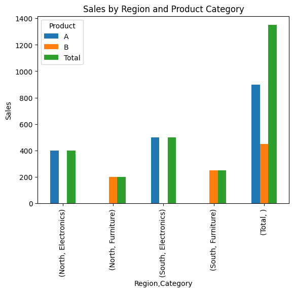
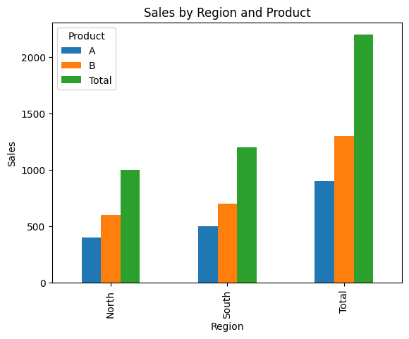
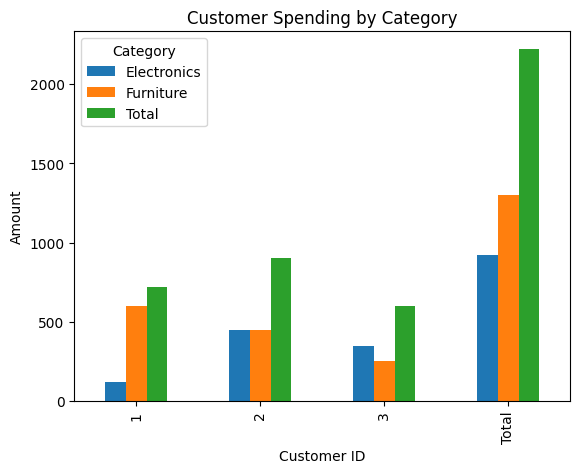

# Pivot Tables with pandas

As data scientists, we are constantly sifting through vast amounts of data, searching for insights that can drive decisions. One of the most powerful tools in our arsenal is the pivot table. If you’re familiar with Excel, you might have already used pivot tables to summarize data. However, the true magic happens when you bring pivot tables into the realm of Python using the pandas library. In this article, we’ll dive into the basics of pivot tables in pandas and explore how they can help us manipulate and analyze our data with ease.

## 1. Understanding Pivot Tables

At its core, a pivot table allows us to transform and summarize data by aggregating it in meaningful ways. Think of it as a multi-dimensional spreadsheet where you can slice and dice your data to uncover trends and patterns. With pandas, creating pivot tables is both straightforward and incredibly powerful, allowing us to handle large datasets efficiently.

### Why Use Pivot Tables?

Pivot tables are incredibly versatile and offer several advantages:

- **Data Summarization**: Quickly summarize and aggregate data across multiple dimensions.
- **Data Exploration**: Easily explore large datasets to identify trends, patterns, and outliers.
- **Data Transformation**: Reshape data into a more understandable and useful format.

### Getting Started with pandas

Before we dive into pivot tables, let’s ensure you have pandas installed. If not, you can install it using pip:

```sh title="Shell"
pip install pandas
```

Now, let’s import pandas and create a sample DataFrame to work with:

```python title="Python"
import pandas as pd

# Sample DataFrame
data = {
    "Date": [
        "2023-01-01",
        "2023-01-01",
        "2023-01-02",
        "2023-01-02",
        "2023-01-03",
        "2023-01-03",
    ],
    "Region": ["North", "South", "North", "South", "North", "South"],
    "Product": ["A", "A", "B", "B", "A", "A"],
    "Sales": [100, 150, 200, 250, 300, 350],
}

df = pd.DataFrame(data)
print(df)
```

Our sample DataFrame looks like this:

```text title="Output"
         Date Region Product  Sales
0  2023-01-01  North       A    100
1  2023-01-01  South       A    150
2  2023-01-02  North       B    200
3  2023-01-02  South       B    250
4  2023-01-03  North       A    300
5  2023-01-03  South       A    350
```

This dataset contains sales data for different products across various regions and dates. Now, let's create a pivot table to summarize this information.

### Creating Your First Pivot Table

Creating a pivot table in pandas is straightforward using the `pivot_table` function. Let’s create a pivot table to summarize the total sales for each product by region:

```python title="Python"
pivot_table = pd.pivot_table(
    df, values="Sales", index="Region", columns="Product", aggfunc="sum"
)
print(pivot_table)
```

The output will be:

```text title="Output"
Product    A    B
Region
North    400  200
South    500  250
```

In this pivot table:

- **Index (Rows)**: Regions (`North`, `South`)
- **Columns**: Products (`A`, `B`)
- **Values**: Sum of Sales for each Product in each Region

### Customizing Aggregation Functions

One of the strengths of pivot tables is the ability to customize the aggregation function. By default, `pivot_table` uses the mean, but you can easily change it to other functions like `sum`, `count`, `min`, `max`, etc.

For example, to find the average sales instead of the sum:

```python title="Python"
pivot_table_avg = pd.pivot_table(
    df, values="Sales", index="Region", columns="Product", aggfunc="mean"
)
print(pivot_table_avg)
```

The output will be:

```text title="Output"
Product    A    B
Region
North    200  200
South    250  250
```

Here, we see the average sales for each product by region.

### Tips for Working with Pivot Tables

1. **Handling Missing Data**: Use the `fill_value` parameter to replace missing values in the pivot table. For example, `fill_value=0` will replace NaNs with zeros.
2. **Multiple Aggregation Functions**: You can apply multiple aggregation functions at once using a list. For example, `aggfunc=['sum', 'mean']`.
3. **Multi-Level Indexing**: Pivot tables can handle multi-level (hierarchical) indexing both in rows and columns, which is useful for complex datasets.

```python title="Python"
pivot_table_multi = pd.pivot_table(
    df, values="Sales", index=["Region", "Product"], aggfunc=["sum", "mean"]
)
print(pivot_table_multi)
```

Output:

```text title="Output"
                 sum  mean
               Sales Sales
Region Product
North  A         400   200
       B         200   200
South  A         500   250
       B         250   250
```

By understanding and leveraging these tips, you can create powerful pivot tables to analyze your data more effectively.

In the next sections, we will dive deeper into advanced techniques, such as dealing with hierarchical indexes and customizing pivot tables further to meet specific analytical needs.

## 2. Advanced Pivot Table Techniques

Now that we’ve covered the basics, let’s delve into some advanced techniques that can make pivot tables even more powerful and flexible. These techniques will help you tackle more complex data analysis tasks and gain deeper insights from your data.

### Multi-Level Indexing

In real-world scenarios, you often need to summarize data across multiple dimensions. pandas pivot tables can handle multi-level (hierarchical) indexing, both in rows and columns. This feature is particularly useful when you need to analyze data across several categories.

Let’s expand our dataset to include an additional dimension: `Category`.

```python title="Python"
# Expanded sample DataFrame
data = {
    "Date": [
        "2023-01-01",
        "2023-01-01",
        "2023-01-02",
        "2023-01-02",
        "2023-01-03",
        "2023-01-03",
    ],
    "Region": ["North", "South", "North", "South", "North", "South"],
    "Product": ["A", "A", "B", "B", "A", "A"],
    "Category": [
        "Electronics",
        "Electronics",
        "Furniture",
        "Furniture",
        "Electronics",
        "Electronics",
    ],
    "Sales": [100, 150, 200, 250, 300, 350],
}

df = pd.DataFrame(data)
print(df)
```

The new DataFrame looks like this:

```text title="Output"
         Date Region Product     Category  Sales
0  2023-01-01  North       A  Electronics    100
1  2023-01-01  South       A  Electronics    150
2  2023-01-02  North       B    Furniture    200
3  2023-01-02  South       B    Furniture    250
4  2023-01-03  North       A  Electronics    300
5  2023-01-03  South       A  Electronics    350
```

To create a pivot table that summarizes sales by region, product, and category, you can specify multiple levels for the index and columns:

```python title="Python"
pivot_table_multi = pd.pivot_table(
    df,
    values="Sales",
    index=["Region", "Category"],
    columns="Product",
    aggfunc="sum",
)
print(pivot_table_multi)
```

The output will be:

```text title="Output"
Product                 A      B
Region Category
North  Electronics  400.0    NaN
       Furniture      NaN  200.0
South  Electronics  500.0    NaN
       Furniture      NaN  250.0
```

In this pivot table:

- **Rows**: Multi-level index with Region and Category.
- **Columns**: Products.
- **Values**: Sum of Sales for each combination of Region and Category.

### Handling Missing Data

In many datasets, you’ll encounter missing values. pandas allows you to handle these gracefully in pivot tables using the `fill_value` parameter. This parameter lets you specify a value to replace NaNs in the resulting table.

```python title="Python"
pivot_table_filled = pd.pivot_table(
    df,
    values="Sales",
    index=["Region", "Category"],
    columns="Product",
    aggfunc="sum",
    fill_value=0,
)
print(pivot_table_filled)
```

The output with missing values filled with zeroes:

```text title="Output"
Product               A    B
Region Category
North  Electronics  400    0
       Furniture      0  200
South  Electronics  500    0
       Furniture      0  250
```

### Applying Multiple Aggregation Functions

Sometimes, a single aggregation function is not enough to capture all the insights from your data. pandas allows you to apply multiple aggregation functions simultaneously using a list of functions. This can provide a more comprehensive view of your data.

```python title="Python"
pivot_table_multi_agg = pd.pivot_table(
    df,
    values="Sales",
    index=["Region", "Category"],
    columns="Product",
    aggfunc=["sum", "mean"],
    fill_value=0,
)
print(pivot_table_multi_agg)
```

The output will show both the sum and the mean of sales:

```text title="Output"
                    sum      mean
Product               A    B    A    B
Region Category
North  Electronics  400    0  200    0
       Furniture      0  200    0  200
South  Electronics  500    0  250    0
       Furniture      0  250    0  250
```

### Customizing the Display

You can customize the display of your pivot table to make it more readable. For instance, you can use the `margins` parameter to add totals for rows and columns. This is particularly useful when you need to see the overall sum or mean for each dimension.

```python title="Python"
pivot_table_margins = pd.pivot_table(
    df,
    values="Sales",
    index=["Region", "Category"],
    columns="Product",
    aggfunc="sum",
    fill_value=0,
    margins=True,
    margins_name="Total",
)
print(pivot_table_margins)
```

The output with margins added:

```text title="Output"
Product               A    B  Total
Region Category
North  Electronics  400    0    400
       Furniture      0  200    200
South  Electronics  500    0    500
       Furniture      0  250    250
Total               900  450   1350
```

### Tips for Effective Use of Pivot Tables

1. **Labeling**: Use descriptive labels for your index, columns, and values to make the pivot table easier to understand.
2. **Filtering**: Apply filters to your DataFrame before creating the pivot table to focus on specific subsets of data.
3. **Visualization**: Combine pivot tables with data visualization libraries like matplotlib or seaborn to create insightful charts and graphs.

```python title="Python"
import matplotlib.pyplot as plt

# Example of visualizing the pivot table
pivot_table_margins.plot(kind='bar')
plt.title('Sales by Region and Product Category')
plt.ylabel('Sales')
plt.show()
```



By mastering these advanced techniques, you can create highly customized pivot tables that provide deep insights into your data.

In the next section, we will explore real-world examples and case studies to demonstrate how pivot tables can be applied to solve complex data analysis problems.

## 3. Real-World Examples and Case Studies

Now that we have covered both the basics and some advanced techniques of pivot tables in pandas, let’s dive into real-world examples and case studies. These examples will illustrate how pivot tables can be applied to solve practical data analysis problems, helping you to harness the full power of your data.

### Example 1: Sales Analysis by Region and Product

Imagine you are a data analyst working for a retail company. You have a dataset containing sales information for various products across different regions and dates. Your task is to analyze sales performance by region and product category.

Here’s a look at your dataset:

```python title="Python"
data = {
    "Date": [
        "2023-01-01",
        "2023-01-01",
        "2023-01-02",
        "2023-01-02",
        "2023-01-03",
        "2023-01-03",
        "2023-01-04",
        "2023-01-04",
    ],
    "Region": [
        "North",
        "South",
        "North",
        "South",
        "North",
        "South",
        "North",
        "South",
    ],
    "Product": ["A", "A", "B", "B", "A", "A", "B", "B"],
    "Category": [
        "Electronics",
        "Electronics",
        "Furniture",
        "Furniture",
        "Electronics",
        "Electronics",
        "Furniture",
        "Furniture",
    ],
    "Sales": [100, 150, 200, 250, 300, 350, 400, 450],
}

df = pd.DataFrame(data)
print(df)
```

Your DataFrame looks like this:

```text title="Output"
         Date Region Product     Category  Sales
0  2023-01-01  North       A  Electronics    100
1  2023-01-01  South       A  Electronics    150
2  2023-01-02  North       B    Furniture    200
3  2023-01-02  South       B    Furniture    250
4  2023-01-03  North       A  Electronics    300
5  2023-01-03  South       A  Electronics    350
6  2023-01-04  North       B    Furniture    400
7  2023-01-04  South       B    Furniture    450
```

#### Step 1: Summarize Total Sales by Region and Product

First, let’s create a pivot table to summarize total sales by region and product:

```python title="Python"
pivot_table_sales = pd.pivot_table(
    df, values="Sales", index="Region", columns="Product", aggfunc="sum"
)
print(pivot_table_sales)
```

The output will be:

```text title="Output"
Product    A    B
Region
North     400  600
South     500  700
```

This pivot table shows the total sales for each product by region.

#### Step 2: Analyzing Sales Performance

To gain more insights, we can add margins to see the overall totals:

```python title="Python"
pivot_table_sales_margins = pd.pivot_table(
    df,
    values="Sales",
    index="Region",
    columns="Product",
    aggfunc="sum",
    margins=True,
    margins_name="Total",
)
print(pivot_table_sales_margins)
```

The output with margins:

```text title="Output"
Product    A     B  Total
Region
North    400   600   1000
South    500   700   1200
Total    900  1300   2200
```

This table includes the total sales for each region and product, as well as the overall total sales.

#### Step 3: Visualizing the Data

Visualizing the pivot table can provide a clearer picture of the sales performance:

```python title="Python"
import matplotlib.pyplot as plt

pivot_table_sales_margins.plot(kind='bar')
plt.title('Sales by Region and Product')
plt.xlabel('Region')
plt.ylabel('Sales')
plt.show()
```



This bar chart helps us easily compare sales performance across different regions and products.

### Example 2: Customer Purchase Behavior Analysis

Suppose you are analyzing customer purchase behavior for an e-commerce platform. You have a dataset containing customer IDs, purchase dates, product categories, and purchase amounts. Your goal is to identify purchasing trends and patterns.

Here’s your dataset:

```python title="Python"
data = {
    "CustomerID": [1, 2, 1, 3, 2, 3, 1, 2],
    "PurchaseDate": [
        "2023-01-01",
        "2023-01-01",
        "2023-01-02",
        "2023-01-02",
        "2023-01-03",
        "2023-01-03",
        "2023-01-04",
        "2023-01-04",
    ],
    "Category": [
        "Electronics",
        "Electronics",
        "Furniture",
        "Furniture",
        "Electronics",
        "Electronics",
        "Furniture",
        "Furniture",
    ],
    "Amount": [120, 150, 200, 250, 300, 350, 400, 450],
}

df = pd.DataFrame(data)
print(df)
```

Your DataFrame looks like this:

```text title="Output"
   CustomerID PurchaseDate     Category  Amount
0           1   2023-01-01  Electronics     120
1           2   2023-01-01  Electronics     150
2           1   2023-01-02    Furniture     200
3           3   2023-01-02    Furniture     250
4           2   2023-01-03  Electronics     300
5           3   2023-01-03  Electronics     350
6           1   2023-01-04    Furniture     400
7           2   2023-01-04    Furniture     450
```

#### Step 1: Summarize Total Amount Spent by Customer and Category

Create a pivot table to summarize the total amount spent by each customer for each category:

```python title="Python"
pivot_table_customer = pd.pivot_table(
    df,
    values="Amount",
    index="CustomerID",
    columns="Category",
    aggfunc="sum",
    fill_value=0,
)
print(pivot_table_customer)
```

The output will be:

```text title="Output"
Category    Electronics  Furniture
CustomerID
1                   120        600
2                   450        450
3                   350        250
```

This pivot table shows how much each customer spent on different categories.

#### Step 2: Analyzing Purchase Patterns

To identify overall spending patterns, let’s add margins:

```python title="Python"
pivot_table_customer_margins = pd.pivot_table(
    df,
    values="Amount",
    index="CustomerID",
    columns="Category",
    aggfunc="sum",
    fill_value=0,
    margins=True,
    margins_name="Total",
)
print(pivot_table_customer_margins)
```

The output with margins:

```text title="Output"
Category    Electronics  Furniture  Total
CustomerID
1                   120        600    720
2                   450        450    900
3                   350        250    600
Total               920       1300   2220
```

This table shows the total spending for each customer and category, as well as the overall total spending.

#### Step 3: Visualizing Customer Purchase Behavior

Visualizing this data can help us identify which categories customers are spending the most on:

```python title="Python"
pivot_table_customer_margins.plot(kind='bar')
plt.title('Customer Spending by Category')
plt.xlabel('Customer ID')
plt.ylabel('Amount')
plt.show()
```



This bar chart highlights the spending patterns of different customers across various categories.

By applying pivot tables to real-world datasets, you can uncover valuable insights and trends that drive decision-making. In the final section, we will summarize the key takeaways and provide additional resources for mastering pivot tables in pandas.

## 4. Key Takeaways and Conclusion

We've covered a lot of ground in this article, from the basics of pivot tables to advanced techniques and real-world applications. By now, you should have a solid understanding of how to use pivot tables in pandas to summarize, analyze, and visualize your data effectively. Let's summarize the key takeaways to further enhance your skills.

### Key Takeaways

1. **Pivot Tables Simplify Data Analysis**: Pivot tables in pandas allow you to quickly summarize and aggregate data across multiple dimensions, making complex datasets more manageable and insights more accessible.
2. **Customizable Aggregations**: You can customize aggregation functions to meet your specific analysis needs, whether it's sum, mean, count, or more advanced functions.
3. **Handling Missing Data**: The `fill_value` parameter in pivot tables helps handle missing data gracefully by replacing NaNs with specified values.
4. **Multi-Level Indexing**: Pivot tables support multi-level indexing, allowing you to analyze data across multiple categories simultaneously.
5. **Multiple Aggregation Functions**: Applying multiple aggregation functions can provide a more comprehensive view of your data.
6. **Visualization**: Combining pivot tables with visualization libraries like matplotlib can help you create clear and insightful charts and graphs, making it easier to communicate your findings.

### Additional Tips

- **Labeling**: Use descriptive labels for your indices, columns, and values to make your pivot tables more understandable.
- **Filtering**: Filter your DataFrame before creating pivot tables to focus on relevant subsets of data.
- **Performance**: For large datasets, consider using optimized data structures and functions to improve performance.

### Conclusion

Pivot tables in pandas are a powerful tool for data analysis, enabling you to transform complex datasets into meaningful summaries and visualizations. By mastering the techniques covered in this article, you can enhance your data analysis skills and make more informed decisions based on your data.
