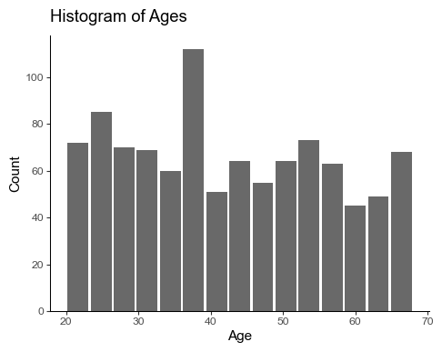
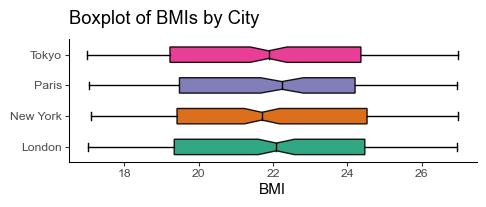
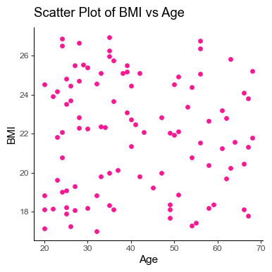
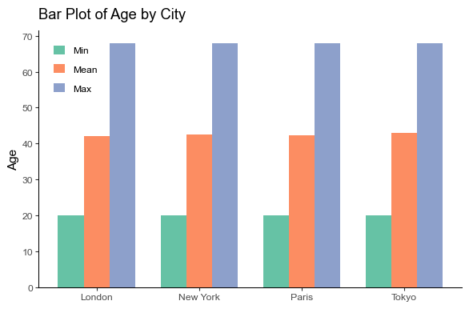

# Data Mastery: Polars Unpacked

## Introduction

Welcome to the realm of [Polars](https://www.pola.rs/) — a fast DataFrame library in Python designed for large datasets. Inspired by pandas, Polars takes it up a notch by offering a more memory-efficient and faster performance, thanks to its implementation in the Rust programming language.

Polars can handle large datasets effortlessly and delivers computations at a lightning-fast speed without the need to load everything in memory. Plus, leveraging [Apache Arrow](https://arrow.apache.org/) to execute vectorized operations gives it an extra edge for high performance.

Apart from its performance prowess, Polars boasts an intuitive API that aligns closely with what you’re familiar within pandas, promising an easy transition.

This article will take you on a journey to unlock the full potential of Polars through a hands-on tutorial on Exploratory Data Analysis. Let’s begin!

## Setting Up Your Environment

First off, you need a Python environment (version 3.7 or above) and pip (the Python package installer).

Installing Polars is as simple as typing out this command in your terminal:

```bash title="Shell"
pip install polars
```

To verify whether the installation was successful, execute the following:

```python title="Python" showLineNumbers
import polars as pl

print(pl.__version__)
```

```
'0.19.3'
```

The full setup for this tutorial is as the following:

```bash title="Shell"
pip install polars matplotlib
```

```python title="Python" showLineNumbers
import random
import string

import matplotlib.pyplot as plt

import polars as pl


SEED = 777  # for reproducibility
plt.style.use("ggplot_classic.mplstyle")  # a custom plot style
```

No error? You’re ready to take advantage of the speedy and efficient data analysis capabilities of Polars.

In the next section, we’ll dive into loading and inspecting data. Stay tuned!

## Loading and Inspecting Your Data

Polars flexes its muscles when dealing with sizable data. For the purposes of this tutorial, since we want to focus on Polars and its features rather than get lost in the complexities of data, let’s create our own synthetic dataset of 1,000,000 records. This dataset will stimulate the challenges of dealing with large data in a controlled fashion.

### Creating a Synthetic Dataset

Creating synthetic dataset helps us simulate real-world scenarios in a manageable and controlled manner. Here’s how you can create a synthetic dataset of 1,000,000 records using Polars:

```python title="Python" showLineNumbers
# Defining the size of our dataset
size = 1000000

# Setting the seed for reproducibility
random.seed(SEED)

# Creating a DataFrame
age = random.choices(range(20, 40), k=size // 2) + random.choices(
    range(40, 71), k=size - size // 2
)
city = random.choices(
    ["New York", "London", "Paris", "Tokyo"],
    weights=[1.0, 0.9, 0.3, 1.5],
    k=size,
)
is_married = random.choices([True, False], weights=[1.0, 1.5], k=size)
bmi = [round(random.uniform(17.0, 27.0), 2) for _ in range(size)]

df = pl.DataFrame(
    {"age": age, "city": city, "is_married": is_married, "bmi": bmi}
)
```

This code will generate a synthetic dataset, `df`, consisting of four variables `age`, `city`, `is_married`, and `bmi`, each with 1,000,000 records. `pl.DataFrame` is used to create a DataFrame, same as we do in pandas, only much faster with larger datasets!

### Inspecting Your Data

Once our dataset is ready, it’s time to take a glimpse at our data. Polars supports similar functions to pandas for displaying and summarizing the data:

- **Head of the DataFrame:** View the first few records of DataFrame:

  ```python title="Python" showLineNumbers
  df.head()
  ```

  ```rust
  shape: (5, 4)
  ┌─────┬──────────┬────────────┬───────┐
  │ age ┆ city     ┆ is_married ┆ bmi   │
  │ --- ┆ ---      ┆ ---        ┆ ---   │
  │ i64 ┆ str      ┆ bool       ┆ f64   │
  ╞═════╪══════════╪════════════╪═══════╡
  │ 24  ┆ New York ┆ true       ┆ 21.84 │
  │ 28  ┆ Tokyo    ┆ false      ┆ 24.37 │
  │ 27  ┆ Tokyo    ┆ false      ┆ 20.84 │
  │ 25  ┆ London   ┆ true       ┆ 24.02 │
  │ 26  ┆ Paris    ┆ true       ┆ 25.41 │
  └─────┴──────────┴────────────┴───────┘
  ```

- **Summary Statistics:** Get a quick statistical overview of your data:

  ```python title="Python" showLineNumbers
  df.describe()
  ```

  ```rust
  shape: (9, 5)
  ┌────────────┬───────────┬─────────┬────────────┬───────────┐
  │ describe   ┆ age       ┆ city    ┆ is_married ┆ bmi       │
  │ ---        ┆ ---       ┆ ---     ┆ ---        ┆ ---       │
  │ str        ┆ f64       ┆ str     ┆ f64        ┆ f64       │
  ╞════════════╪═══════════╪═════════╪════════════╪═══════════╡
  │ count      ┆ 1e6       ┆ 1000000 ┆ 1e6        ┆ 1e6       │
  │ null_count ┆ 0.0       ┆ 0       ┆ 0.0        ┆ 0.0       │
  │ mean       ┆ 42.258076 ┆ null    ┆ 0.399538   ┆ 21.998547 │
  │ std        ┆ 14.804733 ┆ null    ┆ 0.489804   ┆ 2.88818   │
  │ min        ┆ 20.0      ┆ London  ┆ 0.0        ┆ 17.0      │
  │ 25%        ┆ 30.0      ┆ null    ┆ null       ┆ 19.5      │
  │ 50%        ┆ 40.0      ┆ null    ┆ null       ┆ 22.0      │
  │ 75%        ┆ 55.0      ┆ null    ┆ null       ┆ 24.5      │
  │ max        ┆ 70.0      ┆ Tokyo   ┆ 1.0        ┆ 27.0      │
  └────────────┴───────────┴─────────┴────────────┴───────────┘
  ```

With Polars, loading and inspecting data is as easy and intuitive as it has been with pandas, only more efficient with larger datasets.

In the next section, we will dive into data cleaning. Stay tuned!

## Data Cleaning and Preprocessing

Data in the real world is famously _messy_. From mistyped entries and missing values to duplicates that could skew our analysis, we need to employ various strategies data cleaning and preprocessing before our data is ready for analysis.

### Missing Values

Missing data is a common problem in real-world data sets, let’s create some missing data and then manage them.

First, include some null records:

```python title="Python" showLineNumbers
# Create some missing data
df = df.with_columns(
    pl.when(pl.col("age") > 68)
    .then(None)
    .otherwise(pl.col("bmi"))
    .alias("bmi")
)
```

With the code above, we’ve created a situation where whenever `age` is over 68, corresponding `bmi` becomes null to simulate missing data. Let’s see how Polars handles null values:

- **Finding Missing Values:** We can use `df.null_count()` to see the total missing values for each column. A big advantage of Polars over pandas is that operations remain _lazy_ until evaluated and computations are vectorised with Apache Arrow, making operations such as this faster for large datasets!

  ```rust
  shape: (1, 4)
  ┌─────┬──────┬────────────┬───────┐
  │ age ┆ city ┆ is_married ┆ bmi   │
  │ --- ┆ ---  ┆ ---        ┆ ---   │
  │ u32 ┆ u32  ┆ u32        ┆ u32   │
  ╞═════╪══════╪════════════╪═══════╡
  │ 0   ┆ 0    ┆ 0          ┆ 32143 │
  └─────┴──────┴────────────┴───────┘
  ```

- **Imputing Missing Values:** For imputing missing values in the `bmi` column, we can use the following command. It replaces any occurrence of null with the _median_ of the column `bmi`.

  ```python title="Python" showLineNumbers
  df = df.with_columns(pl.col("bmi").fill_null(pl.median("bmi")))
  ```

- **Dropping Missing Values:** If we want to remove all rows with missing values, we may do so using `df.drop_nulls()`.

### Data Type Conversion

Converting data types is a common necessity in preprocessing. Polars provides an easy way to change the data type of a column:

```python title="Python" showLineNumbers
df.select(pl.col("bmi").cast(pl.Int32)).head()
```

```rust
shape: (5, 1)
┌─────┐
│ bmi │
│ --- │
│ i32 │
╞═════╡
│ 21  │
│ 24  │
│ 20  │
│ 24  │
│ 25  │
└─────┘
```

The code above will convert `bmi` column to integer data type.

### Creating New Columns

Creating new features or columns based on existing ones could improve our analysis. With Polars, you can add a new column like so:

```python title="Python" showLineNumbers
df.with_columns((pl.col("age") * 12).alias("age_in_months")).head()
```

```rust
shape: (5, 5)
┌─────┬──────────┬────────────┬───────┬───────────────┐
│ age ┆ city     ┆ is_married ┆ bmi   ┆ age_in_months │
│ --- ┆ ---      ┆ ---        ┆ ---   ┆ ---           │
│ i64 ┆ str      ┆ bool       ┆ f64   ┆ i64           │
╞═════╪══════════╪════════════╪═══════╪═══════════════╡
│ 24  ┆ New York ┆ true       ┆ 21.84 ┆ 288           │
│ 28  ┆ Tokyo    ┆ false      ┆ 24.37 ┆ 336           │
│ 27  ┆ Tokyo    ┆ false      ┆ 20.84 ┆ 324           │
│ 25  ┆ London   ┆ true       ┆ 24.02 ┆ 300           │
│ 26  ┆ Paris    ┆ true       ┆ 25.41 ┆ 312           │
└─────┴──────────┴────────────┴───────┴───────────────┘
```

This code generates a new column called `age_in_months` which is `age` column multiplied by 12.

### Removing Duplicates

Removing duplicate entries is crucial for maintaining accuracy. It’s as simple as calling `df.unique()`.

```python title="Python" showLineNumbers
df = df.unique()
```

And voila, your data is clean and ready for some action! In the next section, we’ll take a look at how to do data visualization. Keep following!

## Data Visualization

While Polars does not have its own library for data visualization, it’s fully compatible with popular Python libraries for creating plots and charts. We will use Matplotlib, that is one of the most popular libraries for creating data visualizations in Python.

Now, let’s create some visualizations for a sample of our synthetic dataset:

```python title="Python" showLineNumbers
sample_df = df.sample(1000, seed=SEED)
```

### Histogram

To view the distribution of `age` in our dataset, we would use a Histogram.

```python title="Python" showLineNumbers
# Create a figure
plt.figure(figsize=(5, 4), layout="tight")

# Plot
plt.hist(sample_df["age"], bins=15, rwidth=0.9, color="dimgray")

# Add a title and axis labels
plt.title("Histogram of Ages")
plt.xlabel("Age")
plt.ylabel("Count")

# Show the plot
plt.show()
```



### Box Plot

Box plots are great for visualizing the measure of dispersion and skewness in a dataset.

```python title="Python" showLineNumbers
# Create a figure
plt.figure(figsize=(5, 2.2), layout="tight")

# Plot
cities_list = sample_df["city"].unique().sort().to_list()

bplot = plt.boxplot(
    [sample_df.filter(pl.col("city") == ct)["bmi"] for ct in cities_list],
    notch=True,
    labels=cities_list,
    vert=False,
    widths=0.5,
    patch_artist=True,
)

for i, color in enumerate(plt.cm.Dark2.colors[: len(cities_list)]):
    bplot["boxes"][i].set(facecolor=color, alpha=0.9)
    bplot["medians"][i].set(color="black")

# Add a title and axis labels
plt.title("Boxplot of BMIs by City")
plt.xlabel("BMI")

# Show the plot
plt.show()
```



### Scatter Plot

Let’s create a scatter plot to visualize the relationship between `age` and `bmi` in our dataset.

```python title="Python" showLineNumbers
# Create a figure
plt.figure(figsize=(4, 4), layout="tight")

# Plot
plt.scatter(
    sample_df["age"][:100], sample_df["bmi"][:100], color="deeppink", s=15
)

# Add a title and axis labels
plt.title("Scatter Plot of BMI vs Age")
plt.xlabel("Age")
plt.ylabel("BMI")

# Show the plot
plt.show()
```



### Bar Chart

To understand the distribution of `age` data by `city`, we can create a bar chart:

```python title="Python" showLineNumbers
# Create a figure
plt.figure(figsize=(6, 4), layout="tight")

# Plot
grouped_df = (
    sample_df.group_by("city")
    .agg(
        pl.col("age").min().alias("min_age"),
        pl.col("age").mean().alias("mean_age"),
        pl.col("age").max().alias("max_age"),
    )
    .sort("city")
)

cities_list = grouped_df["city"].to_list()

bar_width = 0.25
_width = [-bar_width, 0, bar_width]
_column = ["min_age", "mean_age", "max_age"]
_label = ["Min", "Mean", "Max"]

for i, (width, column, label) in enumerate(zip(_width, _column, _label)):
    plt.bar(
        [x + width for x in range(len(cities_list))],
        grouped_df[column],
        width=bar_width,
        label=label,
        color=plt.cm.Set2.colors[i],
    )

# Add a title and axis labels
plt.xticks(range(len(cities_list)), cities_list)
plt.title("Bar Plot of Age by City")
plt.ylabel("Age")
plt.legend(loc="upper left")

# Show the plot
plt.show()
```



These visuals should help illustrate insights in our dataset. As you can see, the integration of Polars with visual libraries such as Matplotlib makes exploratory data analysis a breeze. However, plots and visuals are just the tip of the Exploratory Data Analysis iceberg. Let’s now move on to the next section where we discuss descriptive statistics and insights in more detail. Ready? Let’s go!

## Descriptive Statistics and Insights

Descriptive statistics reduce lots of data into simpler summaries, providing us with a comprehensive snapshot of our data. They describe the mass tendencies of our data and how they deviate from the norm.

### Mean

Let’s start by calculating the mean of `age`. The mean gives us the average value and is a good measure of the dataset’s center.

```python title="Python" showLineNumbers
df["age"].mean()
```

```
43.34
```

### Median

The median is the “middle value” or midpoint in your data and can be more informative than the mean when your data is _skewed_.

```python title="Python" showLineNumbers
df["age"].median()
```

```
43.0
```

### Standard Deviation

The standard deviation tells us the spread of our data from the center, i.e., how much, on average, each value differs from the mean.

```python title="Python" showLineNumbers
df["age"].std()
```

```
14.20
```

### Correlation

Finally, one important aspect of data that we often look at in our exploratory data analysis is the correlation coefficient between variables.

```python title="Python" showLineNumbers
df.select(pl.corr("age", "bmi").alias("correlation"))
```

```rust
shape: (1, 1)
┌─────────────┐
│ correlation │
│ ---         │
│ f64         │
╞═════════════╡
│ 0.000631    │
└─────────────┘
```

The correlation coefficient measures the strength and direction of the linear relationship between the variables.

We’ve now unearthed the basics of Polars and its applications in data exploration. In the next section, we’ll dive deeper into some advanced EDA techniques. Stick around!

## Advanced EDA Techniques

Polars enables us to go beyond basic descriptive statistics to implement a variety of advanced EDA techniques, facilitating comprehensive data investigations to generate deeper insights.

### Grouping Data

Group by operation helps to segment the data into groups, making it easier to analyze patterns across different categories.

```python title="Python" showLineNumbers
df.group_by("city").agg(
    [
        pl.col("age").mean().alias("average_age"),
        pl.col("bmi").median().alias("median_bmi"),
    ]
)
```

```rust
shape: (4, 3)
┌──────────┬─────────────┬────────────┐
│ city     ┆ average_age ┆ median_bmi │
│ ---      ┆ ---         ┆ ---        │
│ str      ┆ f64         ┆ f64        │
╞══════════╪═════════════╪════════════╡
│ Paris    ┆ 42.299786   ┆ 22.0       │
│ New York ┆ 43.479802   ┆ 22.0       │
│ Tokyo    ┆ 43.775188   ┆ 22.0       │
│ London   ┆ 43.368799   ┆ 22.01      │
└──────────┴─────────────┴────────────┘
```

Here we’re examining the average age and median BMI for every city in our data.

### Apply Custom Functions

With Polars you can apply your own custom functions to each value in the DataFrame’s column.

```python title="Python" showLineNumbers
def age_group(age):
    if age < 30:
        return "Young"
    elif age < 60:
        return "Adult"
    else:
        return "Senior"


df.with_columns(
    pl.col("age").map_elements(age_group).alias("age_group")
).head()
```

```rust
shape: (5, 5)
┌─────┬──────────┬────────────┬───────┬───────────┐
│ age ┆ city     ┆ is_married ┆ bmi   ┆ age_group │
│ --- ┆ ---      ┆ ---        ┆ ---   ┆ ---       │
│ i64 ┆ str      ┆ bool       ┆ f64   ┆ str       │
╞═════╪══════════╪════════════╪═══════╪═══════════╡
│ 28  ┆ Tokyo    ┆ false      ┆ 24.37 ┆ Young     │
│ 35  ┆ Paris    ┆ false      ┆ 24.47 ┆ Adult     │
│ 33  ┆ Tokyo    ┆ true       ┆ 19.55 ┆ Adult     │
│ 26  ┆ Tokyo    ┆ false      ┆ 19.3  ┆ Young     │
│ 24  ┆ New York ┆ true       ┆ 23.99 ┆ Young     │
└─────┴──────────┴────────────┴───────┴───────────┘
```

Here, we have built a new categorical variable indicating the age group of each individual.

### Pivot Tables

Pivot tables can be used to restructure the data, which can provide us with a different perspective of our data.

```python title="Python" showLineNumbers
df.pivot(
    index="is_married",
    columns="city",
    values="bmi",
    aggregate_function="mean",
)
```

```rust
shape: (2, 5)
┌────────────┬───────────┬───────────┬───────────┬───────────┐
│ is_married ┆ Tokyo     ┆ Paris     ┆ New York  ┆ London    │
│ ---        ┆ ---       ┆ ---       ┆ ---       ┆ ---       │
│ bool       ┆ f64       ┆ f64       ┆ f64       ┆ f64       │
╞════════════╪═══════════╪═══════════╪═══════════╪═══════════╡
│ false      ┆ 21.999371 ┆ 21.985739 ┆ 22.002251 ┆ 22.001244 │
│ true       ┆ 21.999968 ┆ 22.019422 ┆ 21.992436 ┆ 22.003721 │
└────────────┴───────────┴───────────┴───────────┴───────────┘
```

In this case, we have created a pivot table to inspect the average BMI for each city and for groups of married and not married individuals.

Employing advanced EDA techniques allows us to understand the data from different perspectives, enabling us to extract in-depth actionable insights from our data.

Let’s now draw the curtains by discussing some conclusions and next steps in the last section.

## Conclusion and Next Steps

Our journey so far has been enriching, and we have explored numerous facets of the versatile Polars library. From setting up the environment to performing Exploratory Data Analysis (EDA), Polars has proven to be an impeccable ally at every step.

The simplicity of its API, coupled with its unrivalled performance with large datasets, makes Polars a library to watch out for in large data handling in Python. As we have seen, Polars brings together the best of both worlds, by offering the ease of using Pandas or Spark and the performance of data-centric languages like Rust and Apache Arrow and does so beautifully.

However, as is true with all journeys, our exploration doesn’t end here. Here are some fruitful directions that you can venture into in your next steps with Polars:

- Dive deeper into library’s documentation to explore more functions and capabilities.
- Employ Polars to your existing data science projects and witness the change in performance.
- Explore the interoperability of Polars with various Machine Learning Libraries.
- Participate in kaggle competitions using Polars and see where you stand.

The nexus of data science is evolving, and Polars is one such gem that’s adding a vibrant hue to this landscape. The library is continually being improved and updated, and many new features and enhancements are in the pipeline.

Always remember, in data science, the *greatest teacher is experience*. So, keep exploring and keep experimenting. And most importantly, enjoy the journey as much as the destination. After all, that’s what exploratory data analysis is all about!

Happy analyzing with Polars!
