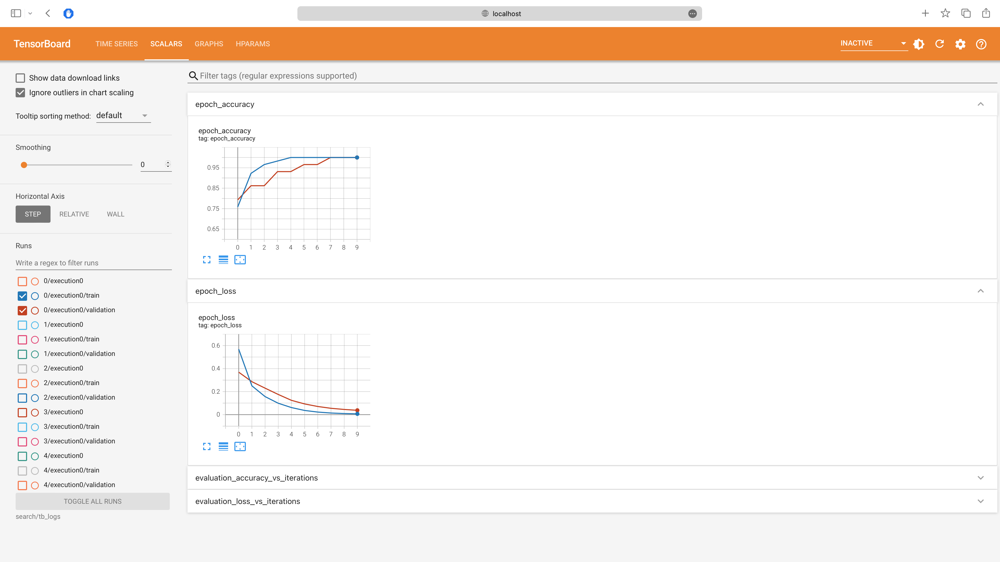
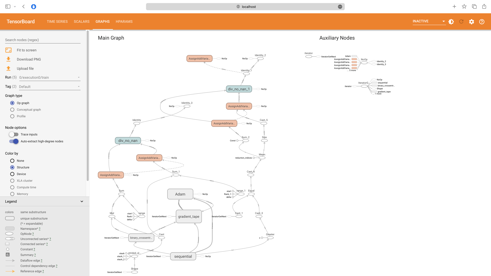
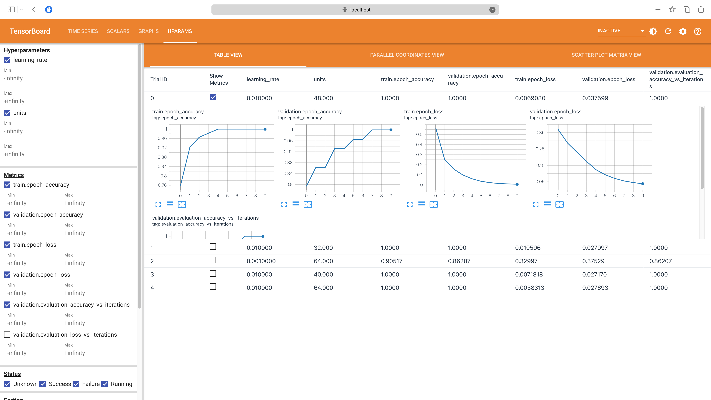
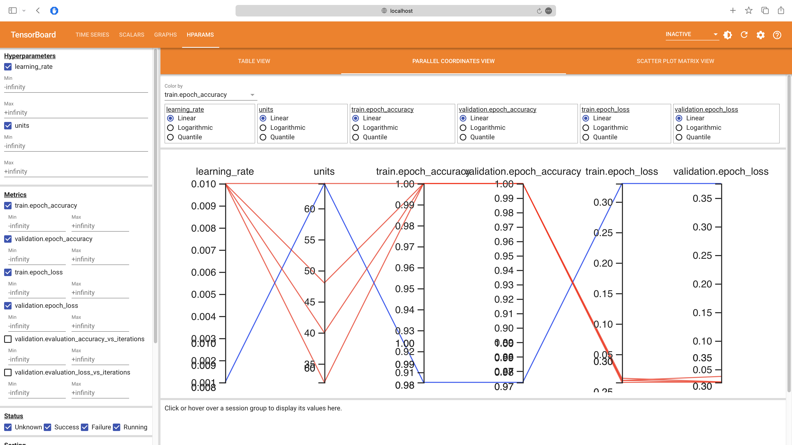
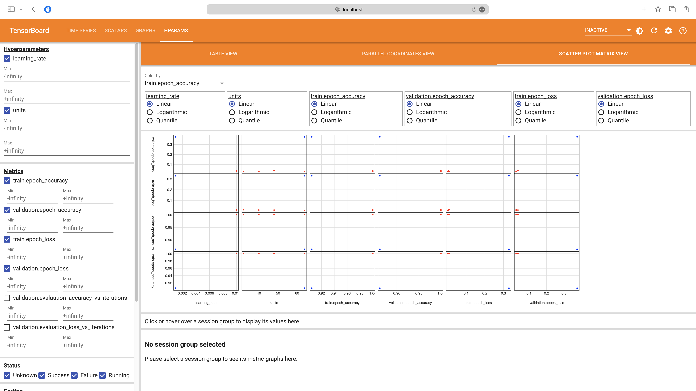

# kerasTuner

Hello, fellow data enthusiasts! Today, we're going to embark on an exciting journey through the world of hyperparameters in machine learning. If you're like me, you probably love the thrill of building a machine learning model and watching it learn and improve. But have you ever wondered how we can make our models even better? The secret sauce lies in the science of hyperparameter tuning.

## Introduction

Hyperparameter tuning is a crucial step in building effective machine learning models. Hyperparameters are parameters whose values are set before the learning process begins, unlike model parameters which are learned during training. Examples include learning rate and number of layers in a neural network.

Tuning these hyperparameters can significantly affect the learning process and the performance of the final model. A well-tuned model can learn more efficiently, generalize better to unseen data, and provide more accurate predictions.

However, finding the optimal hyperparameters is not a straightforward task. It involves searching a potentially large space of hyperparameters, which can be computationally expensive and time-consuming. This is where hyperparameter tuning tools, such as KerasTuner, come in. They automate and optimize the search process, making it easier to find the best hyperparameters for your model.

## Getting KerasTuner Up and Running

KerasTuner is a Python library for hyperparameter tuning. It's designed to work seamlessly with Keras, a popular high-level neural networks API and a front-runner in the machine learning world.

KerasTuner offers several methods to tune the hyperparameters, such as Random Search, Hyperband, and Bayesian Optimization. These methods provide a systematic and efficient way to explore the best hyperparameters for your model. For now, let's focus on getting KerasTuner installed on your machine.

Open up your terminal or command prompt and type the following command:

```bash title="Shell"
pip install keras-tuner
```

Voila! Now, let's verify that everything is installed correctly. You can do this by trying to import KerasTuner in a Python script or notebook:

```python title="Python"
import keras_tuner
```

If you don't see any error messages, congratulations! You've successfully installed KerasTuner and are ready to embark on your hyperparameter tuning journey.

## Using KerasTuner on a Classification Problem

Now that we have KerasTuner installed and ready to go, let's dive into a practical example. We'll be working on a classification problem using a tabular dataset. Our goal is to predict a binary outcome based on a set of features. This is a common task in machine learning, so understanding how to tune hyperparameters for this type of problem will be very useful.

For our example, we'll use the famous Titanic dataset from Kaggle. This dataset contains information about the passengers on the Titanic, including their age, sex, passenger class, and whether or not they survived the sinking of the ship.

### Import Libraries

First, let's setup additional libraries we'll need for this example:

```bash title="Shell"
pip install -q tensorflow pandas scikit-learn seaborn
```

```python title="Python"
import pandas as pd
import seaborn as sns

from sklearn.model_selection import train_test_split
from sklearn.preprocessing import StandardScaler

from tensorflow import keras

import keras_tuner


# Set random seed for reproducibility
SEED = 42
```

### Load and Preprocess the Data

Then, let's load our data and do some basic preprocessing:

```python title="Python"
# Load the data
data = sns.load_dataset("titanic")

# Preprocess the data
data = data.dropna()  # remove rows with missing values
data = pd.get_dummies(data)  # convert categorical variables to dummy variables

# Split into features and target
X = data.drop("survived", axis=1)
y = data["survived"]

# Standardize the features
scaler = StandardScaler()
X = scaler.fit_transform(X)

# Split into training and test sets
X_train, X_test, y_train, y_test = train_test_split(
    X, y, test_size=0.2, random_state=SEED
)
```

### Building the Model

Now, let's define our model-building function. This function will create a Keras model and is where we specify the hyperparameters we want to tune. For this example, we'll tune the number of units in the first hidden layer and the learning rate:

```python title="Python"
def build_model(hp: keras_tuner.HyperParameters):
    model = keras.Sequential()

    # Tune the number of units in the first Dense layer
    # Choose an optimal value between 8-64
    hp_units = hp.Int("units", min_value=8, max_value=64, step=8)

    model.add(keras.layers.Dense(units=hp_units, activation="relu"))
    model.add(keras.layers.Dense(1, activation="sigmoid"))

    # Tune the learning rate for the optimizer
    # Choose an optimal value from 0.01, 0.001, or 0.0001
    hp_learning_rate = hp.Choice("learning_rate", values=[1e-2, 1e-3, 1e-4])

    model.compile(
        optimizer=keras.optimizers.Adam(learning_rate=hp_learning_rate),
        loss=keras.losses.BinaryCrossentropy(from_logits=True),
        metrics=["accuracy"],
    )

    return model
```

In this function, we use the `HyperParameters` object from KerasTuner to define our hyperparameters. The `Int` method is used to specify a range of integer values, and the `Choice` method is used to specify a list of discrete values.

### Defining the Tuner

With our model-building function defined, we're now ready to start the hyperparameter search. For this, we'll use the `BayesianOptimization` tuner provided by KerasTuner. This tuner uses Bayesian optimization with an underlying Gaussian process model to select combinations of hyperparameters to train the model and keeps the best performing ones.

Let's see how to set it up:

```python title="Python"
tuner = keras_tuner.BayesianOptimization(
    build_model,
    objective="val_accuracy",
    max_trials=5,
    seed=SEED,
    max_retries_per_trial=3,
    directory="random_search",
    project_name="titanic",
    overwrite=True,
)

# Summary of the search space
tuner.search_space_summary()
```

In the `BayesianOptimization` constructor, we pass our `build_model` function, specify our objective (in this case, we want to maximize validation accuracy), and set the number of trials and retries per trial. The `max_trials` parameter determines the number of different combinations to try. The `directory` and `project_name` parameters are used to specify where the results of the hyperparameter search will be saved.

```
Search space summary
Default search space size: 2
units (Int)
{'default': None, 'conditions': [], 'min_value': 8, 'max_value': 64, 'step': 8, 'sampling': 'linear'}
learning_rate (Choice)
{'default': 0.01, 'conditions': [], 'values': [0.01, 0.001, 0.0001], 'ordered': True}
```

### Hyperparameter Search

The `search` method is then used to perform the hyperparameter search. We pass our training data and labels, specify the number of epochs to train for, and set aside 20% of the training data for validation. We also use the `TensorBoard` callback to log the results of the search.

```python title="Python"
tuner.search(
    X_train,
    y_train,
    epochs=10,
    validation_split=0.2,
    callbacks=[keras.callbacks.TensorBoard("./random_search/tb_logs")],
)
```

```
Trial 5 Complete [00h 00m 01s]
val_accuracy: 1.0

Best val_accuracy So Far: 1.0
Total elapsed time: 00h 00m 03s
```

### Best Model

Once the search is complete, we can retrieve the best hyperparameters and use them to build our final model:

```python title="Python"
# Get the best model
best_model = tuner.get_best_models(num_models=1)[0]
best_model.build(X_train.shape)

# Summary of the best model
best_model.summary()
```

The `get_best_models` method is used to retrieve the best models from the search.

```
Model: "sequential"
_________________________________________________________________
 Layer (type)                Output Shape              Param #
=================================================================
 dense (Dense)               (145, 48)                 1488

 dense_1 (Dense)             (145, 1)                  49

=================================================================
Total params: 1537 (6.00 KB)
Trainable params: 1537 (6.00 KB)
Non-trainable params: 0 (0.00 Byte)
_________________________________________________________________
```

### Summary of Search Results

Then, we can use the `results_summary` method to get a summary of the results from the hyperparameter search. Note that the results are sorted by the objective value, which in our case is validation accuracy.

```python title="Python"
tuner.results_summary()
```

```
Results summary
Results in search/titanic
Showing 10 best trials
Objective(name="val_accuracy", direction="max")

Trial 0 summary
Hyperparameters:
units: 48
learning_rate: 0.01
Score: 1.0

Trial 1 summary
Hyperparameters:
units: 32
learning_rate: 0.01
Score: 1.0

Trial 3 summary
Hyperparameters:
units: 40
learning_rate: 0.01
Score: 1.0

Trial 4 summary
Hyperparameters:
units: 64
learning_rate: 0.01
Score: 1.0

Trial 2 summary
Hyperparameters:
units: 64
learning_rate: 0.001
Score: 0.8620689511299133
```

### Evaluation

Finally, we can evaluate our best model on the test data:

```python title="Python"
# Evaluate the model on the test data
score = best_model.evaluate(X_test, y_test, verbose=0)

print("Test loss:", score[0])
print("Test accuracy:", score[1])
```

```
Test loss: 0.10603184998035431
Test accuracy: 0.9729729890823364
```

### Analysing the Results

TensorBoard is a powerful tool provided by TensorFlow for visualizing and analyzing machine learning experiments. It can be particularly useful for analyzing the results of hyperparameter tuning with KerasTuner.

To launch TensorBoard, open up your terminal or command prompt and type the following command:

```bash title="Shell"
tensorboard --logdir search/tb_logs
```

Then, open up your browser and go to http://localhost:6006.

You can view the loss and metrics for each trial. In the screenshot below, we can see the train and validation loss and accuracy for the first trial:



You can also view the computation graph for each trial. The computation graph for the first trial is shown below:



There is also an `HPARAMS` tab that allows you to compare the performance of different hyperparameters:







## Pro Tips for Mastering KerasTuner

By following the tips bellow, you can master KerasTuner and use it to build high-performing models:

1. **Define a Wide Range of Hyperparameters**: When defining your hyperparameters, try to cover a wide range of possible values. This will give the tuner more freedom to explore and find the best values. However, be careful not to define too wide a range, as this can make the search space too large and the search process inefficient.

2. **Choose the Right Tuner**: KerasTuner offers several tuners, each with its own strengths and weaknesses. RandomSearch is a good starting point because it's simple and efficient. If you have more time and computational resources, consider using Hyperband, which is based on the state-of-the-art Hyperband algorithm. If you have prior knowledge about the distribution of good hyperparameters, consider using BayesianOptimization.

3. **Use Early Stopping**: Early stopping is a technique where the training process is stopped when the model's performance on a validation set stops improving. This can save a lot of time and computational resources. KerasTuner integrates well with the EarlyStopping callback from Keras.

4. **Parallelize the Search**: If you have access to multiple GPUs or a distributed computing system, you can parallelize the hyperparameter search to make it faster. KerasTuner supports distributed tuning.

5. **Analyze the Results**: After the hyperparameter search, take the time to analyze the results. This can give you insights into the problem and the performance of your model. For example, you can plot the distribution of scores for different hyperparameters to see how they affect the performance. You can use TensorBoard for a more interactive analysis.

6. **Retrain the Best Model**: After the hyperparameter search, retrain the best model on the entire training set (including the validation set) for the optimal number of epochs. This can give the model a small performance boost.

7. **Keep Experimenting**: Don't be afraid to experiment with different hyperparameters, tuners, and tuning strategies.
