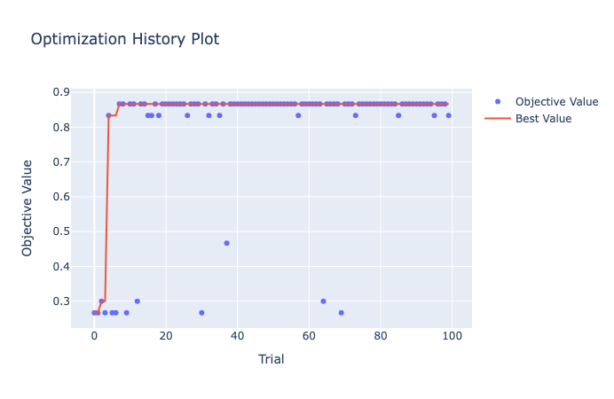
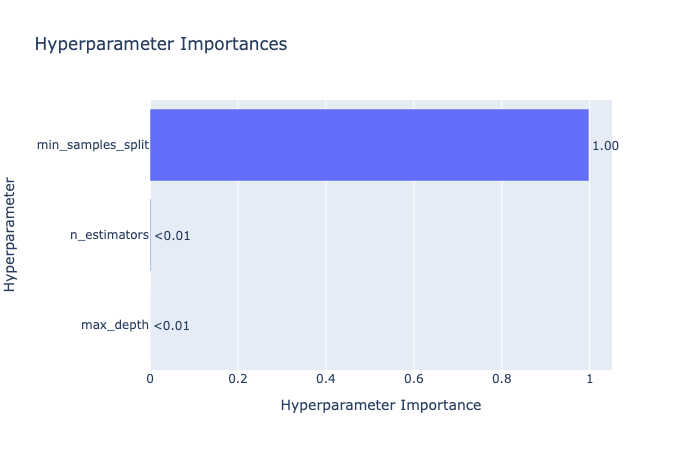
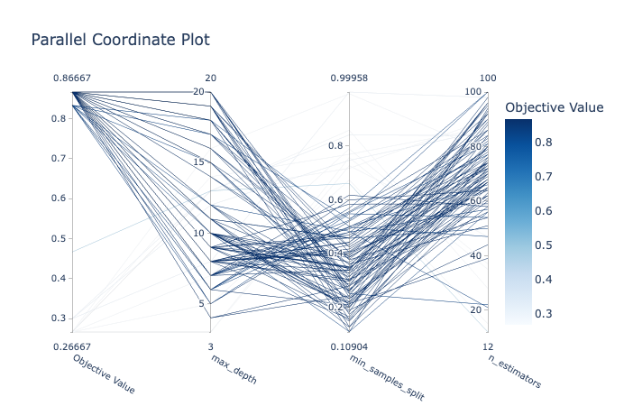
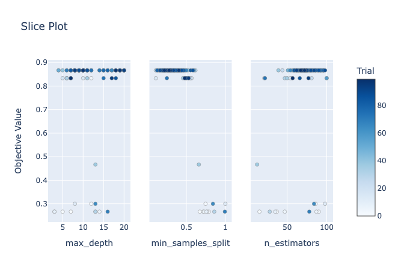

# Optuna

In this hands-on tutorial, we'll dive deep into the fascinating world of hyperparameter optimization using Optuna, a powerful Python library. Buckle up, because we're about to embark on a journey that will elevate your machine learning models to new heights!

## Introduction

What exactly are hyperparameters, and why should you care? Let's unravel this mystery.

### What Are Hyperparameters?

Think of hyperparameters as the knobs and switches on your model's control panel. They don't get learned during training (unlike model weights), but they significantly impact your model's performance. Examples include learning rates, batch sizes, regularization strengths, and the number of hidden layers in a neural network.

### The Impact of Hyperparameters

Imagine you're baking a cake. The ingredients (data) are essential, but how long you bake it (hyperparameters) determines whether it's a fluffy masterpiece or a burnt disaster. Similarly, choosing the right hyperparameters can make or break your model's accuracy, convergence speed, and generalization ability.

### Why Optuna?

Now, let's talk about Optuna! This Python library intelligently explores the hyperparameter space, finds the sweet spots, and optimizes your model with minimal effort.

## Setting Up Your Environment

Let's roll up our sleeves and get our environment ready for some hyperparameter magic.

### Installing Optuna and dependencies

First things first, let's install Optuna. Open your terminal (or Anaconda prompt) and type:

```bash title="Shell"
pip install optuna
```

### Importing Necessary Libraries

Next, fire up your favorite Python IDE (mine's VS Code). Import the following libraries:

```python title="Python"
import optuna
from sklearn.datasets import load_iris
from sklearn.model_selection import train_test_split
from sklearn.ensemble import RandomForestClassifier
from sklearn.metrics import accuracy_score

SEED = 77
```

### Loading Your Dataset

For this tutorial, we'll use a classic dataset - the Iris dataset. It teaches us about flower species. If you don't have it already, fetch it using:

```python title="Python"
iris = load_iris()
X, y = iris.data, iris.target
```

Now you're all set! Your environment is primed, and the data is at your fingertips.

## Defining Your Objective Function

Welcome to the heart of hyperparameter optimization! Here, we'll craft the function we want to optimize.

### Crafting the Objective Function

Our objective function takes hyperparameters as inputs and returns a score (or loss) that we want to minimize or maximize. For example, in a classification task, it could be the cross-entropy loss or accuracy.

Let's say we're training a random forest classifier on the Iris dataset. Our training and test dataset looks like this:

```python title="Python"
X_train, X_val, y_train, y_val = train_test_split(
    X, y, test_size=0.2, random_state=SEED
)

# The first 3 elements
print(f"X_train:\n{X_train[:3]}...\n")
print(f"y_train:\n{y_train[:3]}...\n")
print(f"X_val:\n{X_val[:3]}...\n")
print(f"y_val:\n{y_val[:3]}...\n")
```

```
X_train:
[[6.3 2.5 4.9 1.5]
 [7.2 3.  5.8 1.6]
 [5.3 3.7 1.5 0.2]]...

y_train:
[1 2 0]...

X_val:
[[5.8 2.7 3.9 1.2]
 [6.3 2.8 5.1 1.5]
 [5.7 2.5 5.  2. ]]...

y_val:
[1 2 2]...
```

Our objective function might look like this:

```python title="Python"
def objective(trial):
    # Hyperparameters to optimize
    n_estimators = trial.suggest_int("n_estimators", 10, 100)
    max_depth = trial.suggest_int("max_depth", 3, 20)
    min_samples_split = trial.suggest_float("min_samples_split", 0.1, 1.0)
    
    # Create and train the model
    model = RandomForestClassifier(
        n_estimators=n_estimators,
        max_depth=max_depth,
        min_samples_split=min_samples_split,
        random_state=SEED
    )
    model.fit(X_train, y_train)
    
    # Evaluate on validation set
    val_preds = model.predict(X_val)
    val_accuracy = accuracy_score(y_val, val_preds)
    
    # Our goal: maximize accuracy!
    return val_accuracy
```

### The Magic of Optuna's study Object

Now, let's summon the Optuna study! This object orchestrates our optimization process. It explores the hyperparameter space, evaluates our objective function, and guides us toward the best configuration.

```python title="Python"
study = optuna.create_study(direction="maximize")  # Maximize accuracy
```

## Exploring Search Spaces

In this section, we'll delve into different search spaces, where each dimension represents a hyperparameter, and each point holds the promise of better model performance.

### Continuous vs. Discrete Hyperparameters

Imagine our search space as a cosmic playground. Some hyperparameters roam freely in continuous realms, while others hop discretely from one value to another. Let's break it down:

1. **Continuous Hyperparameters:** These are real-valued and infinite. Examples include learning rates, dropout probabilities, and weight decay coefficients. Optuna glides through these spaces, sampling points.
2. **Discrete Hyperparameters:** Think of these as integer-valued or categorical. Batch sizes, tree depths, and activation functions fall into this category.

### Customizing Your Search Space

You have the power to define your own search space. Set bounds, constraints, and explore the uncharted. Whether you're seeking optimal hyperparameters or performance, Optuna will guide you.

## Optimization Algorithms

In this section, we'll unveil the guides that navigate our hyperparameters pointing us toward optimal configurations.

### TPE (Tree-structured Parzen Estimator)

TPE balances exploration and exploitation. It narrows down the search space, focusing on promising regions.

```python title="Python"
study_tpe = optuna.create_study(
    direction="maximize", sampler=optuna.samplers.TPESampler()
)
```

### Random Search (Sometimes Simplicity Wins)

Random search explores unpredictably. While not as sophisticated as TPE, it surprises us with simplicity.

```python title="Python"
study_random = optuna.create_study(
    direction="maximize", sampler=optuna.samplers.RandomSampler()
)
```

## Trials, Trials, Trials!

In this section, we'll unleash our hyperparameter trials. Each trial is a chance to uncover hidden constellations of optimal configurations.

### Running Your Optimization Trials

Optuna orchestrates our trials, tweaking hyperparameters, training models, and evaluating their performance.

```python title="Python"
# Let the trials begin!
study.optimize(objective, n_trials=100)
```

```
[I 2024-02-12 11:56:10,802] A new study created in memory with name: no-name-8134c441-bdcf-452a-9ed5-ae0c8722c345
[I 2024-02-12 11:56:10,877] Trial 0 finished with value: 0.8666666666666667 and parameters: {'n_estimators': 65, 'max_depth': 12, 'min_samples_split': 0.3146680813827415}. Best is trial 0 with value: 0.8666666666666667.
[I 2024-02-12 11:56:10,968] Trial 1 finished with value: 0.3 and parameters: {'n_estimators': 93, 'max_depth': 11, 'min_samples_split': 0.7188358544224039}. Best is trial 0 with value: 0.8666666666666667.
[I 2024-02-12 11:56:11,068] Trial 2 finished with value: 0.8666666666666667 and parameters: {'n_estimators': 97, 'max_depth': 3, 'min_samples_split': 0.17517568716403698}. Best is trial 0 with value: 0.8666666666666667.
...
[I 2024-02-12 11:56:19,256] Trial 97 finished with value: 0.8666666666666667 and parameters: {'n_estimators': 97, 'max_depth': 8, 'min_samples_split': 0.284594211567275}. Best is trial 22 with value: 0.9.
[I 2024-02-12 11:56:19,332] Trial 98 finished with value: 0.8666666666666667 and parameters: {'n_estimators': 59, 'max_depth': 6, 'min_samples_split': 0.38599015615782106}. Best is trial 22 with value: 0.9.
[I 2024-02-12 11:56:19,405] Trial 99 finished with value: 0.8666666666666667 and parameters: {'n_estimators': 54, 'max_depth': 11, 'min_samples_split': 0.16165709051161997}. Best is trial 22 with value: 0.9.
```

```python title="Python"
# TPE
study_tpe.optimize(objective, n_trials=100)
```

```
[I 2024-02-12 11:50:04,668] A new study created in memory with name: no-name-406e0cce-60e6-4420-8aeb-82c4bef5c2a8
[I 2024-02-12 11:50:04,735] Trial 0 finished with value: 0.26666666666666666 and parameters: {'n_estimators': 37, 'max_depth': 7, 'min_samples_split': 0.7885613884209568}. Best is trial 0 with value: 0.26666666666666666.
[I 2024-02-12 11:50:04,754] Trial 1 finished with value: 0.26666666666666666 and parameters: {'n_estimators': 15, 'max_depth': 5, 'min_samples_split': 0.6731251336910595}. Best is trial 0 with value: 0.26666666666666666.
[I 2024-02-12 11:50:04,849] Trial 2 finished with value: 0.3 and parameters: {'n_estimators': 86, 'max_depth': 12, 'min_samples_split': 0.7460270374607401}. Best is trial 2 with value: 0.3.
...
[I 2024-02-12 11:50:13,359] Trial 97 finished with value: 0.8666666666666667 and parameters: {'n_estimators': 72, 'max_depth': 10, 'min_samples_split': 0.2193760150748684}. Best is trial 7 with value: 0.8666666666666667.
[I 2024-02-12 11:50:13,444] Trial 98 finished with value: 0.8666666666666667 and parameters: {'n_estimators': 67, 'max_depth': 18, 'min_samples_split': 0.27915755394957986}. Best is trial 7 with value: 0.8666666666666667.
[I 2024-02-12 11:50:13,518] Trial 99 finished with value: 0.8333333333333334 and parameters: {'n_estimators': 57, 'max_depth': 7, 'min_samples_split': 0.4796829947804756}. Best is trial 7 with value: 0.8666666666666667.
```

```python title="Python"
# Random search
study_random.optimize(objective, n_trials=100)
```

```
[I 2024-02-12 11:54:04,344] A new study created in memory with name: no-name-6a1f6b6b-86c3-480a-ae3b-ae341ab5fca1
[I 2024-02-12 11:54:04,370] Trial 0 finished with value: 0.8333333333333334 and parameters: {'n_estimators': 18, 'max_depth': 3, 'min_samples_split': 0.5323455027233865}. Best is trial 0 with value: 0.8333333333333334.
[I 2024-02-12 11:54:04,448] Trial 1 finished with value: 0.8333333333333334 and parameters: {'n_estimators': 75, 'max_depth': 7, 'min_samples_split': 0.5407936894092948}. Best is trial 0 with value: 0.8333333333333334.
[I 2024-02-12 11:54:04,499] Trial 2 finished with value: 0.8666666666666667 and parameters: {'n_estimators': 47, 'max_depth': 17, 'min_samples_split': 0.6854362685752783}. Best is trial 2 with value: 0.8666666666666667.
...
[I 2024-02-12 11:54:10,189] Trial 97 finished with value: 0.8666666666666667 and parameters: {'n_estimators': 86, 'max_depth': 5, 'min_samples_split': 0.17671758874989624}. Best is trial 62 with value: 0.9333333333333333.
[I 2024-02-12 11:54:10,242] Trial 98 finished with value: 0.8666666666666667 and parameters: {'n_estimators': 45, 'max_depth': 16, 'min_samples_split': 0.5891751430666154}. Best is trial 62 with value: 0.9333333333333333.
[I 2024-02-12 11:54:10,276] Trial 99 finished with value: 0.26666666666666666 and parameters: {'n_estimators': 30, 'max_depth': 10, 'min_samples_split': 0.9734243825309358}. Best is trial 62 with value: 0.9333333333333333.Stay Curious!
```

Our trials are like shooting arrows into the unknown. Some hit bullseyes, others graze distant planets. But with each trial, we inch closer to the optimal hyperparameters that unlock our model's potential.

## Visualizing Results

In this section, we'll create visualizations (for TPE study) that reveal the essence of our hyperparameter optimization journey.

### Tracking Progress

As our trials unfold, Optuna records their trajectories. You can visualize it using Optuna:

```python title="Python"
optuna.visualization.plot_optimization_history(study_tpe)
```




The plot reveals peaks, valleys, and the path to enlightenment.

### Plotting Hyperparameter Distributions

Imagine a canvas splashed with colors - each hue representing a hyperparameter. Optuna offers beautiful plots to visualize their distributions:

```python title="Python"
optuna.visualization.plot_param_importances(study_tpe)
```



This plot highlights the most influential hyperparameters.

### Scatter Plots, Parallel Coordinates, and More

Our data points dance across dimensions. Optuna's scatter plots and parallel coordinates reveal their choreography:

```python title="Python"
optuna.visualization.plot_parallel_coordinate(study_tpe)
```



```python title="Python"
optuna.visualization.plot_slice(study_tpe)
```



These visualizations connect the dots, showing how hyperparameters interact.

### Stay Curious, Fellow Starfarers!

Our visualizations are like telescopes - revealing patterns beyond raw numbers.

## Conclusion and Next Steps

As you navigate the hyperparameter space, experiment, iterate, and embrace uncertainty. There's no one-size-fits-all solution. Each dataset, each model, is a unique constellation waiting to be understood.

Our journey doesn't end here. Explore Bayesian optimization, ensemble methods, and multi-objective optimization. Remember, there's always more to discover.
