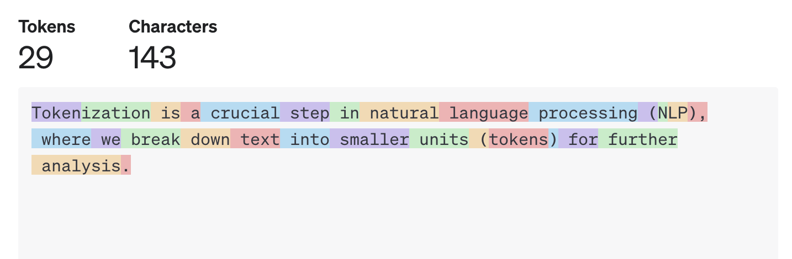

# Tokenization



Tokenization is a crucial step in natural language processing (NLP), where we break down text into smaller units (tokens) for further analysis. In this article, we’ll explore various tokenization techniques, their pros and cons, and practical tips for implementing them in Python.

## 1. Introduction to Tokenization

In this section, we'll explore the basics of tokenization, its importance for large language models (LLMs), and the difference between tokenization and word segmentation.

### What is Tokenization?

Tokenization is the process of breaking down a piece of text (usually a sentence or a document) into smaller units called **tokens**. These tokens can be words, subwords, or even characters. Why do we need tokenization? Well, imagine trying to analyze a long paragraph without breaking it down into meaningful chunks-it would be like trying to solve a jigsaw puzzle blindfolded!

### Why is Tokenization Essential for LLMs?

Large language models, such as BERT, GPT, and their variants, rely heavily on tokenization. Here's why:

1. **Input Representation**: LLMs process input text in the form of tokenized sequences. Each token corresponds to a position in the input.

2. **Fixed-Length Context**: LLMs have a fixed context window (e.g., 512 tokens for BERT). Tokenization ensures that the input fits within this window.

3. **Embeddings**: Tokens are converted into dense vector representations (embeddings) that capture semantic meaning. These embeddings drive the model's predictions.

### Tokenization vs. Word Segmentation

While tokenization and word segmentation might seem similar, they serve different purposes:

1. **Tokenization**: Focuses on dividing text into meaningful units (tokens). It handles punctuation, special characters, and spaces.

2. **Word Segmentation**: Specifically deals with splitting languages like Chinese or Japanese, where words don't have clear spaces. Word segmentation breaks down continuous text into individual words.

## 2. Basic Tokenization Techniques

In this section, we'll explore the fundamental tokenization techniques that form the building blocks for more advanced methods.

### Sentence Tokenization

**Sentence tokenization** involves splitting a text into individual sentences. It's essential because many NLP tasks operate at the sentence level. Python's `nltk` library provides useful tools for sentence tokenization:

```python title="Python"
import nltk
from nltk.tokenize import sent_tokenize

nltk.download('punkt')

text = "Tokenization is fascinating. Sentence tokenization splits text into sentences. It's crucial for NLP."
sentences = sent_tokenize(text)

for sentence in sentences:
    print(sentence)
```

Output:

```
Tokenization is fascinating.
Sentence tokenization splits text into sentences.
It's crucial for NLP.
```

### Word Tokenization

**Word tokenization** breaks down a sentence into individual words. The `nltk` library also offers word tokenization:

```python title="Python"
from nltk.tokenize import word_tokenize

sentence = "Word tokenization is essential for NLP tasks."
words = word_tokenize(sentence)

print(words)
```

Output:

```
['Word', 'tokenization', 'is', 'essential', 'for', 'NLP', 'tasks', '.']
```

### Subword Tokenization (e.g., Byte-Pair Encoding)

Subword tokenization splits text into smaller units, such as subwords or characters. **Byte-Pair Encoding (BPE)** is a popular subword tokenization method. It merges the most frequent character pairs iteratively to create subword tokens. The `tiktoken` library in Python provides an efficient BPE implementation:

```python title="Python"
import tiktoken

enc = tiktoken.get_encoding("cl100k_base")

text = "Subword tokenization with BPE is powerful."
encoded = enc.encode(text)
decoded = enc.decode(encoded)

assert decoded == text

print(encoded)
```

Output:

```
[3214, 1178, 4037, 2065, 449, 426, 1777, 374, 8147, 13]
```

## 3. Advanced Tokenization Methods

In this segment, we'll explore more sophisticated tokenization techniques that go beyond the basics. Let's dive right in!

### Byte-Level BPE (Byte-Pair Encoding)

**Byte-Level BPE** is a powerful subword tokenization method. It operates at the byte level, making it suitable for handling various languages, special characters, and emojis. Here's how it works:

1. **Learn Subword Vocabulary**: Byte-Level BPE starts with a vocabulary containing individual bytes (characters). It then iteratively merges the most frequent byte pairs until reaching a specified vocabulary size.

2. **Subword Encoding**: Given a text, Byte-Level BPE encodes it by replacing common byte pairs with subword tokens. For example, the word "unhappiness" might be encoded as "un##happiness."

3. **Decoding**: During decoding, we reverse the process to obtain the original text.

Let's see an example using Python and the `tokenizers` library:

```python title="Python"
from tokenizers import Tokenizer

tokenizer = Tokenizer.from_pretrained("bert-base-uncased")
encoded = tokenizer.encode("Byte-Level BPE is fascinating.")
decoded = tokenizer.decode(encoded.ids)

print(encoded.tokens)
```

Output:

```
['[CLS]', 'byte', '-', 'level', 'bp', '##e', 'is', 'fascinating', '.', '[SEP]']
```

### SentencePiece

**SentencePiece** is another subword tokenization method that's widely used in NLP. It's particularly effective for languages with complex word boundaries (e.g., Japanese, Korean). Here's how it works:

1. **Unsupervised Learning**: SentencePiece learns subword units from raw text without relying on word boundaries or linguistic knowledge.

2. **Vocabulary Size**: You can control the vocabulary size, allowing flexibility in balancing token granularity.

3. **Subword Encoding and Decoding**: Similar to BPE, SentencePiece encodes and decodes text efficiently.

### Unigram Language Model

The **Unigram Language Model** tokenizes text based on the likelihood of each subword occurring independently. It doesn't rely on pairs like BPE or SentencePiece. While less common, it's worth exploring if you're working with specific languages or domain-specific data.

## 4. Handling Special Cases

In this section, we'll explore how to handle special cases during tokenization. While most tokenization methods work well for standard text, real-world data often contains challenges like emojis, URLs, and hashtags.

### Dealing with Emojis, URLs, and Hashtags

#### Emojis

Emojis add expressive power to text, but they can disrupt tokenization. Here's how to handle them:

1. **Preserve Emojis**: Some tokenizers treat emojis as separate tokens. If you want to preserve them, ensure your tokenizer doesn't split emojis into individual characters.

2. **Replace Emojis**: Alternatively, you can replace emojis with a special token (e.g., `<EMOJI>`). This simplifies tokenization.

#### URLs

URLs contain special characters (e.g., slashes, dots) that can confuse tokenizers. Consider the following approaches:

1. **Remove URLs**: If URLs don't carry essential information, remove them before tokenization.

2. **Replace URLs**: Replace URLs with a placeholder (e.g., `<URL>`). This ensures they don't interfere with token boundaries.

#### Hashtags

Hashtags (common on social media) pose a similar challenge. Here's how to handle them:

1. **Split Hashtags**: Split hashtags into individual words. For example, `#MachineLearning` becomes `Machine Learning`.

2. **Preserve Hashtags**: If hashtags convey specific meaning, preserve them as a single token.

### Custom Tokenization Rules

Sometimes, you'll encounter domain-specific terms or abbreviations. Custom rules can help:

1. **Add Custom Tokens**: Extend your tokenizer's vocabulary with domain-specific terms. For instance, include medical abbreviations if working with healthcare data.

2. **Preprocess Text**: Apply custom preprocessing (e.g., replacing acronyms) before tokenization.

Adapt your approach based on your specific use case and the nature of your data.

## 5. Tokenization in Pretrained LLMs

In this section, we'll explore how tokenization is handled in pretrained large language models (LLMs) like BERT, GPT, and their variants. These models have revolutionized NLP tasks, and understanding their tokenization process is essential for effective usage.

### How BERT and GPT Tokenize Input

1. **WordPiece Tokenization (BERT)**:

   - BERT uses **WordPiece** tokenization, which is similar to BPE but operates at the word level.
   - It starts with a vocabulary of subword units (usually words).
   - During tokenization, BERT splits words into subword tokens (e.g., "unhappiness" becomes "un" + "##happiness").
   - Special tokens like `[CLS]` (classification) and `[SEP]` (separator) are added to the input.

2. **Byte-Level Tokenization (GPT)**:

   - GPT models, on the other hand, use **byte-level tokenization**.
   - They treat each byte (character) as a token.
   - This approach handles languages with complex scripts (e.g., Chinese, Japanese) effectively.

3. **Special Tokens**:
   - Both BERT and GPT add special tokens to the input sequence.
   - `[CLS]` token marks the start of the input, and `[SEP]` token separates segments (e.g., sentences or paragraphs).
   - Positional embeddings ensure the model understands token order.

### Practical Example

Let's see how to tokenize a sentence using the popular `transformers` library in Python:

```python title="Python"
from transformers import BertTokenizer, GPT2Tokenizer

# Load BERT and GPT2 tokenizers
bert_tokenizer = BertTokenizer.from_pretrained("bert-base-uncased")
gpt2_tokenizer = GPT2Tokenizer.from_pretrained("gpt2")

# Tokenize a sentence
sentence = "Tokenization is fascinating."
bert_tokens = bert_tokenizer.tokenize(sentence)
gpt2_tokens = gpt2_tokenizer.tokenize(sentence)

print("BERT tokens:", bert_tokens)
print("GPT-2 tokens:", gpt2_tokens)
```

Output:

```
BERT tokens: ['token', '##ization', 'is', 'fascinating', '.']
GPT-2 tokens: ['Token', 'ization', 'Ġis', 'Ġfascinating', '.']
```

### Special Considerations:

- **Subword Units**: BERT and GPT handle subword units differently, impacting their tokenization behavior.
- **Custom Tokens**: You can add custom tokens to the vocabulary for domain-specific tasks.

Remember that tokenization affects downstream tasks, so choose the right method based on your use case.

## 6. Tips for Efficient Tokenization

Tokenization is a critical step in natural language processing (NLP), and optimizing this process can significantly impact your overall workflow. Here are some practical tips to ensure efficient tokenization:

1. **Batch Processing**:

   - If you're dealing with a large dataset, consider batch processing. Tokenize multiple sentences at once to reduce overhead and improve speed.
   - Libraries like `transformers` allow batch tokenization, which is especially useful when working with pretrained language models.

2. **Preprocessing**:

   - Clean your text before tokenization. Remove unnecessary characters, HTML tags, or special symbols.
   - Address common issues like extra spaces, line breaks, and punctuation.

3. **Custom Rules**:
   - Add custom rules to handle domain-specific terms or special cases.
   - For instance, if you're working with medical data, include medical abbreviations in your tokenizer's vocabulary.

And there you have it! Armed with these practical examples, you're ready to tokenize text like a pro. If you have any questions or need further assistance, feel free to ask!
