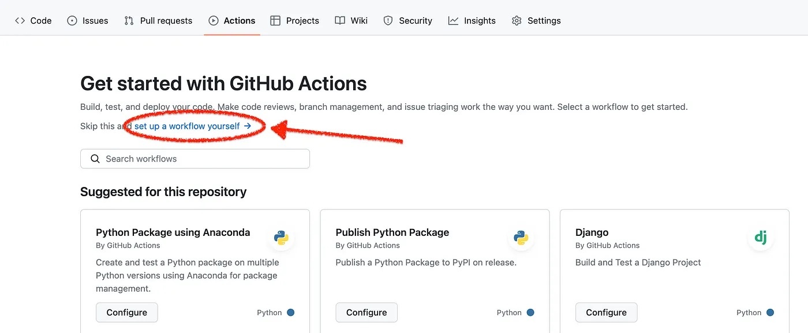

# Automate Your GitHub Commits

Are you tired of manually committing to your GitHub repository every day? Do you wish there was an easier way to stay on top of your daily commits? Look no further than Python and GitHub Actions!

In this article, I’ll show you how to automate your GitHub commits using Python and GitHub Actions. By the end of this tutorial, you’ll have a fully functional automated commit process that will run every day and keep your repository up to date.

## Step 1: Setting Up Your Repository

Before we dive into the code, you’ll need to create a new repository in GitHub. Once you’ve created your repository, navigate to the “Actions” tab and click “set up a workflow yourself”. This will open up a new file where you can define your workflow.



## Step 2: Defining Your Workflow

In the new file, you’ll need to define your workflow. Here’s an example of what your workflow might look like:

```yaml title="YAML"
name: Daily Commit

on:
  schedule:
    - cron: "0 3 * * *" # Runs every day at 3 AM

jobs:
  build:
    runs-on: ubuntu-latest
    steps:
      - uses: actions/checkout@v3

      - name: Set up Python
        uses: actions/setup-python@v4
        with:
          python-version: "3.10"

      - name: Install Dependencies
        run: |
          python -m pip install --upgrade pip
          pip install -r requirements.txt

      - name: Run Python Script
        run: |
          python main.py

      - name: Commit Changes
        run: |
          git config --global user.email "you@example.com"
          git config --global user.name "Your Name"
          git commit -am "Daily Commit"
          git push
```

This workflow will run every day at 3 AM and execute the following steps:

1. Check out the latest code from the repository
2. Set up Python
3. Install any necessary dependencies, that are listed in requirements.txt file
4. Run the Python script (`main.py`)
5. Commit the changes with the message “Daily Commit” and push them back to GitHub

## Step 3: Writing Your Python Script

Now that you have your workflow defined, you’ll need to write a Python script that will update your code. Here’s an example script that will add a new line, current date, to a text file every day:

```python title="main.py"
from datetime import datetime

filename = 'example.txt'

with open(filename, 'a') as f:
    now = datetime.now()
    f.write(f'Today is {now.strftime("%Y-%m-%d")}\n')
```

This script will open up the “example.txt” file and add a new line with today’s date every time it is run.

## Step 4: Committing to Your Repository Every Day

Now, you can sit back and let it run every day. With this automated commit process in place, you’ll never have to worry about falling behind on your daily commits again!

## Conclusion

In this tutorial, I showed you how to automate your GitHub commits using Python and GitHub Actions. By following these steps, you’ll have a fully functional automated commit process that will run every day and keep your repository up to date.

Happy coding!
