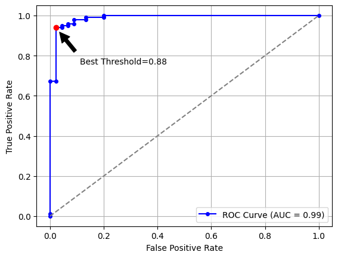
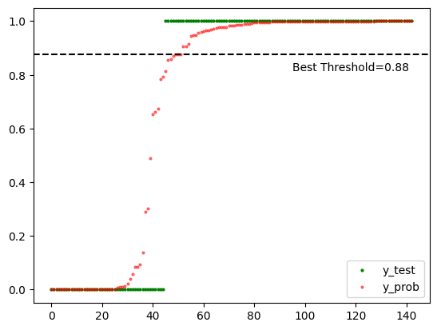

# Mastering Logistic Regression Thresholds

Hey there, data enthusiasts, Pythonistas, and machine learning mavens! Today, we’re diving deep into the intriguing realm of logistic regression thresholds! Buckle up, as we embark on a fun-filled journey to find that elusive sweet spot where true magic happens! 🧙‍♂️

## What are Thresholds, Anyway?

Let’s begin by demystifying the essence of thresholds in logistic regression. Imagine we have trained a logistic regression model, and now it’s time to make predictions. Instead of yielding hard class labels, logistic regression predicts probabilities&mdash;the likelihood of an instance belonging to a particular class. But how do we convert probabilities into discrete predictions? Enter the threshold!

The threshold acts as a decision boundary, determining whether the predicted probability belongs to class 0 or class 1. The default threshold is often set at 0.5, where any probability greater than or equal to 0.5 is classified as class 1, and the rest as class 0. Easy, right? But why stick to the mundane “0.5” when we can explore the magical world of threshold tuning?

## Escaping the Shackles of the Status Quo

Ah, the allure of deviating from the norm! While 0.5 might seem like a sensible choice, life is full of excitement when we dare to explore new horizons! So, when should we consider altering the threshold? Great question!

In the realm of logistic regression, it all boils down to the problem at hand and the trade-offs we’re willing to make. Sometimes, misclassifying one class can have more dire consequences than the other. For instance, in medical diagnoses, misdiagnosing a severe condition could be much costlier than a false positive. In such scenarios, tweaking the threshold can dramatically impact the model’s performance and save the day!

## ROC Curve and the Quest for the Optimal Threshold

It’s time to embrace the ROC (Receiver Operating Characteristic) curve, our trusty guide in the quest for the optimal threshold! This nifty visualization plots the true positive rate ($\rm{TPR} = \rm{TP}/(\rm{TP}+\rm{FN})$) against the false positive rate ($\rm{FPR} = \rm{FP}/(\rm{FP}+\rm{TN})$) for various threshold values.

Imagine yourself on a roller coaster, where you control the threshold knob. As you adjust the threshold, the roller coaster glides along the ROC curve, and you get to observe the TPR (True Positive Rate) and FPR (False Positive Rate) changing in harmony. The point closest to the top-left corner represents the ideal threshold, where we maximize TPR while _minimizing_ FPR. The index of this point can be calculated as $\argmax(\rm{TPR}-\rm{FPR})$, based on Youden’s J statistic.

Let’s get our hands dirty with some Python code to visualize the ROC curve and the best threshold:

```python title="Python"
import numpy as np
import matplotlib.pyplot as plt
from sklearn.datasets import load_breast_cancer
from sklearn.model_selection import train_test_split
from sklearn.linear_model import LogisticRegression
from sklearn.metrics import roc_curve, roc_auc_score

# Load data
X, y = load_breast_cancer(return_X_y=True)

# Split data into train and test sets
X_train, X_test, y_train, y_test = train_test_split(
    X, y, test_size=0.25, random_state=7
)

# Train the model
model = LogisticRegression(max_iter=2000, random_state=7)
model.fit(X_train, y_train)

# Get predicted probabilities
y_prob = model.predict_proba(X_test)[:, 1]

# y_test contains true labels and y_prob contains predicted probabilities
fpr, tpr, thresholds = roc_curve(y_test, y_prob)
roc_auc = roc_auc_score(y_test, y_prob)

# Find the best threshold based on Youden's J statistic
J = tpr - fpr
ix = np.argmax(J)
best_thresh = thresholds[ix]

# Plot ROC curve
plt.plot(
    fpr,
    tpr,
    marker="o",
    markersize=4,
    color="blue",
    label=f"ROC Curve (AUC = {roc_auc:.2f})",
)
plt.plot([0, 1], [0, 1], color="grey", linestyle="--")
plt.xlabel("False Positive Rate")
plt.ylabel("True Positive Rate")
plt.legend(loc="lower right")
plt.grid(True)

# Annotate the best threshold
plt.plot(fpr[ix], tpr[ix], color="red", marker="o", markersize=6)
plt.annotate(
    f"Best Threshold={best_thresh:.2f}",
    xy=(fpr[ix], tpr[ix]),
    xytext=(fpr[ix] + 0.09, tpr[ix] - 0.18),
    arrowprops=dict(facecolor="black", shrink=0.15),
)
plt.show()
```



Also, the following shows the true (`y_test`) and predicted (`y_prob`) values:

```python title="Python"
# Sorted y_test and y_prob
sorted_y_test = sorted(y_test)
sorted_y_prob = sorted(y_prob)

# Plot
plt.plot(sorted_y_test, "o", markersize=2, color="green")
plt.plot(sorted_y_prob, "o", markersize=2, color="red", alpha=0.5)
plt.axhline(y=best_thresh, color="black", linestyle="--")
plt.annotate(
    f"Best Threshold={best_thresh:.2f}",
    xy=(95, best_thresh),
    xytext=(95, best_thresh - 0.06),
)
plt.legend(labels=["y_test", "y_prob"], loc="lower right")
plt.show()
```



## Precision and Recall

Allow me to introduce you to these remarkable characters:

- **Precision:** The connoisseur of correctness. Precision is all about delivering accurate positive predictions. When Precision speaks, you can trust that it’s the real deal. It despises false positives&mdash;instances we mistakenly label as positive when they’re actually negative.
- **Recall:** The advocate of inclusivity. Recall aims to capture as many true positives as possible, even if it means inviting a few false positives to the party. It abhors false negatives&mdash;instances we mistakenly label as negative when they’re truly positive.

Here’s the thrilling part: Precision and Recall often play a balancing act. As you tweak the threshold, their relationship transforms. Imagine you’re organizing a party. If you’re strict about invitations (high threshold), only a select few VIPs attend, ensuring high Precision. But you might miss out on other potential VIPs (low Recall). On the flip side, with a lenient invitation policy (low threshold), you get more VIPs (high Recall), but a few party crashers (low Precision) might slip in.

You must decide the threshold that strikes the perfect balance between Precision and Recall. Sometimes, your problem demands higher Precision (e.g., fraud detection, where false positives are costly), while in other cases, elevated Recall takes the spotlight (e.g., disease screening, where missing true positives is a big no-no).

Let’s calculate the Precision and Recall scores using Python:

```python title="Python"
import numpy as np
from sklearn.metrics import precision_score

# Consider a series of threshold values
thresholds = np.arange(0.05, 1.0, 0.05)
best_threshold = 0.0
best_precision = 0.0

# Find the best threshold when the precision is maximized
for threshold in thresholds:
    predicted_labels = (y_prob >= threshold).astype(int)
    precision = precision_score(y_true=y_test, y_pred=predicted_labels)
    if precision > best_precision:
        best_threshold = threshold
        best_precision = precision

print(f"Best threshold: {best_threshold:.2f}")
print(f"Best precision: {best_precision:.2f}")
```

```
Best threshold: 0.90
Best precision: 0.99
```

```python title="Python"
import numpy as np
from sklearn.metrics import recall_score

# Consider a series of threshold values
thresholds = np.arange(0.05, 1.0, 0.05)
best_threshold = 0.0
best_recall = 0.0

# Find the best threshold when the recall is maximized
for threshold in thresholds:
    predicted_labels = (y_prob >= threshold).astype(int)
    recall = recall_score(y_true=y_test, y_pred=predicted_labels)
    if recall > best_recall:
        best_threshold = threshold
        best_recall = recall

print(f"Best threshold: {best_threshold:.2f}")
print(f"Best recall: {best_recall:.2f}")
```

```
Best threshold: 0.05
Best recall: 1.00
```

But here’s the secret sauce: you don’t have to settle for just one threshold. You can experiment with various thresholds, observe how Precision and Recall perform, and choose the one that resonates with your problem’s heartbeat.

## F1 Score

The F1 score is like the perfect duet of precision and recall, i.e., $2 * (\rm{precision} * \rm{recall}) / (\rm{precision} + \rm{recall})$. It considers both false positives and false negatives, making it a brilliant metric for imbalanced datasets!

The F1 score reaches its highest value at the threshold that balances precision and recall. We can easily find this threshold using Python:

```python title="Python"
import numpy as np
from sklearn.metrics import f1_score

# Consider a series of threshold values
thresholds = np.arange(0.05, 1.0, 0.05)
best_threshold = 0.0
best_f1 = 0.0

# Find the best threshold and F1 score
for threshold in thresholds:
    predicted_labels = (y_prob >= threshold).astype(int)
    f1 = f1_score(y_true=y_test, y_pred=predicted_labels)
    if f1 > best_f1:
        best_threshold = threshold
        best_f1 = f1

print(f"Best threshold: {best_threshold:.2f}")
print(f"Best F1 score: {best_f1:.2f}")
```

```
Best threshold: 0.70
Best F1 score: 0.97
```

## Conclusion

Congratulations, fellow thresholdologists! 🎉

You’ve now learned the secret sauce of threshold selection in logistic regression. Whether it’s adjusting the threshold to suit your problem, rocking the ROC curve, or serenading the precision, recall or F1 score, Python is your trusty sidekick in this thrilling adventure!

That’s all for now, folks! Until next time! 🚀
