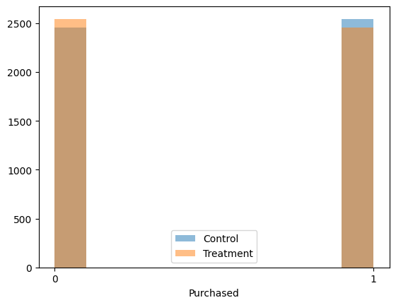
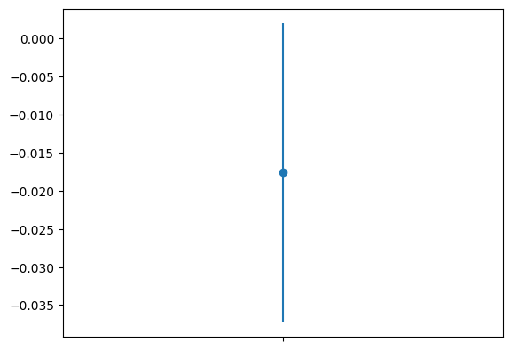

# Unlocking the Power of A/B Testing

## The basics: What you need to know

Let’s begin by discussing the basics of A/B testing. A/B testing is a statistical method used to compare two versions of a webpage, app, or any other user experience in order to determine which version performs better in terms of achieving a desired outcome, such as increasing conversion rates or click-through rates.

In an A/B test, a group of users is randomly split into two groups: the control group, which sees the original version of the experience (often called the “A” version), and the treatment group, which sees a modified version of the experience (often called the “B” version). By comparing the performance of the two groups, we can determine whether the modification has had a positive or negative impact on the desired outcome.

A/B testing is widely used in the fields of web development, marketing, and user experience design, and is a powerful tool for optimizing performance and achieving business goals. In this hands-on tutorial, we will cover all the important concepts of A/B testing and provide Python implementations for each step of the process. So let’s dive in!

## Key concepts

Before we get started with the implementation, it’s important to understand the key metrics and statistical concepts that are used in A/B testing.

Firstly, we have the conversion rate, which is the percentage of users who complete a desired action, such as making a purchase or filling out a form. This is often the primary metric used in A/B testing, as it directly measures the impact of the changes made to the experience.

Next, we have [statistical significance](https://en.wikipedia.org/wiki/Statistical_significance), which is a measure of the likelihood that the observed difference in conversion rates between the control and treatment groups is not due to chance. Generally, a p-value of less than 0.05 (i.e. there is less than a 5% chance that the difference is due to chance) is considered statistically significant.

In addition to statistical significance, we also need to consider practical significance, which refers to the size of the difference in conversion rates between the control and treatment groups. A statistically significant difference may not be practically significant if the difference is too small to be meaningful from a business perspective.

Finally, we have [confidence intervals](https://en.wikipedia.org/wiki/Confidence_interval), which give us a range of values that the true conversion rate is likely to fall within. This helps us to estimate the potential impact of the changes made to the experience.

Now that we understand these key concepts, let’s move on to the implementation. We will be using Python and some popular libraries for statistical analysis and visualization, so make sure you have them installed before getting started.

## Get started with the implementation

We’ll start by importing the necessary libraries for this tutorial: numpy, pandas, scipy, and matplotlib. If you don’t have these libraries installed, you can install them by running the following commands in your command prompt:

```bash title="Shell"
pip install numpy pandas scipy matplotlib
```

Once you have the libraries installed, you can import them in your Python script as follows:

```python title="Python" showLineNumbers
import numpy as np
import pandas as pd
from scipy.stats import ttest_ind
import matplotlib.pyplot as plt
```

Next, we’ll load the data that we will be using for our A/B test. For the purpose of this tutorial, we’ll be using a simulated dataset that contains information about 10000 website visitors (5000 for the control group and 5000 for the treatment group) and whether they made a purchase or not. We’ll load this dataset using pandas, and then split it into our control and treatment groups:

```python title="Python" showLineNumbers
# Create a simulated dataset with 5000 observations in each of the control
# and treatment groups
control_size = treatment_size = 5000
np.random.seed(777)  # Set the seed for reproducibility
data = pd.DataFrame(
    {
        "group": ["control"] * control_size + ["treatment"] * treatment_size,
        "purchased": np.random.randint(0, 2, control_size + treatment_size),
    }
)

# Split the data into the control and treatment groups
control = data[data["group"] == "control"]
treatment = data[data["group"] == "treatment"]
```

Now that we have our data loaded and split into our groups, we can start analyzing the results of our A/B test. In the next step, we’ll start by calculating the conversion rate for each group.

## Performing t-test

The conversion rate is the percentage of users who completed the desired action, in this case, making a purchase. We can calculate the conversion rate by dividing the number of purchases by the total number of visitors in each group.

```python title="Python" showLineNumbers
# Calculate the conversion rate for the control group
control_conversion_rate = control["purchased"].mean()

# Calculate the conversion rate for the treatment group
treatment_conversion_rate = treatment["purchased"].mean()

print("Control conversion rate:", control_conversion_rate)
print("Treatment conversion rate:", treatment_conversion_rate)
```

This will output the conversion rates for each group. We can use these conversion rates to determine whether the changes made in the treatment group had a positive impact on the desired outcome.

```
Control conversion rate: 0.5088
Treatment conversion rate: 0.4912
```

Now, we perform a hypothesis test to determine whether the observed difference in conversion rates between the control and treatment groups is statistically significant.

The null hypothesis for our test is that there is no difference in conversion rates between the control and treatment groups. The alternative hypothesis is that there is a difference in conversion rates between the control and treatment groups.

We’ll use a [two-sample t-test](https://en.wikipedia.org/wiki/Student%27s_t-test) to compare the means of the control and treatment groups. The t-test will calculate a p-value, which represents the probability of observing the difference in conversion rates between the two groups if the null hypothesis is true. If the p-value is less than our significance level (usually 0.05), we can reject the null hypothesis and conclude that the difference in conversion rates is statistically significant.

```python title="Python" showLineNumbers
# Perform a two-sample t-test
t_stat, p_val = ttest_ind(control["purchased"], treatment["purchased"])

print("t-statistic:", t_stat)
print("p-value:", p_val)
```

```
t-statistic: 1.7600966160767242
p-value: 0.07842200109645418
```

In the next step, we’ll visualize the results of our A/B test using a histogram and a confidence interval.

## Analyzing the test results

We’ll start by plotting histograms, using the matplotlib library, for the control and treatment groups to visualize the distribution of our data:

```python title="Python" showLineNumbers
# Plot histograms for the control and treatment groups
plt.hist(control["purchased"], alpha=0.5, label="Control")
plt.hist(treatment["purchased"], alpha=0.5, label="Treatment")
plt.legend()
plt.xlabel("Purchased")
plt.xticks([0, 1])
plt.show()
```

This code will create a histogram for each group and display them on the same plot. The `alpha` parameter controls the transparency of each histogram, and the `label` parameter adds a legend to the plot.



Next, we’ll plot a confidence interval for the difference in means between the control and treatment groups. The confidence interval will give us a range of values that the true difference in means is likely to fall within.

```python title="Python" showLineNumbers
# Calculate the mean difference between the control and treatment groups
mean_difference = treatment_conversion_rate - control_conversion_rate

# Calculate the standard error of the mean difference
se = np.sqrt(
    (control["purchased"].var() / len(control))
    + (treatment["purchased"].var() / len(treatment))
)

# Calculate the margin of error for a 95% confidence interval
me = 1.96 * se

# Calculate the lower and upper bounds of the confidence interval
lower_bound = mean_difference - me
upper_bound = mean_difference + me

# Plot the confidence interval
plt.errorbar(0, mean_difference, yerr=me, fmt="o")
plt.xlim(-0.5, 0.5)
plt.xticks([0], [""])
plt.show()
```



This plot shows the mean difference between the two groups as a dot, with the confidence interval as vertical lines above and below the dot. If the confidence interval does not include zero, we can conclude that the difference in means between the two groups is statistically significant — which is clearly not the case here.

## Drawing conclusions from the test results

Now that we have visualized the results of our A/B test, let’s interpret our findings and draw conclusions.

Based on our hypothesis test and visualization, we can conclude whether the changes made in the treatment group had a statistically significant impact on the conversion rate compared to the control group. If the p-value from our hypothesis test is less than our significance level (usually 0.05), and the confidence interval does not include zero, we can conclude that the difference in conversion rates between the control and treatment groups is statistically significant and that the changes made in the treatment group had a positive impact on the desired outcome.

If the p-value is greater than our significance level, or the confidence interval includes zero, we cannot conclude that the difference in conversion rates between the control and treatment groups is statistically significant, and we cannot claim that the changes made in the treatment group had a positive impact on the desired outcome.

Based on our experiment here, the p-value is ~0.08 > 0.05 and the confidence interval includes zero, therefore, the positive impact of the modifications made in the treatment group on the desired outcome cannot be claimed.

It’s important to note that A/B testing is not a one-time process, and it may take several iterations to achieve statistically significant results. It’s also important to consider the practical significance of the observed difference in conversion rates, as even a statistically significant difference may not be meaningful in the context of the overall business goals.

In the next steps, we’ll discuss some best practices for conducting A/B tests and avoiding common pitfalls.

## Best practices for conducting reliable A/B tests

Before we wrap up this hands-on tutorial on A/B testing, let’s go over some best practices to keep in mind when conducting A/B tests.

- **Set clear goals and hypotheses:** Before conducting an A/B test, it’s important to clearly define what you’re trying to achieve and formulate a hypothesis. This will help ensure that you’re measuring the right metrics and that you’re not introducing any bias into your test.
- **Use large enough sample sizes:** A/B tests require a sufficient sample size to ensure that the results are statistically significant. You can use sample size calculators to determine the appropriate sample size for your test based on the expected effect size and desired confidence level.
- **Randomize and balance your samples:** To ensure that your results are not biased, it’s important to randomly assign participants to the control and treatment groups and to ensure that the groups are balanced in terms of demographic and other relevant factors.
- **Use appropriate statistical tests:** Choose the appropriate statistical test based on the type of data you’re working with (e.g., categorical or continuous) and the nature of the hypothesis you’re testing.
- **Monitor your tests:** Continuously monitor your A/B test while it’s running to ensure that there are no issues or anomalies that could impact your results. For example, if you notice that one group is experiencing technical difficulties, you may need to pause the test and investigate before resuming.
- **Don’t stop too early:** Resist the temptation to stop the test as soon as you see a statistically significant result. It’s important to continue the test for a sufficient amount of time to ensure that the results are reliable and not due to chance.

## Common pitfalls when conducting A/B tests

In addition to the best practices mentioned above, it’s important to be aware of common pitfalls when conducting A/B tests:

- **Running too many tests at once:** Conducting multiple A/B tests simultaneously can lead to statistical errors and false positives. It’s best to focus on one test at a time and ensure that you have enough resources to properly monitor and analyze the results.
- **Ignoring practical significance:** While statistical significance is important, it’s also important to consider the practical significance of the observed difference in conversion rates. A statistically significant result may not be meaningful in the context of the overall business goals.
- **Biased samples:** If the control and treatment groups are not randomized and balanced, the results of the A/B test may be biased. It’s important to ensure that both groups are representative of the target audience and that any confounding variables are controlled for.
- **Overfitting:** Overfitting occurs when a model is too complex and is tailored to fit the training data too closely, resulting in poor generalization to new data. To avoid overfitting, it’s important to use appropriate regularization techniques and to test the model on a separate validation set.
- **Misinterpreting results:** It’s important to interpret the results of an A/B test correctly and to avoid making conclusions based on false positives or false negatives. Consult with experts in statistical analysis if you’re unsure about the interpretation of the results.

By being aware of these common pitfalls and following the best practices mentioned earlier, you can ensure that your A/B tests are reliable and accurate, and that you’re making data-driven decisions that will help you achieve your business goals.

## Putting it all together

In conclusion, A/B testing is a powerful technique that can help you optimize your website or product and increase your conversions. By carefully designing and conducting A/B tests, you can determine which design or content changes are most effective and make data-driven decisions to improve your business performance.

In this hands-on tutorial, we covered the basics of A/B testing, including the definition, benefits, and key concepts. We also provided a step-by-step guide on how to conduct an A/B test using Python and walked through an example A/B test using simulated data.

Additionally, we discussed best practices and common pitfalls to keep in mind when conducting A/B tests to ensure that your results are reliable and accurate.

We hope this tutorial has been helpful in getting you started with A/B testing and that you feel confident in conducting your own tests. Remember to always use sound statistical techniques, set clear goals and hypotheses, and monitor your tests carefully to ensure that you’re making data-driven decisions that will drive your business forward.
