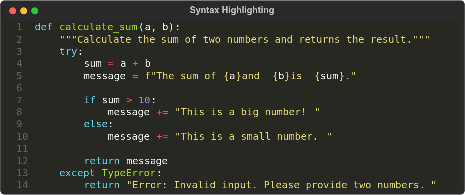
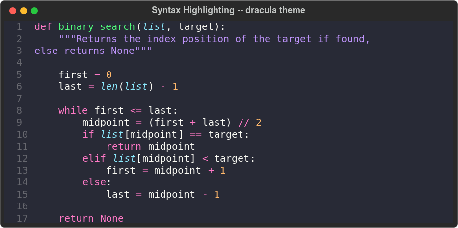
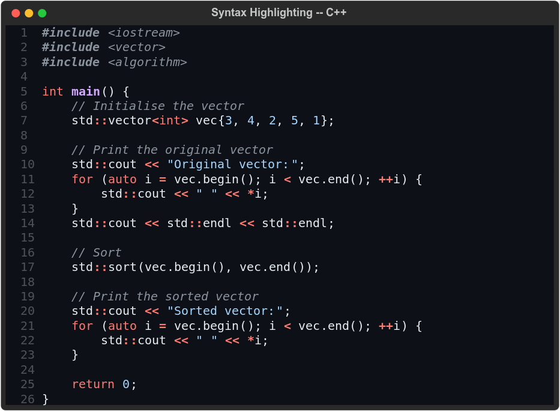
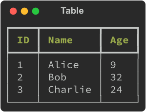
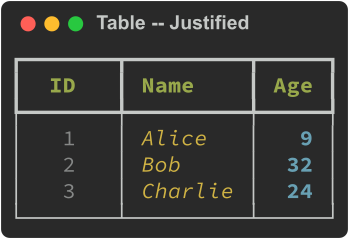
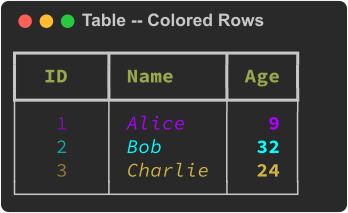
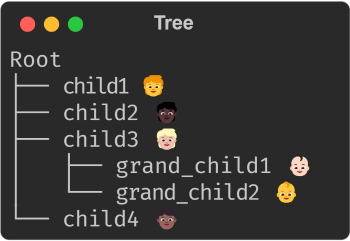
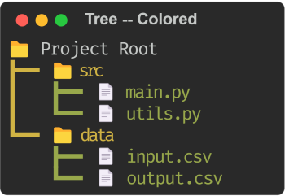
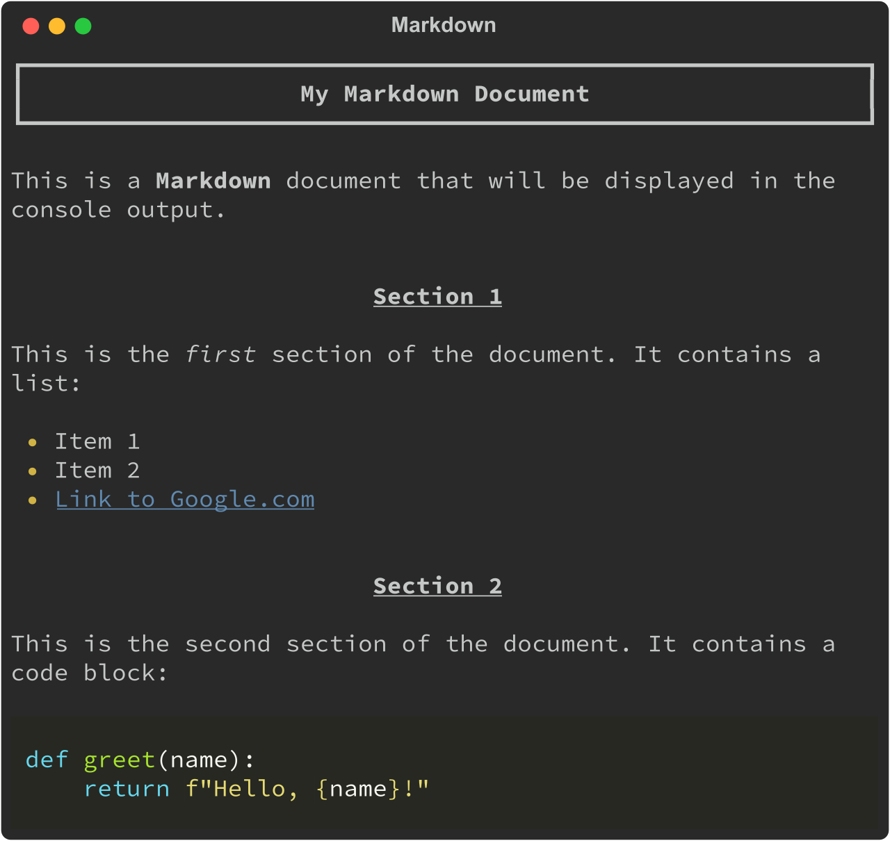

# Rich Python Library: Elevate Terminal Output with Elegance

Welcome to a fascinating journey into the enchanting realm of the rich Python library! If you’re tired of plain, monotonous outputs and yearn to bring a touch of elegance and flair to your code results, then you’re in for a treat. In this article, we’ll explore how the rich library can turn your command-line outputs into eye-catching masterpieces. So, grab your code editor and let’s dive into the world of syntax highlighting, tables, progress bars, emojis, and more like you’ve never seen before!

First, make sure you’ve installed it:

```bash title="Shell"
pip install rich
```

Now, let’s unveil the wonders of Rich!

## Syntax Highlighting

Picture this: you’ve spent hours crafting that perfect piece of code, and now it’s time to present it to the world. Why settle for bland monochrome when you can have syntax highlighting that dazzles the eyes? The rich library makes it a breeze.

### Painting the Canvas

Imagine you have a piece of code that you’re excited to showcase. A mundane printout might leave your audience unimpressed, but fret not—the rich library is here to save the day:

```python title="Python" showLineNumbers
from rich.syntax import Syntax
from rich.console import Console

# Create code
code = '''def calculate_sum(a, b):
    """Calculate the sum of two numbers and returns the result."""
    try:
        sum = a + b
        message = f"The sum of {a} and {b} is {sum}."

        if sum > 10:
            message += " This is a big number!"
        else:
            message += " This is a small number."

        return message
    except TypeError:
        return "Error: Invalid input. Please provide two numbers."'''

# Create syntax
syntax = Syntax(code, "python", line_numbers=True)

# Create console
console = Console()

# Print highlighted code
console.print(syntax)
```

This will output the following:



With just a few lines of code, your plain snippet of code has transformed into a visual masterpiece.

### Customizing Colors

The rich library offers a plethora of colors to choose from. Experiment with different styles to find the perfect one for your context:

```python title="Python" showLineNumbers
from rich.syntax import Syntax
from rich.console import Console

# Create code
code = '''def binary_search(list, target):
    """Returns the index position of the target if found,
    else returns None"""

    first = 0
    last = len(list) - 1

    while first <= last:
        midpoint = (first + last) // 2
        if list[midpoint] == target:
            return midpoint
        elif list[midpoint] < target:
            first = midpoint + 1
        else:
            last = midpoint - 1

    return None'''

# Create syntax
syntax = Syntax(code, "python", line_numbers=True, theme="dracula")

# Create console
console = Console()

# Print highlighted code
console.print(syntax)
```



In this example, we’ve used the `dracula` theme to give our code a unique look.

Here is the list of all available styles:

```
abap, algol_nu, algol, arduino, autumn, borland, bw, colorful, default,
dracula, emacs, friendly_grayscale, friendly, fruity, github-dark,
gruvbox-dark, gruvbox-light, igor, inkpot, lightbulb, lilypond, lovelace,
manni, material, monokai, murphy, native, nord-darker, nord, one-dark,
paraiso-dark, paraiso-light, pastie, perldoc, rainbow_dash, rrt, sas,
solarized-dark, solarized-light, staroffice, stata-dark, stata-light,
stata, tango, trac, vim, vs, xcode, zenburn
```

### Multiple Languages

The rich library isn’t limited to Python; it supports syntax highlighting for various languages:

```python title="Python" showLineNumbers
from rich.syntax import Syntax
from rich.console import Console

# Create code
code = '''#include <iostream>
#include <vector>
#include <algorithm>

int main() {
    // Initialise the vector
    std::vector<int> vec{3, 4, 2, 5, 1};

    // Print the original vector
    std::cout << "Original vector:";
    for (auto i = vec.begin(); i < vec.end(); ++i) {
        std::cout << " " << *i;
    }
    std::cout << std::endl << std::endl;

    // Sort
    std::sort(vec.begin(), vec.end());

    // Print the sorted vector
    std::cout << "Sorted vector:";
    for (auto i = vec.begin(); i < vec.end(); ++i) {
        std::cout << " " << *i;
    }

    return 0;
}'''

# Create syntax
syntax = Syntax(code, "c++", line_numbers=True, theme="github-dark")

# Create console
console = Console()

# Print highlighted code
console.print(syntax)
```



Whether you’re showcasing Python, Java, C++, or even SQL, the rich library ensures your code remains a visual spectacle.

Syntax highlighting isn’t just about aesthetics; it’s about enhancing the readability and understanding of your code. With the rich library by your side, you can effortlessly add a touch of artistic flair to your code outputs.

## Tables

Tables are more than just rows and columns; they’re visual representations of organized information that invite clarity and understanding. In the world of programming, displaying data neatly is a crucial skill, and the rich library empowers you to create stunning tables that breathe life into your outputs.

### Structuring Your Data

Imagine you have data that you want to present in a table. Gone are the days of struggling with manual formatting. The rich library comes to your rescue:

```python title="Python" showLineNumbers
from rich.console import Console
from rich.table import Table

# Create table
table = Table(show_header=True, header_style="bold cyan")

# Add columns
table.add_column("ID")
table.add_column("Name")
table.add_column("Age")

# Add rows
table.add_row("1", "Alice", "28")
table.add_row("2", "Bob", "32")
table.add_row("3", "Charlie", "24")

# Create console
console = Console()

# Print table
console.print(table)
```



With this elegant snippet, you’ve conjured a beautifully structured table, complete with headers and rows. The `show_header=True` parameter ensures your table's header is displayed, and `header_style="bold cyan"` styles the header with a touch of grandeur.

The rich library doesn’t stop at the basics; it offers a spectrum of styling options to make your tables pop.

### Aligning Columns

Ensure your data lines up perfectly by specifying column alignments:

```python title="Python" showLineNumbers
from rich.console import Console
from rich.table import Table

# Create table
table = Table(show_header=True, header_style="bold green")

# Add columns
table.add_column("ID", style="dim", width=5, justify="center")
table.add_column("Name", style="italic yellow")
table.add_column("Age", style="bold cyan", justify="right")

# Add rows
table.add_row("1", "Alice", "9")
table.add_row("2", "Bob", "32")
table.add_row("3", "Charlie", "24")

# Create console
console = Console()

# Print table
console.print(table)
```



In this example, we’ve centered the “ID” column, used italics for the “Name” column, and right-aligned the “Age” column.

### Highlighting Rows

Catch your audience’s attention by highlighting specific rows:

```python title="Python" showLineNumbers
from rich.console import Console
from rich.table import Table

# Create table
table = Table(show_header=True, header_style="bold green")

# Add columns
table.add_column("ID", style="dim", width=5, justify="center")
table.add_column("Name", style="italic")
table.add_column("Age", style="bold", justify="right")

# Add rows
table.add_row("1", "Alice", "9", style="#af00ff")
table.add_row("2", "Bob", "32", style="rgb(0,255,255)")
table.add_row("3", "Charlie", "24", style="yellow")

# Create console
console = Console()

# Print table
console.print(table)
```



Adding color to rows makes your data stand out and gives your table a touch of visual drama.

## Progress Bars

Imagine you’re executing a time-consuming task or a lengthy loop&mdash;wouldn’t it be wonderful to provide your users with a sense of progress? Enter progress bars, your companions on the road to completion. With the rich library, progress bars transcend their utilitarian function, becoming a source of anticipation and excitement.

### Painting the Progress

Picture this scenario: you have a function that takes time to complete, and you want to keep your audience informed about the progress. The rich library transforms this into a captivating experience:

```bash title="Shell"
pip install -q ipywidgets
```

```python title="Python" showLineNumbers
import time
from rich.progress import track


def do_something():
    time.sleep(1)


for i in track(range(4)):
    do_something()
```

This will output the following:


### Showcasing Additional Information

Why limit yourself to progress percentages? Display additional information that enriches the user’s experience:

```python title="Python" showLineNumbers
import time
from rich.progress import (
    Progress,
    SpinnerColumn,
    TextColumn,
    BarColumn,
    TaskProgressColumn,
    TimeRemainingColumn,
    TimeElapsedColumn,
)

with Progress(
    SpinnerColumn(finished_text="🐍"),
    TextColumn("[progress.description]{task.description}"),
    BarColumn(bar_width=40),
    TaskProgressColumn(),
    TimeRemainingColumn(),
    TimeElapsedColumn(),
) as progress:
    task1 = progress.add_task("[red]Downloading", total=6)
    task2 = progress.add_task("[green]Processing", total=6)
    task3 = progress.add_task("[cyan]Cooking", total=6)

    while not progress.finished:
        progress.update(task1, advance=1.5)
        progress.update(task2, advance=1)
        progress.update(task3, advance=1.5)
        time.sleep(1)
```


With a few lines of code, you’ve transformed a routine task into an interactive and engaging experience. The rich library’s progress bars don’t just indicate completion; they immerse your audience in a journey of anticipation, turning mundane activities into captivating moments.

## Emoji

Communication goes beyond words; it’s about expressing emotions and conveying subtleties. Emojis, those tiny characters that speak volumes, are the perfect companions for adding a touch of humanity to your code outputs. With the rich library, your code gains the power to emote and connect on a whole new level.

```python title="Python" showLineNumbers
import rich

rich.print(":smiley: Hello, world! :thumbs_up::sparkles:")
```

This will output the following:

```
😃 Hello, world! 👍✨
```

As another example, you can use a warning emoji to draw attention to critical messages.

```python title="Python" showLineNumbers
import rich

warning_message = ":warning: Warning: Unauthorized access detected!"
rich.print(warning_message)
```

```
⚠ Warning: Unauthorized access detected!
```

The list of available emojis can be found by the following snippet:

```python title="Python" showLineNumbers
from rich.emoji import EMOJI

# Uncomment to print all available emojis
# for name, emoji in EMOJI.items():
#     print(f"{name}: {emoji}")

# Print the first N emojis
N = 10
for name, emoji in list(EMOJI.items())[:N]:
    print(f"{name}: {emoji}")
```

```
1st_place_medal 🥇
2nd_place_medal 🥈
3rd_place_medal 🥉
ab_button_(blood_type) 🆎
atm_sign 🏧
a_button_(blood_type) 🅰
afghanistan 🇦🇫
albania 🇦🇱
algeria 🇩🇿
american_samoa 🇦🇸
```

## Tree

Ever found yourself lost in a labyrinth of files or nested structures? The tree visualization is your guiding light, providing clarity and insight into complex hierarchies. With the rich library, your code outputs can transform into elegant trees that reveal the beauty of your data structures.

```python title="Python" showLineNumbers
from rich.console import Console
from rich.tree import Tree

# Create a tree structure
tree = Tree("Root")
tree.add("child1 :child:")
tree.add("child2 :child_dark_skin_tone:")

child3 = tree.add("child3 :child_medium-light_skin_tone:")
child3.add("grand_child1 :baby_light_skin_tone:")
child3.add("grand_child2 :baby:")

tree.add("child4 :child_medium-dark_skin_tone:")

# Create console
console = Console()

# Print tree
console.print(tree)
```

This will output the following:



Breaking down your tree into subtrees enhances readability and maintains the structural clarity.

Here is another example:

```python title="Python" showLineNumbers
from rich.console import Console
from rich.tree import Tree

# Create a tree structure
tree = Tree(":file_folder: Project Root", guide_style="bold yellow")

# `src` subdirectory
src = tree.add(":file_folder: src", guide_style="bold green", style="yellow")
src.add(":page_facing_up: main.py", style="green")
src.add(":page_facing_up: utils.py", style="green")

# `data` subdirectory
data = tree.add(":file_folder: data", guide_style="bold green", style="yellow")
data.add(":page_facing_up: input.csv", style="green")
data.add(":page_facing_up: output.csv", style="green")

# Create console
console = Console()

# Print tree
console.print(tree)
```



By adding custom icons and applying styles, your tree takes on a distinctive and visually appealing character.

## Markdown

In the realm of code documentation and narrative, plain text can only take you so far. Enter Markdown&mdash;a lightweight and versatile markup language that allows you to add rich formatting, links, headings, and more to your text. With the rich library, your code outputs can effortlessly become expressive narratives that captivate and inform.

````python title="Python" showLineNumbers
from rich.console import Console
from rich.markdown import Markdown

# Markdown text
markdown_text = """
# My Markdown Document

This is a **Markdown** document that will be displayed in the console output.

## Section 1

This is the *first* section of the document. It contains a list:

* Item 1
* Item 2

## Section 2

This is the second section of the document. It contains a code block:

```python
print("Hello World!")
```
"""

# Convert the Markdown to a Rich object
markdown = Markdown(markdown_text)

# Create console
console = Console()

# Print the Markdown
console.print(markdown)
````



In this snippet, you’ve breathed life into your narrative. The headings, bold text, italics, lists, hyperlink, and code blocks transform your words into an engaging experience.

## Conclusion

In the realm of coding, functionality meets artistry through the “rich” Python library. From expressive formatting and syntax highlighting to dynamic emojis, tables, and progress bars, “rich” transforms terminal outputs into captivating visual experiences. With “rich,” you’re not just coding; you’re crafting narratives and displaying progress in a way that engages, informs, and enchants. Embrace the richness of “rich” and let your code shine with a touch of elegance.

Happy coding!
