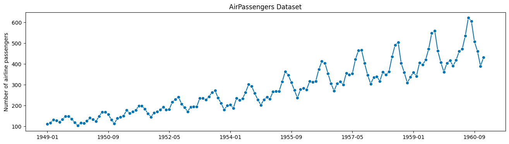
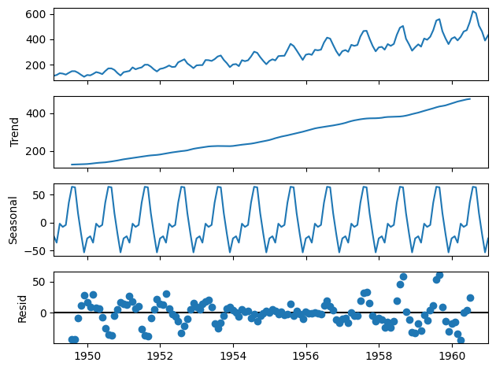
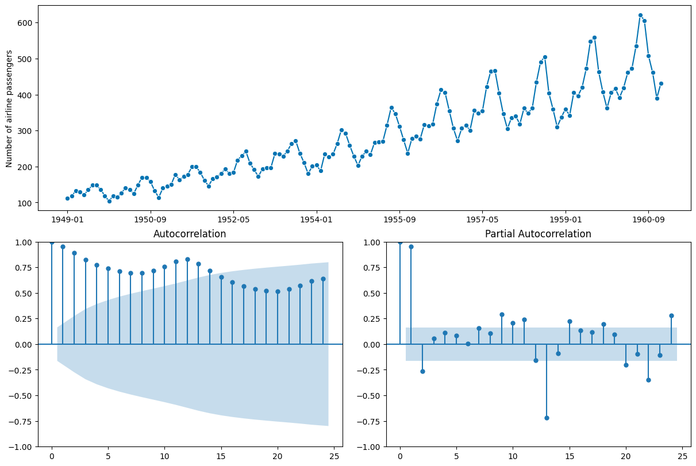
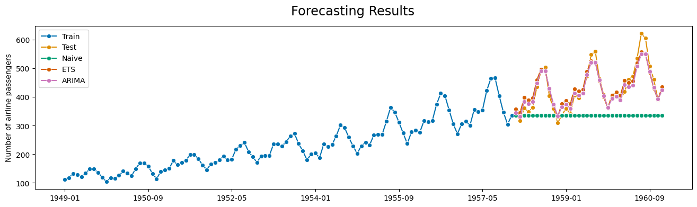

# Time-Series Forecasting with sktime

Greetings, data enthusiasts! Today, we embark on a thrilling journey into the realm of time-series forecasting using the marvelous [sktime](https://github.com/sktime/sktime) library. Whether you’re a seasoned data scientist seeking to sharpen your skills or a curious beginner taking your first steps into the world of time-series analysis, this tutorial promises to unravel the magic behind forecasting with practicality. So, fasten your seatbelts and let’s dive in!

## Introduction

Before we leap into the technicalities, let’s set the stage with a quick introduction to time-series forecasting. Imagine you’re holding a magnifying glass to a series of data points recorded at regular intervals&mdash;these are time-series data. From stock prices to weather measurements, time-series data are ubiquitous and demand powerful techniques to predict future values.

## Installing libraries and Preparing our Data

To kickstart our journey, we need the right tools. Open up your trusty command line or Jupyter Notebook and install the required libraries with the following command:

```bash title="Shell"
pip install sktime matplotlib pandas
```

With sktime at our disposal, we're ready to dive into the dataset. For this tutorial, let's use a classic time-series dataset: the good ol' AirPassengers. You can load it up with just a few lines of Python:

```python title="Python" showLineNumbers
from sktime.datasets import load_airline

y = load_airline()
y
```

```
Period
1949-01    112.0
1949-02    118.0
1949-03    132.0
1949-04    129.0
1949-05    121.0
           ...
1960-08    606.0
1960-09    508.0
1960-10    461.0
1960-11    390.0
1960-12    432.0
Freq: M, Name: Number of airline passengers, Length: 144, dtype: float64
```

## Exploratory Time-Series Analysis

Before we plunge headfirst into the realm of forecasting, it’s vital to understand the landscape we’re traversing. In this section, we’ll put on our detective hats and engage in some exploratory time-series analysis.

### The Power of Visualization

A picture is worth a thousand words, and in the world of data analysis, a good plot can reveal insights that words alone might miss. Let’s dive in and visualize our AirPassengers dataset to understand its journey through time.

```python title="Python" showLineNumbers
import matplotlib.pyplot as plt
from sktime.utils.plotting import plot_series

plot_series(y)
plt.title("AirPassengers Dataset")
plt.show()
```



This nifty piece of code harnesses the might of matplotlib and sktime’s plotting utilities to present our dataset as a beautiful time-series plot. Peaks, valleys, trends, and seasonality&mdash;these visual cues will provide the foundation for our forecasting endeavors.

### Detecting Seasonality

Seasonality is like the rhythm in a song&mdash;a repeating pattern that gives a time series its unique flavor. To detect it, we can use the [statsmodels](https://github.com/statsmodels/statsmodels) library:

```python title="Python" showLineNumbers
import pandas as pd
from statsmodels.tsa.seasonal import seasonal_decompose

# Convert to pandas dataframe
y_df = pd.DataFrame(y.values, index=y.index.to_timestamp(freq="M"))

# Decompose the time series
decomposed = seasonal_decompose(y_df)

# Plot the decomposed time series
decomposed.plot();
```

This code snippet dissects the time series into its components: trend, seasonality, and residuals. The `decomposed` object contains these components, and the `plot()` function visually showcases the individual parts, helping us gauge the presence and nature of seasonality.



### Auto Correlation Function (ACF) and Partial Auto Correlation Function (PACF)

Just as detectives gather clues to solve a mystery, we can leverage the Auto Correlation Function (ACF) and Partial Auto Correlation Function (PACF) plots to unravel hidden patterns within our time series. These plots provide valuable insights into potential lag relationships and inform the choice of parameters for our forecasting models.

```python title="Python" showLineNumbers
from sktime.utils.plotting import plot_correlations

plot_correlations(y);
```

This code crafts the ACF and PACF plots, letting us identify lag correlations and trends in the data. It’s like gazing at constellations in the night sky&mdash;each peak and dip holds a piece of the forecasting puzzle.



### Statistical Tests for Stationarity

A stationary time series has stable statistical properties over time, which makes forecasting more feasible. We can employ the Augmented Dickey-Fuller (ADF) test to determine stationarity:

```python title="Python" showLineNumbers
from sktime.param_est.stationarity import StationarityADF

sty_est = StationarityADF()
sty_est.fit(y)

print(f"ADF statistic: {sty_est.test_statistic_:.2f}")
print(f"p-value: {sty_est.pvalue_:.2f}")
print(f"The data is {'' if sty_est.stationary_ else 'not'} stationary.")
```

This code conducts the ADF test on our time series and reports the ADF statistic and p-value. A p-value below a certain threshold (0.05 by default) suggests stationarity. If our series isn’t stationary, we can consider _differencing_ to make it more amenable to forecasting.

```
ADF statistic: 0.82
p-value: 0.99
The data is not stationary.
```

### Embrace the Insights

And there you have it, our exploration into the heart of our time series data. With visualization, decomposition, ACF and PACF analysis, and stationarity testing, we’ve equipped ourselves with tools that let us understand the rhythm, detect patterns, and assess the stationary nature of our data. Armed with these insights, we’re primed and ready to venture into the exciting world of forecasting methods. Stay tuned for the upcoming sections as we journey deeper into the art of prediction!

## Forecasting with Classical Methods

In this section, we’ll dive into the world of classical time-series forecasting methods. We’ll explore the elegance of exponential smoothing and the power of ARIMA models, all while keeping the horizon and test data size in perfect harmony.

### Data Splitting

Before we unleash our forecasting magic, it’s crucial to split our data into training and testing sets. The horizon, which represents the number of steps into the future we want to predict, should match the size of our test set. This ensures a fair evaluation of our forecasts.

```python title="Python" showLineNumbers
from sktime.forecasting.model_selection import temporal_train_test_split

# Horizon size = 36
y_train, y_test = temporal_train_test_split(y, test_size=36)
```

With our data neatly partitioned, we can move on to the world of forecasting.

### Naive is Nice

Let’s start with a gentle introduction&mdash;meet the Naive Forecaster. Like a crystal ball that sees the future as an extension of the present, the Naive Forecaster predicts the last observed value for the forecast horizon.

```python title="Python" showLineNumbers
from sktime.forecasting.naive import NaiveForecaster

# Fit the forecaster
naive_forecaster = NaiveForecaster(strategy="last")
naive_forecaster.fit(y_train)

# Predict 36 steps ahead
naive_preds = forecaster.predict(fh=range(1, 37))
naive_preds.head()
```

The code above creates a Naive Forecaster instance and uses it to predict the values for the next 36 steps. Simple, effective, and a great starting point for our forecasting journey.

```
1958-01    336.0
1958-02    336.0
1958-03    336.0
1958-04    336.0
1958-05    336.0
Freq: M, Name: Number of airline passengers, dtype: float64
```

### Exponential Smoothing

Next on our journey is Exponential Smoothing, a method that captures trends and seasonality with an air of elegance. Let’s summon its power to predict the future.

```python title="Python" showLineNumbers
from sktime.forecasting.exp_smoothing import ExponentialSmoothing

# Fit the forecaster
ets_forecaster = ExponentialSmoothing(
    trend="additive",
    seasonal="additive",
    sp=12,
)
ets_forecaster.fit(y_train)

# Predict 36 steps ahead
ets_preds = ets_forecaster.predict(fh=range(1, 37))
ets_preds.head()
```

The above code crafts an Exponential Smoothing forecaster, fits it to the training data, and produces forecasts for the next 36 steps. Watch as it captures the essence of the time series and weaves predictions that respect its nuances.

```
1958-01    357.332353
1958-02    345.820169
1958-03    398.634554
1958-04    390.191995
1958-05    396.346394
Freq: M, Name: Number of airline passengers, dtype: float64
```

### ARIMA

No discussion of classical forecasting methods would be complete without mentioning ARIMA (AutoRegressive Integrated Moving Average). Like a wizard conjuring spells, ARIMA weaves together _auto-regressive_, _differencing_, and _moving average_ components to predict the future.

```python title="Python" showLineNumbers
from sktime.forecasting.arima import ARIMA

# Fit the forecaster
arima_forecaster = ARIMA(seasonal_order=(1, 1, 1, 12))
arima_forecaster.fit(y_train)

# Predict 36 steps ahead
arima_preds = arima_forecaster.predict(fh=range(1, 37))
arima_preds.head()
```

Behold, the code above crafts an ARIMA forecaster with a chosen order, fits it to the training data, and summons its predictive magic for the next 36 steps.

```
1958-01    344.448891
1958-02    331.472840
1958-03    383.956004
1958-04    376.575094
1958-05    383.183513
Freq: M, Name: Number of airline passengers, dtype: float64
```

### Cherish the Classical Charm

With the horizon and test data size in perfect alignment, we’ve tamed the classical forecasting methods&mdash;Naive, Exponential Smoothing, and ARIMA. These techniques are your companions as you journey through the ever-changing landscape of time-series data. But our voyage is far from over! The realm of evaluation, visualization of forcecasts, and machine learning approaches beckons, and we’ll explore their treasures in the next sections.

## Evaluating and Visualizing Forecasts

In this section, we’ll put on our data detective hats once more and dive deep into the world of evaluating and visualizing forecasts. It’s not just about making predictions; it’s about understanding how well our models fare in the art of foreseeing the future.

### The Metrics of Mastery

Before we unravel the forecasting magic, let’s talk metrics. A trustworthy metric helps us gauge the performance of our models. For time-series forecasting, one of the go-to metrics is the Mean Absolute Percentage Error (MAPE). It tells us how much our predictions deviate from the actual values, in percentage terms.

```python title="Python" showLineNumbers
from sktime.performance_metrics.forecasting import (
    mean_absolute_percentage_error
)

mape_naive = mean_absolute_percentage_error(y_test, naive_preds)
mape_ets = mean_absolute_percentage_error(y_test, ets_preds)
mape_arima = mean_absolute_percentage_error(y_test, arima_preds)

print(f"MAPE Naive: {mape_naive:.2f}")
print(f"MAPE ETS: {mape_ets:.2f}")
print(f"MAPE ARIMA: {mape_arima:.2f}")
```

```
MAPE Naive: 0.20
MAPE ETS: 0.05
MAPE ARIMA: 0.04
```

### A Visual Feast

Numbers have their charm, but nothing beats a well-crafted plot to visualize the forecasting journey. Behold the code that creates a visual symphony of training, test, and predicted values:

```python title="Python" showLineNumbers
from sktime.utils.plotting import plot_series

plot_series(
    y_train,
    y_test,
    naive_preds,
    ets_preds,
    arima_preds,
    labels=["Train", "Test", "Naive", "ETS", "ARIMA"],
    title="Forecasting Results",
);
```



### Grasp the Power of Evaluation

In the realm of forecasting, evaluation and visualization are your guiding stars. By calculating MAPE and painting visual narratives, you’re equipped to comprehend the strengths and weaknesses of your models. With these insights in hand, you’re ready to make informed decisions and refine your forecasting strategies. So, embrace the metrics, relish the plots, and set forth with a deeper understanding of your forecasting journey!

## Unleashing the Power of Machine Learning

Greetings, data explorers, as we journey into the heart of modern forecasting! In this section, we’ll harness the boundless potential of machine learning to predict time series values. Buckle up, for we’re about to merge the beauty of sktime’s regression-based models with the finesse of machine learning pipelines.

### Crafting the Machine Learning Pipeline

A machine learning pipeline is like a symphony&mdash;each instrument (or step) plays a crucial role in creating harmonious predictions. Let’s summon the pipeline wizardry and craft our own using `make_reduction()`.

```python title="Python" showLineNumbers
from sktime.forecasting.compose import make_reduction
from sklearn.pipeline import Pipeline
from sklearn.linear_model import LinearRegression

regressor = make_reduction(
    estimator=Pipeline([("regressor", LinearRegression())]),
    window_length=12,
)
```

The code above creates a pipeline that encompasses a Linear Regression model. The `window_length` parameter determines the number of past observations the model considers. This way, our model learns from history to predict the future.

### Try a Different Tune

Machine learning is versatile, so let’s swap our model for something different. How about the mighty `RandomForestRegressor`? It’s like having an ensemble of experts predicting together.

```python title="Python" showLineNumbers
from sklearn.ensemble import RandomForestRegressor

rf_regressor = make_reduction(
    estimator=Pipeline(
        [
            ("regressor", RandomForestRegressor(random_state=42)),
        ]
    ),
    window_length=12,
)
```

The code snippet introduces the Random Forest Regressor into our pipeline. Now we have a different instrument in our symphony, ready to predict with its own unique flavor.

### Enchanting the Future

With our machine learning pipelines at the ready, it’s time to summon their predictive power.

```python title="Python" showLineNumbers
# Fit the models
l_regressor.fit(y_train)
rf_regressor.fit(y_train)

# Predict 36 steps ahead
l_preds = l_regressor.predict(fh=range(1, 37))
rf_preds = rf_regressor.predict(fh=range(1, 37))

# Print the predictions
print("Linear Regression")
print(l_preds.head())

print("\n\nRandom Forest")
print(rf_preds.head())
```

These lines of code fit our pipelines to the training data and unleash them to predict the values for the next 36 steps.

```
Linear Regression
1958-01    352.755841
1958-02    345.708489
1958-03    388.697585
1958-04    388.083764
1958-05    409.020152
Freq: M, Name: Number of airline passengers, dtype: float64


Random Forest
1958-01    351.24
1958-02    351.57
1958-03    422.33
1958-04    432.40
1958-05    434.68
Freq: M, Name: Number of airline passengers, dtype: float64
```

### The Symphony of Machine Learning

As our machine learning models sing their predictive symphony, consider the magic of these pipelines. They encapsulate the essence of machine learning, enabling you to combine models, preprocessors, and more into a harmonious unit. With machine learning, you’ve added another dimension to your forecasting toolkit&mdash;adaptable, robust, and ready to tackle a myriad of time series challenges.

## Wrapping Up

Congratulations, intrepid explorers of time-series forecasting! You’ve ventured through classical methods and unleashed machine learning might with sktime. Armed with these techniques, you can now tackle a myriad of time-series challenges with confidence. Remember, practice makes perfect, so keep experimenting and refining your skills. Until next time, may your predictions be accurate and your data flow ever smooth.
