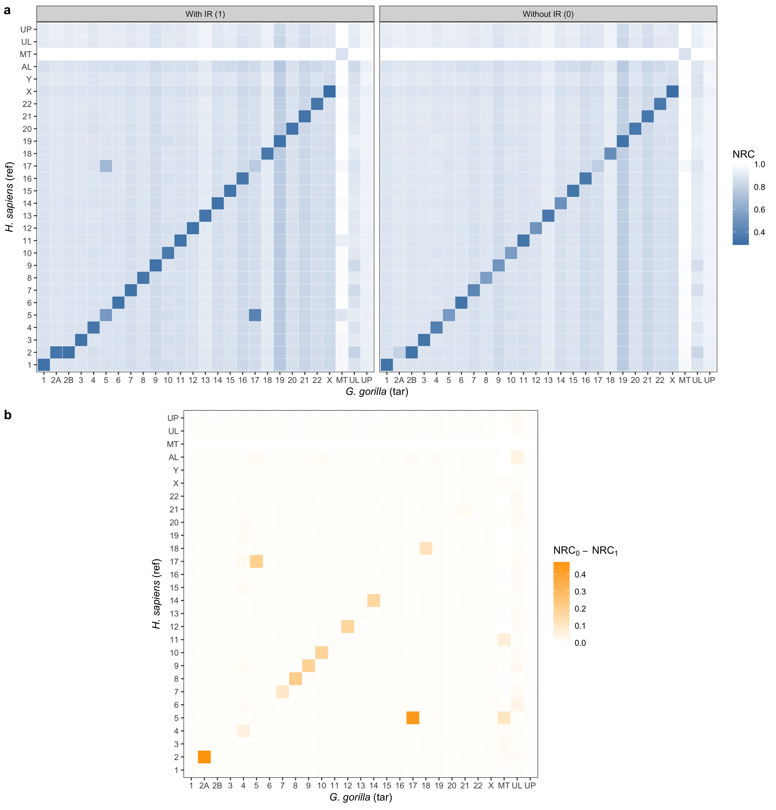

# Unlocking Data’s Story: An Introduction to ggplot2

Visualizing data can be the most engaging way to tell a story, reveal insights, and communicate complex information. When it comes to creating stunning, layered plots in R, **ggplot2** is the go-to tool. Part of the tidyverse collection, ggplot2 stands out not only for its flexibility and visual appeal but also for the grammar-based approach it offers. This grammar of graphics framework makes it intuitive to combine various components-like points, lines, shapes, and facets-to create richly informative plots.

## What’s Special About ggplot2?

At its core, ggplot2 is structured around a series of layers. Each layer represents a different part of the plot, like data, geometries, and statistical transformations. This makes it incredibly flexible-you can start with a simple scatter plot and layer in colors, labels, and even transformations until you have exactly the visualization you need.

Another reason to love ggplot2 is its elegance with **data mapping**. Instead of manually coding each feature, you define a mapping of variables to visual properties, such as color, size, and shape. The rest is taken care of by ggplot2, which automates the hard work of scaling, positioning, and layering.

Let’s look at ggplot2 in action through examples. Here, I'll walk through the visualizations I created for my PhD thesis, showing how you can build plots layer by layer to achieve impactful, publication-quality visuals.

## Plot 2.8



```r title="R"
library(ggplot2)
library(reshape2)
library(ggpubr)

# Set theme
theme_set(theme_bw())

# Download datasets
base <- "https://raw.githubusercontent.com/smortezah/phd/refs/heads/main/plot/"
for (file in c("ir_hs_gg.tsv", "ir_diff_hs_gg.tsv", "ir_hs_gg.png")) {
  download.file(paste0(base, "2.8/", file), file)
}

# Set input/output files
file_in_a <- "ir_hs_gg.tsv"
file_in_b <- "ir_diff_hs_gg.tsv"
file_out <- "ir_hs_gg.png"

# Functions
prepare_data <- function(filename, ir) {
  df <- read.table(filename, header = TRUE)
  df$ref <- rownames(df)

  df_molten <-
    melt(df, id.vars = "ref", variable.name = "tar", value.name = "nrc")
  df_molten$ir <- ir

  write.table(
    df_molten,
    file = paste(filename, ".tsv"),
    quote = FALSE,
    sep = "\t",
    col.names = NA
  )
}

# Data
hs_names_in <- c(
  "HS1", "HS2", "HS3", "HS4", "HS5", "HS6", "HS7", "HS8", "HS9", "HS10",
  "HS11", "HS12", "HS13", "HS14", "HS15", "HS16", "HS17", "HS18", "HS19",
  "HS20", "HS21", "HS22", "HSX", "HSY", "HSAL", "HSMT", "HSUL", "HSUP"
)
hs_names_out <- c(
  "1", "2", "3", "4", "5", "6", "7", "8", "9", "10", "11", "12", "13", "14",
  "15", "16", "17", "18", "19", "20", "21", "22", "X", "Y", "AL", "MT", "UL",
  "UP"
)
gg_names_in <- c(
  "GG1", "GG2A", "GG2B", "GG3", "GG4", "GG5", "GG6", "GG7", "GG8", "GG9",
  "GG10", "GG11", "GG12", "GG13", "GG14", "GG15", "GG16", "GG17", "GG18",
  "GG19", "GG20", "GG21", "GG22", "GGX", "GGMT", "GGUL", "GGUP"
)
gg_names_out <- c(
  "1", "2A", "2B", "3", "4", "5", "6", "7", "8", "9", "10", "11", "12", "13",
  "14", "15", "16", "17", "18", "19", "20", "21", "22", "X", "MT", "UL", "UP"
)

## Data for a
df_hs_gg <- read.table(file_in_a, header = TRUE)
df_hs_gg$ref <-
  factor(df_hs_gg$ref, levels = hs_names_in, labels = hs_names_out)
df_hs_gg$tar <-
  factor(df_hs_gg$tar, levels = gg_names_in, labels = gg_names_out)

## Data for b
df_diff_hs_gg <- read.table(file_in_b, header = TRUE)
df_diff_hs_gg$ref <-
  factor(df_diff_hs_gg$ref, levels = hs_names_in, labels = hs_names_out)
df_diff_hs_gg$tar <-
  factor(df_diff_hs_gg$tar, levels = gg_names_in, labels = gg_names_out)

# Plot
a <- ggplot(df_hs_gg, aes(tar, ref)) +
  geom_tile(aes(fill = nrc), colour = "white") +
  coord_equal() +
  scale_fill_gradient(name = "NRC", low = "steelblue", high = "white") +
  ylab(expression(paste(italic("H. sapiens "), "(ref)"))) +
  xlab(expression(paste(italic("G. gorilla "), "(tar)"))) +
  facet_wrap(~ir.label, dir = "h")

b <- ggplot(df_diff_hs_gg, aes(tar, ref)) +
  geom_tile(aes(fill = nrc), colour = "white") +
  coord_equal() +
  scale_fill_gradient(
    name = expression(NRC[0] ~ -~ NRC[1]),
    low = "white",
    high = "orange"
  ) +
  ylab(expression(paste(italic("H. sapiens "), "(ref)"))) +
  xlab(expression(paste(italic("G. gorilla "), "(tar)")))

# Save plot
plot <- ggarrange(a, b, labels = c("a", "b"), nrow = 2)
ggsave(file_out, plot = plot, height = 12, width = 11.5)
```

### Code Walkthrough

1. **Data Preparation**:

   - We begin by downloading and reshaping the data into long format, suitable for `ggplot2` visualization. Here, the datasets `ir_hs_gg.tsv` and `ir_diff_hs_gg.tsv` are tailored for comparison between human (_H. sapiens_) and gorilla (_G. gorilla_) NRC scores.
   - Custom mappings (from "HS1" to "1" and "GG1" to "1") standardize axis labels, making the data more readable and highlighting cross-species differences.

2. **Building the Panels**:

   - **Panel (a)**: This panel displays NRC scores with and without IR conditions between human (ref) and gorilla (tar) with a color gradient from "steelblue" (low NRC) to "white" (high NRC), making it easy to interpret expression levels at a glance.
   - **Panel (b)**: Here, we illustrate the difference in NRC values between IR conditions, with a gradient from "white" to "orange" emphasizing the intensity of NRC[0] - NRC[1]. This setup highlights regions where IR conditions have a stronger impact, providing an immediate sense of variation.

3. **Arranging the Panels**:
   - Using `ggarrange`, we display the two panels in a vertical layout with labeled subpanels ("a" and "b") to keep the comparison clear and structured.
   - Finally, the plot is saved as a PNG image with custom dimensions to ensure clarity for publication.

## Plot 3.13


```r title="R"
library(ggplot2)
library(ggpubr)
library(desc)

# Set theme
theme_set(theme_bw())

# Download datasets
base <- "https://raw.githubusercontent.com/smortezah/phd/refs/heads/main/plot/"
download.file(paste0(base, "3.13/ac_nc_size.tsv"), "ac_nc_size.tsv")

# Set input/output files
file_in <- "ac_nc_size.tsv"
file_out <- "ac_nc.png"

# Data
df <- read.table(file_in, header = TRUE)
sorted_domain <- c("Viruses", "Archaea", "Bacteria", "Eukaryota")

df_ave <- data.frame(
  domain = factor(sorted_domain, levels = sorted_domain),
  ave.nc = c(0.96, 0.92, 0.92, 0.88),
  color = c("grey50", "blue", "brown", "purple")
)

# Plot
a <- ggplot(df, aes(x = domain, y = nc)) +
  geom_violin(aes(fill = domain)) +
  scale_x_discrete(limits = sorted_domain) +
  scale_fill_manual(
    limits = sorted_domain,
    values = c("grey50", "blue", "brown", "purple")
  ) +
  ylab("NC") +
  theme(axis.title.x = element_blank(), legend.position = "none")

b <-
  ggplot(df_ave, aes(x = domain, y = ave.nc, label = ave.nc)) +
  geom_segment(
    aes(
      x = domain,
      xend = domain,
      y = 0.85,
      yend = ave.nc,
    ),
    linewidth = 0.75,
    color = df_ave$color
  ) +
  geom_point(size = 15, color = df_ave$color) +
  geom_text(color = "white", size = 3) +
  ylim(0.85, 1) +
  ylab("Average NC") +
  theme(axis.title.x = element_blank())

# Save plot
plot <- ggarrange(a, b, labels = c("a", "b"))
ggsave(file_out, plot = plot, height = 3, width = 7)
```

### Code Walkthrough

1. **Data Preparation**:

   - After downloading the dataset `ac_nc_size.tsv`, we load it into a dataframe (`df`) and define the order of the four biological domains (`sorted_domain`) for consistent sorting along the x-axis.
   - We create `df_ave`, a second dataframe for average NC values per domain. This dataframe also includes a color palette for each domain to distinguish them visually.

2. **Building the Panels**:

   - **Panel (a)**:
     - This panel displays the distribution of NC values across domains using violin plots, which are ideal for visualizing the spread and density of data within categories.
     - We use `scale_fill_manual` to set each domain's color, ensuring consistent hues across both panels.
     - The y-axis is labeled “NC” to indicate that this panel displays the range of NC values.
   - **Panel (b)**:
     - The second panel highlights the **average NC** per domain. Vertical segments from a base of 0.85 to the average NC level make it easy to locate each domain’s position along the y-axis.
     - Each segment is followed by a large, colored point showing the average NC value, with a white label in the center displaying the exact value.
     - Custom colors from `df_ave` ensure visual alignment with Panel (a), providing a cohesive look.

3. **Arranging and Saving the Plot**:
   - Using `ggarrange`, we combine Panels (a) and (b) horizontally, with labels for easy reference.
   - Finally, the plot is saved with a 7x3 aspect ratio, ideal for embedding in a publication or slide.

This layout offers an informative snapshot of NC distributions and averages by domain, making it easy to compare individual data variability with overall trends.

## Plot 4.7


```r title="R"
library(ggplot2)
library(ggpubr)
library(dplyr)

# Set theme
theme_set(theme_bw())

# Set output file
file_out <- "cryfa_enc_aes.png"

# Data
## Data for time
time_data <- rbind(
  c("Cryfa", 0.7, "FASTA", "Encrypt"),
  c("Cryfa", 0.9, "FASTA", "Decrypt"),
  c("Cryfa", 8.3, "FASTQ", "Encrypt"),
  c("Cryfa", 8.2, "FASTQ", "Decrypt"),
  c("AES Crypt", 3.2, "FASTA", "Encrypt"),
  c("AES Crypt", 3.1, "FASTA", "Decrypt"),
  c("AES Crypt", 19.2, "FASTQ", "Encrypt"),
  c("AES Crypt", 16.8, "FASTQ", "Decrypt")
)

df_time <- data.frame(
  method = time_data[, 1],
  time = as.numeric(time_data[, 2]),
  format = time_data[, 3],
  state = time_data[, 4]
)
df_time <- df_time %>% mutate(time = ifelse(state == "Encrypt", -time, time))

## Data for size
size_data <- rbind(
  c("Cryfa", "FASTA", 2163, "Compressed", 6327, 2.9),
  c("Cryfa", "FASTA", 4164, "Reduced", 6327, 2.9),
  c("Cryfa", "FASTQ", 18706, "Compressed", 35542, 1.9),
  c("Cryfa", "FASTQ", 16836, "Reduced", 35542, 1.9),
  c("AES Crypt", "FASTA", 6327, "Compressed", 6327, 1.0),
  c("AES Crypt", "FASTQ", 35542, "Compressed", 35542, 1.0)
)

df_size <- data.frame(
  method = size_data[, 1],
  format = size_data[, 2],
  size = as.numeric(size_data[, 3]) / 1024,
  state = size_data[, 4],
  total.size = as.numeric(size_data[, 5]) / 1024,
  ratio = as.numeric(size_data[, 6])
)
df_size$state <- reorder(df_size$state, df_size$size)
df_size <- df_size %>%
  group_by(method, format) %>%
  mutate(lab_ypos = cumsum(size) - 0.5 * size)

# Plot
a <- ggplot(df_time, aes(x = method, y = time, fill = state)) +
  geom_col() +
  coord_flip() +
  geom_text(
    aes(
      y = time,
      label = ifelse(state == "Encrypt", -round(time, 1), round(time, 1))
    ),
    size = 3,
    color = ifelse(
      df_time$format == "FASTA" & df_time$method == "Cryfa",
      "black",
      "white"
    ),
    hjust = ifelse(
      df_time$state == "Encrypt",
      ifelse(df_time$format == "FASTA" & df_time$method == "Cryfa", 1.3, -0.3),
      ifelse(df_time$format == "FASTA" & df_time$method == "Cryfa", -0.3, 1.3)
    )
  ) +
  ylab("Time (min)") +
  theme(axis.title.y = element_blank(), legend.position = "right") +
  scale_fill_discrete(
    name = "",
    breaks = c("Encrypt", "Decrypt"),
    labels = c(
      "Encrypt /\nCompact & Encrypt         ",
      "Decrypt /\nDecrypt & Unpack"
    )
  ) +
  scale_y_continuous(breaks = c(0), labels = c(0)) +
  facet_grid(format ~ ., scales = "free") +
  geom_hline(yintercept = 0)

b <- ggplot(df_size, aes(x = method, y = size, fill = state)) +
  geom_blank(aes(x = method, y = size * 1.11)) +
  geom_col() +
  geom_text(
    aes(y = lab_ypos, label = round(size, digits = 1)),
    size = 3,
    color = "white"
  ) +
  geom_text(
    aes(y = total.size, label = paste0("CR = ", round(ratio, digits = 1))),
    vjust = -0.75,
    size = 2.5
  ) +
  theme(axis.title.x = element_blank(), legend.position = "right") +
  ylab("Size (GB)") +
  scale_fill_manual(
    name = "",
    breaks = c("Compressed", "Reduced"),
    labels = c("Compressed", "Reduced\n(Original - Compressed)"),
    values = c("#E69F00", "#56B4E9")
  ) +
  facet_grid(. ~ format, scales = "free")

# Save plot
plot <- ggarrange(a, b, labels = c("a", "b"), nrow = 2)
ggsave(file_out, plot = plot, height = 4.5)
```

### Code Walkthrough

1. **Data Preparation**:

   - **Execution Time Data**: We load the encryption and decryption times for Cryfa and AES Crypt in both FASTA and FASTQ formats into `df_time`. To make encryption and decryption times easily distinguishable on a centered bar chart, encryption times are given as negative values.
   - **File Size Data**: In `df_size`, we load compressed and reduced file sizes (in GB) for Cryfa and AES Crypt in both formats. Each row includes the total original file size, compressed file size, and calculated compression ratio (CR).

2. **Building the Panels**:

   - **Panel (a): Execution Time**:
     - We create a **horizontal bar chart** with each method’s time split by state (encryption or decryption) for both formats, organized into separate facets for easy comparison.
     - Time labels are displayed within the bars. Custom color adjustments ensure readability, especially for Cryfa's FASTA data, where text is in black.
   - **Panel (b): File Size Comparison**:
     - This panel uses a **stacked bar chart** to represent compressed and reduced file sizes. Labels on each segment indicate the size in GB.
     - Each bar’s top displays the **Compression Ratio (CR)**, with `CR = 1.0` for AES Crypt, indicating no additional compression, while Cryfa achieves reductions in size.
     - Custom colors highlight compressed (orange) and reduced (blue) states, and facets separate the data by format (FASTA and FASTQ).

3. **Arranging and Saving the Plot**

By combining time efficiency and compression effectiveness, Plot 4.7 visually conveys the advantages of Cryfa over AES Crypt for sequence data, making it clear where each tool excels.

## Plot 4.9


```r title="R"
library(ggplot2)
library(ggpubr)

# Set theme
theme_set(theme_bw())

# Set output file
file_out <- "cryfa_thread.png"

# Data
# Data for time
time_data <- rbind(
  c("viruses.fasta", 1, 0.16, "Real time", "enc"),
  c("viruses.fasta", 1, 0.12, "Real time", "dec"),
  c("viruses.fasta", 2, 0.08, "Real time", "enc"),
  c("viruses.fasta", 2, 0.10, "Real time", "dec"),
  c("viruses.fasta", 3, 0.06, "Real time", "enc"),
  c("viruses.fasta", 3, 0.09, "Real time", "dec"),
  c("viruses.fasta", 4, 0.06, "Real time", "enc"),
  c("viruses.fasta", 4, 0.09, "Real time", "dec"),
  c("viruses.fasta", 5, 0.05, "Real time", "enc"),
  c("viruses.fasta", 5, 0.08, "Real time", "dec"),
  c("viruses.fasta", 6, 0.05, "Real time", "enc"),
  c("viruses.fasta", 6, 0.08, "Real time", "dec"),
  c("viruses.fasta", 7, 0.04, "Real time", "enc"),
  c("viruses.fasta", 7, 0.07, "Real time", "dec"),
  c("viruses.fasta", 8, 0.04, "Real time", "enc"),
  c("viruses.fasta", 8, 0.07, "Real time", "dec"),
  #
  c("viruses.fasta", 1, 0.14, "CPU time", "enc"),
  c("viruses.fasta", 1, 0.12, "CPU time", "dec"),
  c("viruses.fasta", 2, 0.14, "CPU time", "enc"),
  c("viruses.fasta", 2, 0.12, "CPU time", "dec"),
  c("viruses.fasta", 3, 0.15, "CPU time", "enc"),
  c("viruses.fasta", 3, 0.13, "CPU time", "dec"),
  c("viruses.fasta", 4, 0.17, "CPU time", "enc"),
  c("viruses.fasta", 4, 0.14, "CPU time", "dec"),
  c("viruses.fasta", 5, 0.17, "CPU time", "enc"),
  c("viruses.fasta", 5, 0.15, "CPU time", "dec"),
  c("viruses.fasta", 6, 0.19, "CPU time", "enc"),
  c("viruses.fasta", 6, 0.15, "CPU time", "dec"),
  c("viruses.fasta", 7, 0.19, "CPU time", "enc"),
  c("viruses.fasta", 7, 0.16, "CPU time", "dec"),
  c("viruses.fasta", 8, 0.20, "CPU time", "enc"),
  c("viruses.fasta", 8, 0.16, "CPU time", "dec"),
  #
  c("DS-B1088_SR.fastq", 1, 0.72, "Real time", "enc"),
  c("DS-B1088_SR.fastq", 1, 0.57, "Real time", "dec"),
  c("DS-B1088_SR.fastq", 2, 0.42, "Real time", "enc"),
  c("DS-B1088_SR.fastq", 2, 0.48, "Real time", "dec"),
  c("DS-B1088_SR.fastq", 3, 0.33, "Real time", "enc"),
  c("DS-B1088_SR.fastq", 3, 0.41, "Real time", "dec"),
  c("DS-B1088_SR.fastq", 4, 0.31, "Real time", "enc"),
  c("DS-B1088_SR.fastq", 4, 0.40, "Real time", "dec"),
  c("DS-B1088_SR.fastq", 5, 0.28, "Real time", "enc"),
  c("DS-B1088_SR.fastq", 5, 0.37, "Real time", "dec"),
  c("DS-B1088_SR.fastq", 6, 0.26, "Real time", "enc"),
  c("DS-B1088_SR.fastq", 6, 0.36, "Real time", "dec"),
  c("DS-B1088_SR.fastq", 7, 0.25, "Real time", "enc"),
  c("DS-B1088_SR.fastq", 7, 0.35, "Real time", "dec"),
  c("DS-B1088_SR.fastq", 8, 0.24, "Real time", "enc"),
  c("DS-B1088_SR.fastq", 8, 0.35, "Real time", "dec"),
  #
  c("DS-B1088_SR.fastq", 1, 0.59, "CPU time", "enc"),
  c("DS-B1088_SR.fastq", 1, 0.50, "CPU time", "dec"),
  c("DS-B1088_SR.fastq", 2, 0.63, "CPU time", "enc"),
  c("DS-B1088_SR.fastq", 2, 0.55, "CPU time", "dec"),
  c("DS-B1088_SR.fastq", 3, 0.65, "CPU time", "enc"),
  c("DS-B1088_SR.fastq", 3, 0.56, "CPU time", "dec"),
  c("DS-B1088_SR.fastq", 4, 0.72, "CPU time", "enc"),
  c("DS-B1088_SR.fastq", 4, 0.62, "CPU time", "dec"),
  c("DS-B1088_SR.fastq", 5, 0.76, "CPU time", "enc"),
  c("DS-B1088_SR.fastq", 5, 0.64, "CPU time", "dec"),
  c("DS-B1088_SR.fastq", 6, 0.78, "CPU time", "enc"),
  c("DS-B1088_SR.fastq", 6, 0.68, "CPU time", "dec"),
  c("DS-B1088_SR.fastq", 7, 0.81, "CPU time", "enc"),
  c("DS-B1088_SR.fastq", 7, 0.70, "CPU time", "dec"),
  c("DS-B1088_SR.fastq", 8, 0.83, "CPU time", "enc"),
  c("DS-B1088_SR.fastq", 8, 0.72, "CPU time", "dec")
)

df_time <- data.frame(
  dataset = time_data[, 1],
  thread = as.numeric(time_data[, 2]),
  time = as.numeric(time_data[, 3]),
  type = time_data[, 4],
  state = time_data[, 5]
)
df_time$thread <- factor(df_time$thread, levels = c(1:8))

# Data for memory
memory_data <- rbind(
  c("viruses.fasta", 1, 9, "Memory", "enc"),
  c("viruses.fasta", 1, 9, "Memory", "dec"),
  c("viruses.fasta", 2, 9, "Memory", "enc"),
  c("viruses.fasta", 2, 13, "Memory", "dec"),
  c("viruses.fasta", 3, 9, "Memory", "enc"),
  c("viruses.fasta", 3, 15, "Memory", "dec"),
  c("viruses.fasta", 4, 9, "Memory", "enc"),
  c("viruses.fasta", 4, 15, "Memory", "dec"),
  c("viruses.fasta", 5, 9, "Memory", "enc"),
  c("viruses.fasta", 5, 18, "Memory", "dec"),
  c("viruses.fasta", 6, 9, "Memory", "enc"),
  c("viruses.fasta", 6, 19, "Memory", "dec"),
  c("viruses.fasta", 7, 9, "Memory", "enc"),
  c("viruses.fasta", 7, 23, "Memory", "dec"),
  c("viruses.fasta", 8, 11, "Memory", "enc"),
  c("viruses.fasta", 8, 25, "Memory", "dec"),
  #
  c("DS-B1088_SR.fastq", 1, 11, "Memory", "enc"),
  c("DS-B1088_SR.fastq", 1, 10, "Memory", "dec"),
  c("DS-B1088_SR.fastq", 2, 11, "Memory", "enc"),
  c("DS-B1088_SR.fastq", 2, 13, "Memory", "dec"),
  c("DS-B1088_SR.fastq", 3, 11, "Memory", "enc"),
  c("DS-B1088_SR.fastq", 3, 16, "Memory", "dec"),
  c("DS-B1088_SR.fastq", 4, 11, "Memory", "enc"),
  c("DS-B1088_SR.fastq", 4, 18, "Memory", "dec"),
  c("DS-B1088_SR.fastq", 5, 11, "Memory", "enc"),
  c("DS-B1088_SR.fastq", 5, 23, "Memory", "dec"),
  c("DS-B1088_SR.fastq", 6, 11, "Memory", "enc"),
  c("DS-B1088_SR.fastq", 6, 26, "Memory", "dec"),
  c("DS-B1088_SR.fastq", 7, 11, "Memory", "enc"),
  c("DS-B1088_SR.fastq", 7, 28, "Memory", "dec"),
  c("DS-B1088_SR.fastq", 8, 12, "Memory", "enc"),
  c("DS-B1088_SR.fastq", 8, 31, "Memory", "dec")
)

df_memory <- data.frame(
  dataset = memory_data[, 1],
  thread = as.numeric(memory_data[, 2]),
  memory = as.numeric(memory_data[, 3]),
  type = memory_data[, 4],
  state = memory_data[, 5]
)
df_memory$thread <- factor(df_memory$thread, levels = c(1:8))

# Plot
a <- ggplot(df_time, aes(thread, time * 60)) +
  geom_linerange(
    aes(x = thread, ymin = 0, ymax = time * 60, group = state),
    color = "lightgray", linewidth = 1.0,
    position = position_dodge2(0.6, reverse = TRUE)
  ) +
  geom_point(
    aes(color = state),
    position = position_dodge2(0.6, reverse = TRUE),
    size = 3.75
  ) +
  facet_grid(type ~ dataset) +
  xlab("Number of threads") +
  ylab("Time (sec)") +
  scale_color_discrete(
    breaks = c("enc", "dec"),
    labels = c("Compact &\nEncrypt", "Decrypt &\nUnpack")
  ) +
  theme(legend.title = element_blank())

b <- ggplot(df_memory, aes(thread, memory)) +
  geom_linerange(
    aes(x = thread, ymin = 0, ymax = memory, group = state),
    color = "lightgray", linewidth = 1.0,
    position = position_dodge2(0.6, reverse = TRUE)
  ) +
  geom_point(
    aes(color = state),
    position = position_dodge2(0.6, reverse = TRUE),
    size = 3.75
  ) +
  facet_grid(~dataset) +
  xlab("Number of threads") +
  ylab("Memory (MB)") +
  scale_color_discrete(
    breaks = c("enc", "dec"),
    labels = c("Compact &\nEncrypt", "Decrypt &\nUnpack")
  ) +
  theme(legend.title = element_blank())

# Save plot
plot <- ggarrange(a, b, labels = c("a", "b"), nrow = 2, heights = c(1.85, 1))
ggsave(file_out, plot = plot)
```

### Code Walkthrough

1. **Data Preparation**:

   - Two data frames (`df_time` and `df_memory`) are set up with performance data across threads.
   - `df_time` contains timing data (both real and CPU times in seconds) for each dataset, type of operation (encryption or decryption), and thread count.
   - `df_memory` provides memory usage for the same operations across thread counts.

2. **Plotting**:

   - Two main plots are created and then combined vertically:
     - **Time Plot** (`a`): Shows encryption and decryption times by thread count. Each point’s position reflects the time in seconds, and lineranges represent these values. The plot is faceted by dataset and time type (real/CPU), with labels for each operation.
     - **Memory Plot** (`b`): Displays memory usage for each dataset and thread count. Similar to the time plot, lineranges and points represent memory values, and labels differentiate operations.
   - Both plots use custom color schemes and legend formatting to clarify encryption and decryption tasks.

3. **Saving the Plot**

## Plot 4.10


```r title="R"
library(ggplot2)
library(dplyr)
library(ggpubr)

# Set theme
theme_set(theme_bw())

# Download datasets
base <- "https://raw.githubusercontent.com/smortezah/phd/refs/heads/main/plot/"
download.file(paste0(base, "4.10/cryfa_redun.tsv"), "cryfa_redun.tsv")

# Set input/output files
file_in <- "cryfa_redun.tsv"
file_out <- "cryfa_redun.png"

# Data and plot
df <- read.table(file_in, header = TRUE)

## 1.1
cryfa <- df %>% filter(Method == "cryfa")
deliminate <- df %>% filter(Method == "DELIMINATE")
mfcompress <- df %>% filter(Method == "MFCompress")

color_list <- c("blue", "purple", "red", "darkgreen", "darkgray")

g11 <- ggplot(cryfa, aes(x = Size / 1024 / 1024, y = NC, color = Category)) +
  geom_point() +
  scale_color_manual(
    name = "",
    breaks = c("A", "B", "F", "P", "V"),
    labels = c("Archaea", "Bacteria", "Fungi", "Plants", "Viruses"),
    values = color_list
  ) +
  scale_y_continuous(
    limits = c(1.3, 1.5),
    breaks = c(1.3, 1.4, 1.5),
    labels = c(1.3, 1.4, 1.5)
  ) +
  xlim(0, 2) +
  theme(axis.title.x = element_blank()) +
  ggtitle("Cryfa") +
  theme(legend.position = "top")

## 1.2
archaea <- subset(cryfa, Category == "A")
bacteria <- subset(cryfa, Category == "B")
fungi <- subset(cryfa, Category == "F")
plants <- subset(cryfa, Category == "P")
viruses <- subset(cryfa, Category == "V")
df_pointrange <- data.frame(
  Category = c("A", "B", "F", "P", "V"),
  lower = c(
    min(archaea[, "NC"]),
    min(bacteria[, "NC"]),
    min(fungi[, "NC"]),
    min(plants[, "NC"]),
    min(viruses[, "NC"])
  ),
  mean = c(
    mean(archaea[, "NC"]),
    mean(bacteria[, "NC"]),
    mean(fungi[, "NC"]),
    mean(plants[, "NC"]),
    mean(viruses[, "NC"])
  ),
  upper = c(
    max(archaea[, "NC"]),
    max(bacteria[, "NC"]),
    max(fungi[, "NC"]),
    max(plants[, "NC"]),
    max(viruses[, "NC"])
  )
)

g12 <- ggplot(df_pointrange) +
  geom_pointrange(
    aes(x = Category, ymin = lower, y = mean, ymax = upper, color = Category),
    fill = "white",
    fatten = 4,
    shape = 23
  ) +
  theme(axis.title.x = element_blank(), axis.title.y = element_blank()) +
  scale_color_manual(values = color_list) +
  scale_fill_manual(values = color_list) +
  scale_y_continuous(
    position = "left",
    limits = c(1.3, 1.5),
    breaks = c(1.3, 1.4, 1.5),
    labels = c(1.3, 1.4, 1.5)
  ) +
  ggtitle("Cryfa")

## 2.1
g21 <-
  ggplot(deliminate, aes(x = Size / 1024 / 1024, y = NC, color = Category)) +
  geom_point() +
  scale_color_manual(values = color_list) +
  xlim(0, 2) +
  ylim(0.7, 1.1) +
  theme(axis.title.x = element_blank()) +
  ggtitle("DELIMINATE")

## 2.2
archaea <- subset(deliminate, Category == "A")
bacteria <- subset(deliminate, Category == "B")
fungi <- subset(deliminate, Category == "F")
plants <- subset(deliminate, Category == "P")
viruses <- subset(deliminate, Category == "V")
df_pointrange <- data.frame(
  Category = c("A", "B", "F", "P", "V"),
  lower = c(
    min(archaea[, "NC"]),
    min(bacteria[, "NC"]),
    min(fungi[, "NC"]),
    min(plants[, "NC"]),
    min(viruses[, "NC"])
  ),
  mean = c(
    mean(archaea[, "NC"]),
    mean(bacteria[, "NC"]),
    mean(fungi[, "NC"]),
    mean(plants[, "NC"]),
    mean(viruses[, "NC"])
  ),
  upper = c(
    max(archaea[, "NC"]),
    max(bacteria[, "NC"]),
    max(fungi[, "NC"]),
    max(plants[, "NC"]),
    max(viruses[, "NC"])
  )
)

g22 <- ggplot(df_pointrange) +
  geom_pointrange(
    aes(x = Category, ymin = lower, y = mean, ymax = upper, color = Category),
    fill = "white",
    fatten = 4,
    shape = 23
  ) +
  theme(axis.title.x = element_blank(), axis.title.y = element_blank()) +
  scale_color_manual(values = color_list) +
  scale_fill_manual(values = color_list) +
  xlab("") +
  scale_y_continuous(position = "left", limits = c(0.7, 1.1)) +
  ggtitle("DELIMINATE")

## 3.1
g31 <-
  ggplot(mfcompress, aes(x = Size / 1024 / 1024, y = NC, color = Category)) +
  geom_point() +
  scale_color_manual(values = color_list) +
  xlim(0, 2) +
  ylim(0.7, 1.1) +
  xlab("File size (MB)") +
  ggtitle("MFCompress")

## 3.2
archaea <- subset(mfcompress, Category == "A")
bacteria <- subset(mfcompress, Category == "B")
fungi <- subset(mfcompress, Category == "F")
plants <- subset(mfcompress, Category == "P")
viruses <- subset(mfcompress, Category == "V")
df_pointrange <- data.frame(
  Category = c("A", "B", "F", "P", "V"),
  lower = c(
    min(archaea[, "NC"]),
    min(bacteria[, "NC"]),
    min(fungi[, "NC"]),
    min(plants[, "NC"]),
    min(viruses[, "NC"])
  ),
  mean = c(
    mean(archaea[, "NC"]),
    mean(bacteria[, "NC"]),
    mean(fungi[, "NC"]),
    mean(plants[, "NC"]),
    mean(viruses[, "NC"])
  ),
  upper = c(
    max(archaea[, "NC"]),
    max(bacteria[, "NC"]),
    max(fungi[, "NC"]),
    max(plants[, "NC"]),
    max(viruses[, "NC"])
  )
)

g32 <- ggplot(df_pointrange) +
  geom_pointrange(
    aes(x = Category, ymin = lower, y = mean, ymax = upper, color = Category),
    fill = "white",
    fatten = 4,
    shape = 23
  ) +
  theme(axis.title.y = element_blank()) +
  scale_color_manual(values = color_list) +
  scale_fill_manual(values = color_list) +
  xlab("") +
  scale_y_continuous(position = "left", limits = c(0.7, 1.1)) +
  ggtitle("MFCompress")

# Save plot
plot <- ggarrange(
  g11, g12,
  g21, g22,
  g31, g32,
  labels = c("a", "b"),
  nrow = 3,
  ncol = 2,
  widths = c(4, 1),
  heights = c(1.2, 2, 2),
  common.legend = TRUE
)
ggsave(file_out, plot = plot, height = 9.5)
```

### Code Walkthrough

1. **Data Preparation and Filtering:**

   - The dataset is loaded and filtered to separate rows by each compression method (`cryfa`, `deliminate`, `mfcompress`).
   - Each method is associated with biological categories (e.g., Archaea, Bacteria) and analyzed separately.

2. **Scatter Plots of Compression Methods:**

   - For each method (`g11` for Cryfa, `g21` for DELIMINATE, `g31` for MFCompress), a scatter plot is created.
   - The x-axis represents the file size in megabytes, and the y-axis shows the NC values (which likely represent compression efficiency).
   - Custom color coding is used to distinguish between categories, and legend labels are customized.

3. **Point Range Summaries by Category:**

   - For each method, a `geom_pointrange` plot is added to visualize the minimum, mean, and maximum NC values for each category.
   - These plots (e.g., `g12`, `g22`, `g32`) highlight the spread and average NC values for each category within the compression method.

4. **Plot Arrangement and Saving:**
   - The six plots are arranged in a 3x2 grid with labeled panels (a, b, etc.), aligning side-by-side the scatter and point range for each method.
   - The final plot is saved as a PNG file (`cryfa_redun.png`).

## Plot 5.4


```r title="R"
library(ggplot2)
library(ggridges)
library(ggpubr)

# Set theme
theme_set(theme_bw())

# Download datasets
base <- "https://raw.githubusercontent.com/smortezah/phd/refs/heads/main/plot/"
for (file in c("fruit_hs_uniq.tsv", "fruit_hs_stat.tsv")) {
  download.file(paste0(base, "5.4/", file), file)
}

# Set input/output files
file_in_hs_uniq <- "fruit_hs_uniq.tsv"
file_in_hs_stat <- "fruit_hs_stat.tsv"
file_out <- "fruit_hist_uniq_prob.png"

# Data
hs_uniq <- read.table(file_in_hs_uniq, header = TRUE)
data_uniq <- hs_uniq[hs_uniq$k %in% c(5:10), ]

hs_stat <- read.table(file_in_hs_stat, header = TRUE)
data_stat <- hs_stat[hs_stat$k %in% c(2:10), ]

# Plot
a <- ggplot(data_uniq, aes(x = unqRat, y = factor(k), fill = factor(k))) +
  scale_x_continuous(breaks = seq(0.0, 1.0, 0.2)) +
  xlab("Uniqueness ratio") +
  ylab("k-mer size") +
  geom_density_ridges(scale = 6.5, alpha = 0.92) +
  theme(legend.position = "none")

b <- ggplot(data_stat, aes(x = k, y = unqRat)) +
  geom_line(color = "darkblue") +
  geom_point(color = "darkblue", size = 3) +
  scale_x_continuous(breaks = c(2:10)) +
  xlab("k-mer size") +
  ylab("Uniqueness ratio")

c <- ggplot(data_stat, aes(x = k, y = 1 / 21^k)) +
  geom_line(color = "darkred") +
  geom_point(color = "darkred", size = 3) +
  scale_x_continuous(breaks = c(2:10)) +
  xlab("k-mer size") +
  ylab(expression(Probability ~ (1 / 21^k)))

# Save plot
plot <- ggarrange(
  a,
  ggarrange(b, c, nrow = 2, align = "v", labels = c("b", "c")),
  labels = "a",
  widths = 5:3
)
ggsave(file_out, plot = plot)
```

### Code Walkthrough

1. **Data Loading and Filtering:**

   - The datasets `fruit_hs_uniq.tsv` and `fruit_hs_stat.tsv` are downloaded and read.
   - Only specific k-mer sizes are retained: k-mer sizes of 5 to 10 for the `data_uniq` dataset and 2 to 10 for `data_stat`.

2. **Panel A: Density Plot of Uniqueness Ratios by k-mer Size**

   - This plot (`a`) uses `geom_density_ridges` to show the distribution of the uniqueness ratio (`unqRat`) for each k-mer size (from 5 to 10).
   - The x-axis represents the uniqueness ratio, and the y-axis shows k-mer sizes.
   - Each k-mer size has its own density ridge, colored by its k value.

3. **Panel B: Line Plot of Uniqueness Ratio by k-mer Size**

   - This plot (`b`) shows how the uniqueness ratio changes with different k-mer sizes.
   - A line plot with points shows the progression from $k = 2$ to $k = 10$.
   - The dark blue line represents the uniqueness ratio, a key metric for comparing k-mer uniqueness across sizes.

4. **Panel C: Probability Plot by k-mer Size**

   - The last plot (`c`) uses a red line to show the theoretical probability of a unique k-mer sequence as $1/21^k$, given 21 unique values.
   - The probability axis on the y-axis decreases exponentially as k increases, reflecting the rarity of unique sequences with larger k-mer sizes.

5. **Arrangement and Saving**

## Plot extra


```r title="R"
library(ggplot2)
library(ggpubr)
library(dplyr)

# Set theme
theme_set(theme_bw())

# Download datasets
base <- "https://raw.githubusercontent.com/smortezah/phd/refs/heads/main/plot/"
download.file(
  paste0(base, "extra/survey_comp_ratio.tsv"),
  "survey_comp_ratio.tsv"
)

# Set input/output files
file_in <- "survey_comp_ratio.tsv"
file_out <- "survey_comp_ratio.png"

# Data
df <- read.table(file_in, header = TRUE)
df_ref_free <- df %>% filter(format != ".")
df_ref_based <- df %>% filter(format == ".")

# Plot
a <- ggplot(df_ref_free, aes(x = order, y = comp.ratio, color = method)) +
  geom_segment(
    aes(x = order, xend = order, y = 0.0, yend = comp.ratio),
    linewidth = 0.75
  ) +
  geom_point(size = 10) +
  geom_text(label = df_ref_free$comp.ratio, color = "white", size = 2.9) +
  coord_flip() +
  ggtitle("Reference-free compression") +
  ylab("Compression ratio") +
  scale_x_discrete(breaks = df_ref_free$order, labels = df_ref_free$method) +
  facet_grid(
    factor(df_ref_free$format, levels = c("FASTA", "FASTQ", "BAM")) ~ .,
    scales = "free_y", space = "free_y"
  ) +
  theme(axis.title.y = element_blank(), legend.position = "none")

b <- ggplot(df_ref_based, aes(x = order, y = comp.ratio, color = method)) +
  geom_segment(
    aes(x = order, xend = order, y = 0.0, yend = comp.ratio),
    linewidth = 0.75
  ) +
  geom_point(size = 10) +
  geom_text(label = df_ref_based$comp.ratio, color = "white", size = 2.9) +
  coord_flip() +
  ggtitle("Reference-based compression") +
  ylab("Compression ratio") +
  scale_x_discrete(
    breaks = df_ref_based$order,
    labels = c("GeCo", "      iDoComp", "GDC 2", "GReEn", "ERGC")
  ) +
  theme(axis.title.y = element_blank(), legend.position = "none")

# Save plot
plot <- ggarrange(a, b, labels = c("a", "b"), nrow = 2, heights = c(3, 1.2))
ggsave(file_out, plot = plot, height = 8)
```

### Code walkthrough

1. **Data Loading and Filtering:**

   - The dataset `survey_comp_ratio.tsv` is downloaded, read, and filtered into two subsets: `df_ref_free`, representing reference-free compression, and `df_ref_based`, representing reference-based compression.

2. **Panel A: Reference-Free Compression Ratios**

   - This plot (`a`) shows compression ratios across three file formats (FASTA, FASTQ, BAM) for various reference-free methods.
   - Each point represents a method's compression ratio, with colored segments extending from the y-axis to the ratio values.
   - Points are labeled with the compression ratio values, formatted as text inside each point.
   - The x-axis represents the compression ratio, while methods are displayed along the y-axis in a horizontal layout, ordered by the `order` column.

3. **Panel B: Reference-Based Compression Ratios**

   - This plot (`b`) displays compression ratios for reference-based methods, with a similar layout to panel A.
   - The x-axis shows compression ratios, while the y-axis lists reference-based methods (including methods like "GeCo," "iDoComp," "GDC 2," etc.).
   - Compression ratio values are labeled within each point, using white text for visibility.

4. **Arrangement and Saving:**
   - The plots are arranged vertically, with reference-free compression (panel `a`) at the top and reference-based compression (panel `b`) below.
   - The layout is saved as a PNG file (`survey_comp_ratio.png`), providing a detailed comparison between the two compression approaches.
