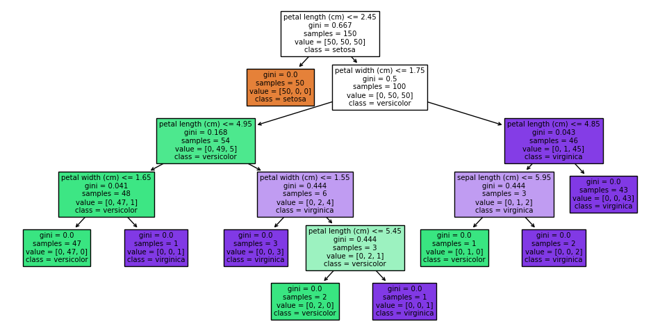

# Explainable AI: The Future of Machine Learning

## What is Explainable AI?

Machine learning (ML) is a subfield of artificial intelligence that involves the use of algorithms and statistical models to enable computer systems to learn from data and make predictions or decisions without being explicitly programmed. However, as ML models become more complex, they can become increasingly difficult to interpret. This lack of interpretability can lead to ethical concerns, such as biased decision-making and lack of transparency. For example, an ML model used in healthcare may make a diagnosis based on a set of features, but it may not be clear why the model made that diagnosis or how it arrived at that decision.

Explainable AI (XAI) is a field of research that aims to address these concerns by developing ML models that are transparent and interpretable. XAI is becoming increasingly important as ML models are being used in high-stakes applications, such as healthcare and finance. By providing explanations for their decisions and predictions, XAI can help ensure that ML models are fair, transparent, and accountable.

XAI seeks to create models that can provide explanations for their decisions and predictions, rather than being treated as a “black box”. Black box models are ML models that are difficult or impossible to interpret. These models can be highly accurate, but their lack of transparency can lead to ethical concerns, such as biased decision-making and lack of accountability.

Explainable AI techniques can be broadly categorized into two types: model-agnostic and model-specific:

- **Model-agnostic** techniques can be applied to any machine learning model, regardless of its architecture or complexity. An example of model-agnostic techniques include SHAP (SHapley Additive exPlanations).
- **Model-specific** techniques are designed for specific types of ML models. For example, decision trees and rule-based models are inherently interpretable, while deep neural networks are typically considered black box models.

## Why is Explainable AI Important?

XAI is important for several reasons, including ethical implications, transparency in decision-making, and regulatory compliance.

One of the main ethical implications of black box models is the potential for biased decision-making. Black box models can be highly accurate, but their lack of transparency can make it difficult to identify and correct biases in the data or model. This can lead to unfair or discriminatory decisions, such as denying loans or job opportunities to certain groups of people. XAI can help address these ethical concerns by providing transparency and accountability in the decision-making process.

Transparency in decision-making is also important for building trust and confidence in the use of ML models. When people understand how a model is making decisions, they are more likely to trust and accept those decisions. This is especially important in high-stakes applications, such as healthcare and finance, where the consequences of a wrong decision can be significant.

Finally, regulatory compliance is another reason why XAI is important. In some industries, such as healthcare and finance, there are regulations that require transparency and accountability in decision-making. XAI can help ensure that ML models comply with these regulations and provide the necessary transparency and accountability.

Here are some examples of industries where XAI is crucial:

- **Healthcare:** In healthcare, machine learning models are used for a variety of tasks, such as diagnosing diseases and predicting patient outcomes. These models can have a significant impact on patient care and outcomes, so it is important to ensure that they are transparent and interpretable. XAI can help healthcare professionals understand how a model is making decisions and provide insights into the underlying factors that contribute to those decisions.
- **Finance:** In finance, ML models are used for tasks such as fraud detection and credit scoring. These models can have a significant impact on people’s financial lives, so it is important to ensure that they are fair and transparent. XAI can help ensure that these models are not making decisions based on biased or discriminatory factors, and can provide insights into the factors that contribute to a particular decision.
- **Autonomous Vehicles:** In the field of autonomous vehicles, machine learning models are used for tasks such as object detection and path planning. These models can have a significant impact on public safety, so it is important to ensure that they are transparent and accountable. XAI can help ensure that these models are making decisions based on factors such as safety and efficiency, and can provide insights into the factors that contribute to a particular decision.

## Techniques for Explainable AI

There are several popular techniques for explainable AI, including both model-agnostic and model-specific techniques.

### SHAP (SHapley Additive exPlanations)

SHAP is a model-agnostic technique that provides global explanations for a model’s behavior. It works by assigning each feature an importance value for a given prediction, based on the contribution of that feature to the prediction. SHAP can be used with any machine learning model, regardless of its architecture or complexity.

Here’s an example of how to use SHAP in Python:

```bash title="Shell"
pip install shap scikit-learn
```

```python title="Python"
from sklearn.model_selection import train_test_split
from sklearn.svm import SVC
import shap

# Train an SVM classifier
X_train, X_test, y_train, y_test = train_test_split(
    *shap.datasets.iris(), test_size=0.2, random_state=0
)
svm = SVC(kernel="rbf", probability=True)
svm.fit(X_train, y_train)

# Use Kernel SHAP to explain test set predictions
explainer = shap.KernelExplainer(svm.predict_proba, X_train, link="logit")
shap_values = explainer.shap_values(X_test, nsamples=100)

# Plot the SHAP values for the output of the first instance
force = shap.plots.force(
    base_value=explainer.expected_value[0],
    shap_values=shap_values[0][0, :],
    features=X_test.iloc[0, :],
    link="logit",
)

# Save the plot to an HTML file
shap.save_html("shap.html", force)

# Show the plot
force
```


**Pros:**

- SHAP provides global explanations for a model’s behavior, which can be useful for understanding how a model is making decisions.
- SHAP can be used with any machine learning model.

**Cons:**

- SHAP can be computationally expensive, especially for large datasets or complex models.
- SHAP may not provide a complete understanding of a model’s behavior, as it only provides feature importance values for a given prediction.

### Decision Trees

Decision trees are a model-specific technique that are inherently interpretable. They work by recursively partitioning the feature space into smaller regions, based on the values of the features. Each partition corresponds to a decision rule, which can be easily understood by humans.

```bash title="Shell"
pip install scikit-learn
```

```python title="Python"
from sklearn.tree import DecisionTreeClassifier
from sklearn.datasets import load_iris
from sklearn import tree

# Load iris dataset
iris = load_iris()

# Define features and target
X = iris.data
y = iris.target

# Create decision tree classifier
dt = DecisionTreeClassifier(random_state=42)
dt.fit(X, y)

# Generate visual representation of decision tree
tree.plot_tree(
    dt,
    feature_names=iris.feature_names,
    class_names=list(iris.target_names),
    filled=True,
)
plt.show()
```



**Pros:**

- Decision trees are inherently interpretable, as they can be represented as a set of rules that can be easily understood by humans.
- Decision trees can be used for both classification and regression problems.

**Cons:**

- Decision trees can be prone to overfitting, especially for complex problems or datasets with many features.
- Decision trees may not always be the most accurate or efficient model, depending on the complexity of the problem.

### Rule-Based Models

Rule-based models are a model-specific technique that are similar to decision trees, but are based on a set of if-else statements. Each rule corresponds to a specific condition on the features, and the output is determined by the first rule that is satisfied.

```python title="Python"
# Create rule-based model
def rule_based_model(X):
    if X[2] <= 2.45:
        return 0
    elif X[3] <= 1.75:
        if X[2] <= 4.95:
            if X[3] <= 1.65:
                return 1
            else:
                return 2
        else:
            if X[3] <= 1.55:
                return 1
            else:
                return 2
    else:
        if X[2] <= 4.85:
            if X[3] <= 1.65:
                return 2
            else:
                return 1
        else:
            return 2

# Test rule-based model
X_test = [[5.1, 3.5, 1.4, 0.2], [6.2, 3.4, 5.4, 2.3]]
for x in X_test:
    print(f"Input: {x}, Prediction: {rule_based_model(x)}")
```

```
Input: [5.1, 3.5, 1.4, 0.2], Prediction: 0
Input: [6.2, 3.4, 5.4, 2.3], Prediction: 2
```

**Pros:**

- Rule-based models are inherently interpretable, as they are based on a set of if-else statements that can be easily understood by humans.
- Rule-based models can be useful for problems where the decision-making process can be easily represented as a set of rules.

**Cons:**

- Rule-based models may not always be the most accurate or efficient model, depending on the complexity of the problem.
- Rule-based models can be difficult to scale to large datasets or complex problems.

## Challenges and Future Directions

Implementing explainable AI techniques can be challenging for several reasons, including:

- **Technical Complexity:** Many XAI techniques are complex and require specialized knowledge to implement and interpret. This can make it difficult for non-experts to use and understand these techniques, which can limit their adoption and impact.
- **Computational Cost:** Some XAI techniques, such as SHAP, can be computationally expensive, especially for large datasets or complex models. This can make it difficult to use these techniques in real-time applications or on resource-constrained devices.
- **Lack of Standardization:** There is currently a lack of standardization in the field of XAI, which can make it difficult to compare and evaluate different techniques. This can also make it difficult to ensure that XAI techniques are being used appropriately and effectively.

Despite these challenges, there is ongoing research in the field of XAI that is focused on addressing these challenges and improving the effectiveness and usability of XAI techniques. Here are some examples of current research:

- Interpretable Machine Learning: Interpretable machine learning (IML) is a subfield of XAI that focuses on developing machine learning models that are inherently interpretable. This can help address the technical complexity challenge by making it easier for non-experts to understand how a model is making decisions. Some examples of IML techniques include decision trees, rule-based models, and linear models.
- Model-Specific Techniques: Model-specific XAI techniques are focused on developing techniques that are tailored to specific types of models, such as deep neural networks. These techniques can help address the computational cost challenge by optimizing the XAI technique for the specific model architecture. Some examples of model-specific XAI techniques include [DeepLIFT](https://arxiv.org/abs/1704.02685) and [Integrated Gradients](https://arxiv.org/abs/1703.01365).
- Standardization Efforts: There are ongoing efforts to standardize XAI techniques and ensure that they are being used appropriately and effectively. For example, the DARPA XAI program is focused on developing XAI techniques that are transparent, explainable, and verifiable. The program is also focused on developing evaluation metrics and standards for XAI techniques.

Looking to the future, XAI has the potential to have a significant impact on society by improving the transparency and accountability of machine learning models. XAI can help address ethical concerns, build trust and confidence, and ensure regulatory compliance. However, there are also potential risks and challenges associated with XAI, such as the potential for malicious actors to exploit XAI techniques for nefarious purposes. It will be important for researchers and practitioners to continue to develop and refine XAI techniques, while also considering the potential risks and challenges associated with these techniques.
